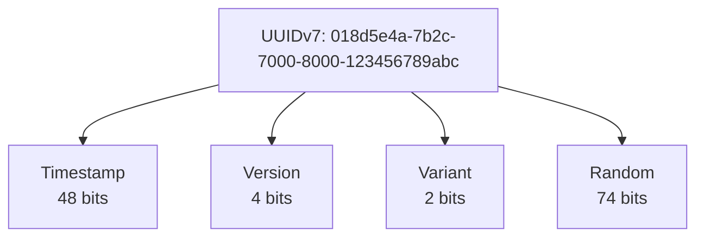

# API Conventions Guide

## Overview

The BookStore API follows strict standards for time handling and JSON serialization to ensure consistency, interoperability, and maintainability.

## Time Standards

### Always Use UTC

**Rule**: All timestamps MUST use UTC timezone.

✅ **Correct**:
```csharp
var timestamp = DateTimeOffset.UtcNow;
var eventTime = DateTimeOffset.UtcNow;
```

❌ **Incorrect**:
```csharp
var timestamp = DateTime.Now;           // Local timezone - NEVER use
var eventTime = DateTimeOffset.Now;     // Local timezone - NEVER use
```

### Always Use DateTimeOffset

**Rule**: Use `DateTimeOffset` instead of `DateTime` for all timestamps.

✅ **Correct**:
```csharp
public DateTimeOffset Timestamp { get; set; }
public DateTimeOffset LastModified { get; set; }
```

❌ **Incorrect**:
```csharp
public DateTime Timestamp { get; set; }  // No timezone info - NEVER use
```

### ISO 8601 Format

All date/time values are automatically serialized in **ISO 8601** format:

```json
{
  "timestamp": "2025-12-26T17:16:09.123Z",
  "lastModified": "2025-12-26T17:16:09Z",
  "publicationDate": "2008-08-01"
}
```

**Format Details**:
- `DateTimeOffset`: `YYYY-MM-DDTHH:mm:ss.fffZ` (with milliseconds)
- `DateOnly`: `YYYY-MM-DD`
- Timezone: Always `Z` (UTC)

### Partial Dates

**Rule**: Use `PartialDate` for incomplete dates (e.g., publication year only).

```csharp
public record BookDto(
    string Title,
    PartialDate? PublicationDate // ✅ Can be year, year-month, or full date
);
```

**Capabilities**:
- **Year only**: `2008`
- **Year-Month**: `2008-08`
- **Full Date**: `2008-08-01`

**Client Usage**:
Always check for value before access:
```csharp
if (book.PublicationDate.HasValue)
{
    var year = book.PublicationDate.Value.Year;
    var display = book.PublicationDate.Value.ToDisplayString();
}
```

## JSON Serialization Standards

### camelCase

**Rule**: All JSON properties use camelCase.

```json
{
  "bookId": "018d5e4a-7b2c-7000-8000-123456789abc",
  "title": "Clean Code",
  "publicationDate": "2008-08-01",
  "lastModified": "2025-12-26T17:16:09Z"
}
```

### Enums: String Serialization

**Rule**: Enums are serialized as strings, not integers.

✅ **Correct** (String):
```json
{
  "status": "Active",
  "role": "Administrator",
  "orderStatus": "Shipped"
}
```

❌ **Incorrect** (Integer):
```json
{
  "status": 0,
  "role": 1,
  "orderStatus": 2
}
```

**Benefits**:
- **Readable**: `"Active"` is clearer than `0`
- **Evolvable**: Can reorder enum values without breaking API
- **Self-documenting**: No need to look up enum definitions
- **Debuggable**: Easier to understand logs and database queries

### Configuration

#### ASP.NET Core (API Responses)

Configured in `Program.cs`:
```csharp
builder.Services.ConfigureHttpJsonOptions(options =>
{
    options.SerializerOptions.PropertyNamingPolicy = JsonNamingPolicy.CamelCase;
    options.SerializerOptions.Converters.Add(
        new JsonStringEnumConverter(JsonNamingPolicy.CamelCase));
});
```

#### Marten (Database Storage)

Configured in `Program.cs`:
```csharp
options.UseDefaultSerialization(
    enumStorage: EnumStorage.AsString,
    casing: Casing.CamelCase);
```

---

## Identifier Standards

### UUIDv7 for All IDs

**Rule**: Use `Guid.CreateVersion7()` for all entity identifiers.

✅ **Correct**:
```csharp
public record CreateBook(...)
{
    public Guid Id { get; init; } = Guid.CreateVersion7();
}

var bookId = Guid.CreateVersion7();
```

❌ **Incorrect**:
```csharp
var bookId = Guid.NewGuid();  // WRONG - creates random UUIDv4
```

**Benefits of UUIDv7**:
- ✅ **Time-ordered**: Naturally sortable by creation time
- ✅ **Database performance**: Better index locality and reduced fragmentation
- ✅ **Distributed systems**: Safe to generate across multiple servers
- ✅ **No collisions**: Globally unique without coordination

**Format**:


> [!NOTE]
> The BookStore project includes a Roslyn analyzer (BS1006) that enforces this convention by flagging any use of `Guid.NewGuid()`.

---

## Type Conventions

### Use Record Types

**Rule**: Use `record` types for immutable data structures (DTOs, commands, events).

✅ **Correct**:
```csharp
// DTOs
// DTOs (in BookStore.Shared.Models)
public record BookDto(
    Guid Id,
    string Title,
    string? Isbn,
    PublisherDto? Publisher,
    IReadOnlyList<AuthorDto> Authors); // ✅ Use IReadOnlyList for collections

// Commands
public record CreateBook(
    string Title,
    string? Isbn,
    IReadOnlyList<Guid> AuthorIds); // ✅ Use IReadOnlyList for collections

// Events
public record BookAdded(
    Guid Id,
    string Title,
    DateTimeOffset Timestamp);
```

❌ **Incorrect**:
```csharp
// WRONG - using class for immutable data
public class BookDto
{
    public Guid Id { get; set; }
    public string Title { get; set; }
}
```

**Benefits**:
- ✅ **Immutability**: Value-based equality by default
- ✅ **Concise**: Less boilerplate code
- ✅ **Thread-safe**: Immutable objects are inherently thread-safe
- ✅ **Event sourcing**: Perfect for immutable events

### Nullable Reference Types

**Rule**: Enable nullable reference types and use `?` for optional values.

✅ **Correct**:
```csharp
public record BookDto(
    Guid Id,
    string Title,           // Required
    string? Isbn,           // Optional
    string? Description,    // Optional
    PublisherDto? Publisher // Optional
);
```

❌ **Incorrect**:
```csharp
public record BookDto(
    Guid Id,
    string Title,
    string Isbn,        // WRONG - should be string? if optional
    string Description  // WRONG - should be string? if optional
);
```

**Configuration**:
```xml
<!-- In .csproj -->
<PropertyGroup>
  <Nullable>enable</Nullable>
</PropertyGroup>
```

---

## Pagination Standards

### PagedListDto Structure

**Rule**: Use consistent pagination response format.

```csharp
public record PagedListDto<T>(
    IReadOnlyList<T> Items,
    long PageNumber,
    long PageSize,
    long TotalItemCount)
{
    public long PageCount { get; init; } = 
        (long)double.Ceiling(TotalItemCount / (double)PageSize);
    public bool HasPreviousPage { get; init; } = PageNumber > 1;
    public bool HasNextPage { get; init; } = 
        PageNumber < (long)double.Ceiling(TotalItemCount / (double)PageSize);
}
```

**JSON Response**:
```json
{
  "items": [
    { "id": "...", "title": "Clean Code" },
    { "id": "...", "title": "Design Patterns" }
  ],
  "pageNumber": 1,
  "pageSize": 20,
  "totalItemCount": 42,
  "pageCount": 3,
  "hasPreviousPage": false,
  "hasNextPage": true
}
```

### Pagination Query Parameters

**Rule**: Use `page` and `pageSize` query parameters.

```
GET /api/books?page=2&pageSize=20&search=architecture
```

**Default Values**:
- `page`: 1
- `pageSize`: 20 (configurable via `PaginationOptions`)

---

## HTTP Header Standards

### Standard Headers

The API uses the following standard headers:

#### Request Headers

| Header | Required | Description | Example |
|--------|----------|-------------|---------|
| `Accept-Language` | No | Preferred language for localized content | `pt-PT`, `en-US` |
| `If-None-Match` | No | ETag for conditional requests (caching) | `"5"` |
| `If-Match` | No | ETag for optimistic concurrency control | `"5"` |

#### Response Headers

| Header | Description | Example |
|--------|-------------|---------|
| `ETag` | Entity version for caching and concurrency | `"5"` |
| `Cache-Control` | Caching directives | `private, max-age=60` |

### Custom Headers

#### Correlation and Causation IDs

**Rule**: Use `X-Correlation-ID` and `X-Causation-ID` for distributed tracing.

```http
POST /api/admin/books
X-Correlation-ID: workflow-123
X-Causation-ID: user-action-456
Content-Type: application/json

{
  "title": "Clean Code",
  ...
}
```

**Behavior**:
- If `X-Correlation-ID` is not provided, the API generates a new UUIDv7
- The API echoes back the correlation ID in the response
- All events in the event store are tagged with correlation and causation IDs

**Benefits**:
- ✅ **Traceability**: Track requests across services
- ✅ **Debugging**: Correlate logs and events
- ✅ **Auditing**: Understand cause-and-effect relationships

---

## API Versioning

### Header-Based Versioning

**Rule**: Use `api-version` header for API versioning.

```http
GET /api/books
api-version: 1.0
```

**Current Version**: `1.0`

**Benefits**:
- ✅ **Clean URLs**: No version in the path
- ✅ **Flexible**: Can version individual endpoints
- ✅ **Backward compatible**: Defaults to latest version

---

## Localization Standards

### Supported Languages

The API supports the following languages:

| Code | Language |
|------|----------|
| `en` | English (default) |
| `pt` | Portuguese |
| `es` | Spanish |
| `fr` | French |
| `de` | German |

### Accept-Language Header

**Rule**: Use `Accept-Language` header for localized content.

```http
GET /api/categories
Accept-Language: pt-PT
```

**Response**:
```json
{
  "items": [
    { "id": "...", "name": "Ficção" },
    { "id": "...", "name": "Mistério" }
  ]
}
```

### Fallback Strategy

1. Try requested language (e.g., `pt`)
2. Fall back to default language (`en`)
3. Fall back to first available translation

---

## Error Response Standards

### Problem Details (RFC 7807)

**Rule**: All error responses use the Problem Details format (RFC 7807).

The API is configured with `AddProblemDetails()` which automatically converts error responses to the standard format.

#### Standard Error Response Format

```json
{
  "type": "https://tools.ietf.org/html/rfc7231#section-6.5.1",
  "title": "Bad Request",
  "status": 400,
  "traceId": "00-1234567890abcdef-1234567890abcdef-00"
}
```

#### Validation Error Response

For validation errors, the API returns detailed error information:

```json
{
  "error": "Invalid language code",
  "languageCode": "xx",
  "message": "The language code 'xx' is not valid. Must be a valid ISO 639-1 (e.g., 'en'), ISO 639-3 (e.g., 'fil'), or culture code (e.g., 'en-US')"
}
```

#### Common Error Responses

| Status Code | Description | Example |
|-------------|-------------|---------|
| `400 Bad Request` | Invalid input or validation failure | Invalid language code, description too long |
| `404 Not Found` | Resource not found | Book ID doesn't exist |
| `412 Precondition Failed` | ETag mismatch (optimistic concurrency) | Concurrent update detected |
| `422 Unprocessable Entity` | Business rule violation | Cannot delete book with active orders |

#### Error Response Examples

**Validation Error**:
```http
POST /api/admin/books
Content-Type: application/json

{
  "title": "Clean Code",
  "language": "invalid",
  ...
}
```

Response:
```http
HTTP/1.1 400 Bad Request
Content-Type: application/json

{
  "error": "Invalid language code",
  "languageCode": "invalid",
  "message": "The language code 'invalid' is not valid. Must be a valid ISO 639-1 (e.g., 'en'), ISO 639-3 (e.g., 'fil'), or culture code (e.g., 'en-US')"
}
```

**Length Validation Error**:
```http
POST /api/admin/books
Content-Type: application/json

{
  "title": "Clean Code",
  "translations": {
    "en": {
      "description": "A very long description that exceeds the maximum allowed length..."
    }
  },
  ...
}
```

Response:
```http
HTTP/1.1 400 Bad Request
Content-Type: application/json

{
  "error": "Description too long",
  "languageCode": "en",
  "maxLength": 5000,
  "actualLength": 6543,
  "message": "Description for language 'en' cannot exceed 5000 characters"
}
```

**Not Found Error**:
```http
GET /api/books/00000000-0000-0000-0000-000000000000
```

Response:
```http
HTTP/1.1 404 Not Found
Content-Type: application/json

{
  "type": "https://tools.ietf.org/html/rfc7231#section-6.5.4",
  "title": "Not Found",
  "status": 404,
  "traceId": "00-1234567890abcdef-1234567890abcdef-00"
}
```

**Optimistic Concurrency Error**:
```http
PUT /api/admin/books/018d5e4a-7b2c-7000-8000-123456789abc
If-Match: "5"
Content-Type: application/json

{
  "title": "Updated Title",
  ...
}
```

Response (if ETag doesn't match):
```http
HTTP/1.1 412 Precondition Failed
Content-Type: application/json

{
  "type": "https://tools.ietf.org/html/rfc7232#section-4.2",
  "title": "Precondition Failed",
  "status": 412,
  "traceId": "00-1234567890abcdef-1234567890abcdef-00"
}
```

### Error Response Best Practices

1. **Always include descriptive messages** - Help clients understand what went wrong
2. **Include relevant context** - Add fields like `languageCode`, `maxLength`, etc.
3. **Use appropriate status codes** - Follow HTTP semantics
4. **Include trace IDs** - For debugging and correlation
5. **Be consistent** - Use the same error format across all endpoints

---

## Common Patterns

### Creating Events

Always use `DateTimeOffset.UtcNow` for event timestamps:

```csharp
public static BookAdded Create(Guid id, string title, ...)
{
    return new BookAdded(
        id,
        title,
        ...,
        DateTimeOffset.UtcNow  // ✅ Always UTC
    );
}
```

### Storing Timestamps

Use `DateTimeOffset` for all timestamp properties:

```csharp
public record BookAdded(
    Guid Id,
    string Title,
    DateTimeOffset Timestamp  // ✅ DateTimeOffset with UTC
);
```

### Querying by Time

Use `DateTimeOffset.UtcNow` for time-based queries:

```csharp
var recentBooks = await session.Query<BookSearchProjection>()
    .Where(b => b.LastModified > DateTimeOffset.UtcNow.AddDays(-7))
    .ToListAsync();
```

---

## Benefits

### UTC Timezone
- ✅ No timezone conversion errors
- ✅ Consistent across all servers
- ✅ Works globally without confusion
- ✅ Simplifies distributed systems

### ISO 8601 Format
- ✅ Universal standard (RFC 3339)
- ✅ Sortable as strings
- ✅ Human-readable
- ✅ Supported by all platforms

### UUIDv7
- ✅ Time-ordered for better performance
- ✅ Database index optimization
- ✅ Natural sorting by creation time
- ✅ Distributed generation without conflicts

### Record Types
- ✅ Immutability by default
- ✅ Value-based equality
- ✅ Less boilerplate code
- ✅ Perfect for DTOs and events

### Enum Strings
- ✅ Self-documenting APIs
- ✅ Safe enum reordering
- ✅ Easier debugging
- ✅ Better database queries

### camelCase
- ✅ JavaScript/TypeScript convention
- ✅ Consistent with web standards
- ✅ Better readability in JSON

---

## Common Pitfalls

### ❌ Using DateTime.Now
```csharp
var timestamp = DateTime.Now;  // WRONG - uses local timezone
```

### ❌ Using DateTime instead of DateTimeOffset
```csharp
public DateTime Timestamp { get; set; }  // WRONG - no timezone info
```

### ❌ Using Guid.NewGuid()
```csharp
var id = Guid.NewGuid();  // WRONG - creates random UUIDv4
```

### ❌ Using classes for DTOs
```csharp
public class BookDto  // WRONG - should use record
{
    public Guid Id { get; set; }
}
```

### ❌ Manual date formatting
```csharp
var dateStr = date.ToString("yyyy-MM-dd");  // WRONG - use serialization
```

### ❌ Integer enum serialization
```csharp
// WRONG - will serialize as integer without configuration
public enum Status { Active, Inactive }
```

### ❌ Not using nullable reference types
```csharp
public record BookDto(
    string Isbn  // WRONG - should be string? if optional
);
```

---

## Validation

### Unit Tests

Test JSON serialization format:

```csharp
[Fact]
public void DateTimeOffset_Should_Serialize_As_ISO8601()
{
    var obj = new { timestamp = DateTimeOffset.UtcNow };
    var json = JsonSerializer.Serialize(obj);
    
    // Should match ISO 8601 format: "2025-12-26T17:16:09.123Z"
    Assert.Matches(@"\d{4}-\d{2}-\d{2}T\d{2}:\d{2}:\d{2}(\.\d+)?Z", json);
}

[Fact]
public void Enum_Should_Serialize_As_String()
{
    var obj = new { status = Status.Active };
    var json = JsonSerializer.Serialize(obj);
    
    Assert.Contains("\"Active\"", json);
    Assert.DoesNotContain("0", json);
}

[Fact]
public void Guid_Should_Be_Version7()
{
    var id = Guid.CreateVersion7();
    var bytes = id.ToByteArray();
    
    // Version 7 has version bits set to 0111
    Assert.Equal(7, (bytes[7] & 0xF0) >> 4);
}
```

---

## Summary

**Golden Rules**:
1. ✅ Always use `DateTimeOffset.UtcNow` (never `DateTime.Now`)
2. ✅ Always use `DateTimeOffset` type (never `DateTime`)
3. ✅ Always use `Guid.CreateVersion7()` (never `Guid.NewGuid()`)
4. ✅ Always use `record` types for DTOs, commands, and events
5. ✅ ISO 8601 format is automatic (don't format manually)
6. ✅ Enums serialize as strings (configured globally)
7. ✅ JSON properties use camelCase (configured globally)
8. ✅ Use nullable reference types (`string?` for optional values)
9. ✅ Use `X-Correlation-ID` and `X-Causation-ID` for tracing
10. ✅ Use `Accept-Language` header for localization
11. ✅ Use Problem Details (RFC 7807) for error responses

These standards ensure the API is:
- **Consistent**: Same format everywhere
- **Interoperable**: Works with all clients
- **Maintainable**: Easy to understand and debug
- **Scalable**: Works across timezones and regions
- **Performant**: Optimized for databases and distributed systems
