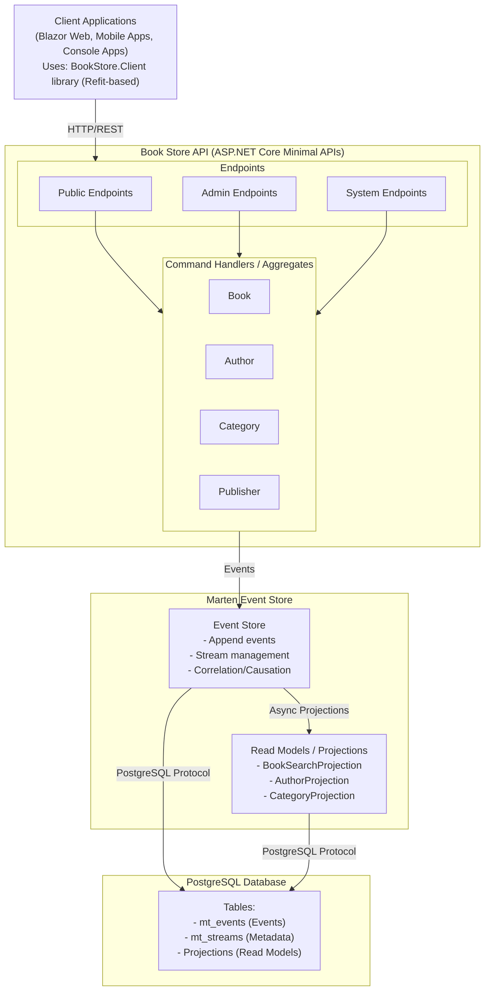
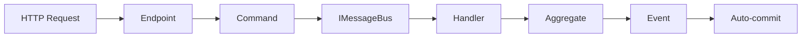
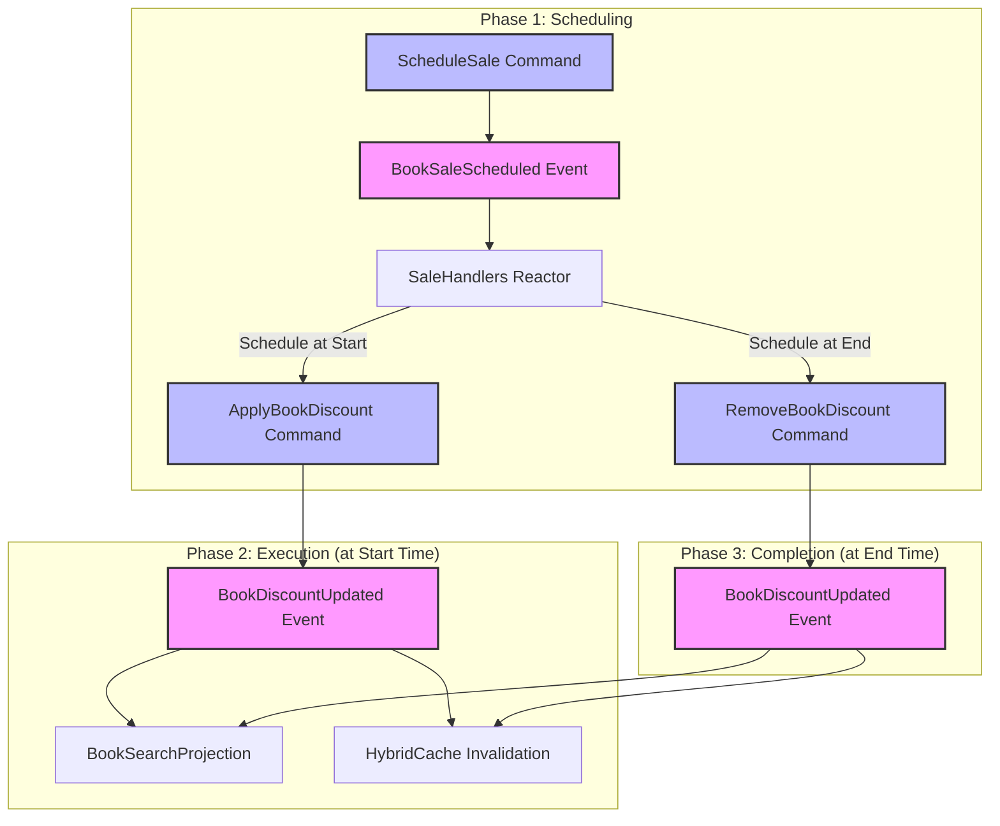
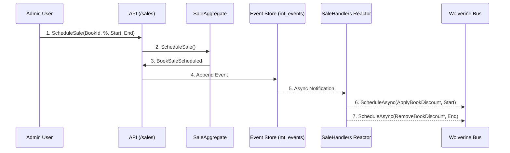
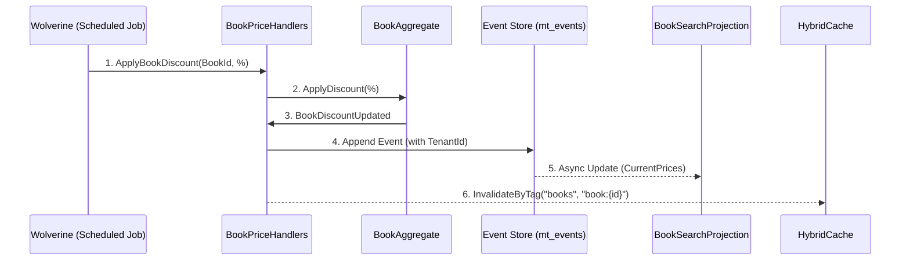
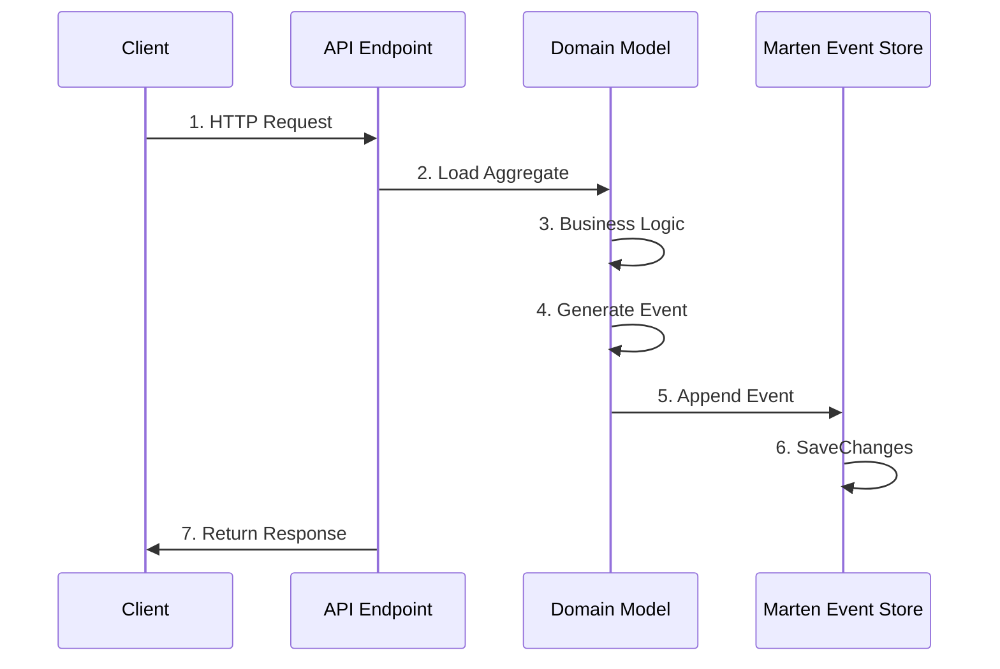
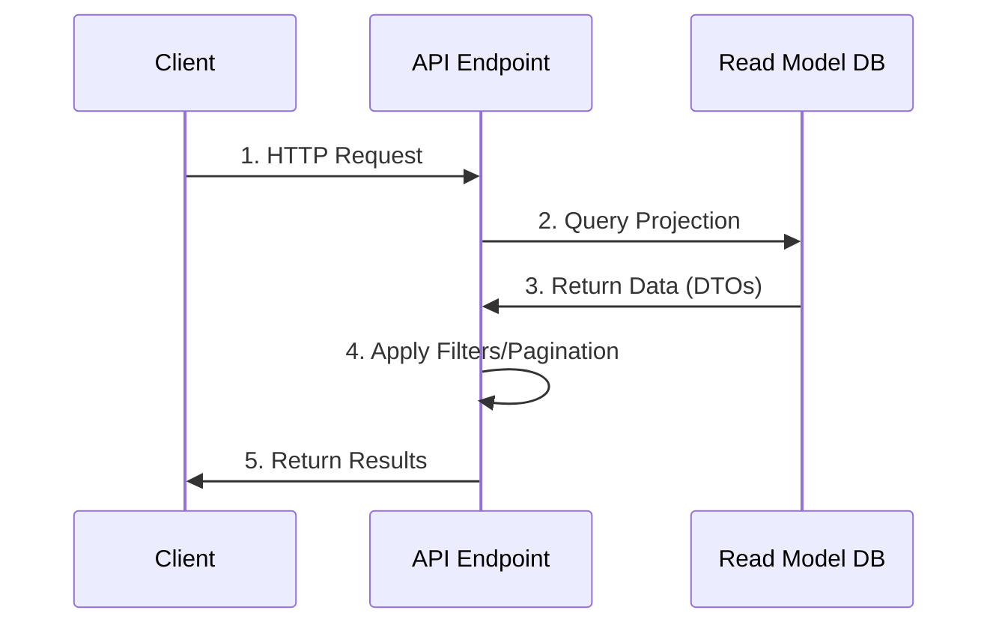
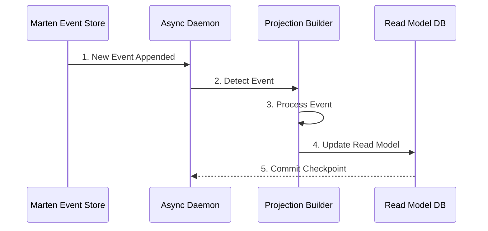

# Architecture Overview

## System Architecture

The Book Store API is built using **Event Sourcing** and **CQRS** patterns with ASP.NET Core Minimal APIs, Marten for event storage, and PostgreSQL as the database.



## Core Patterns

### Event Sourcing

Instead of storing current state, we store all changes as immutable events.

> [!NOTE]
> For a comprehensive guide to event sourcing concepts, patterns, and best practices, see the [Event Sourcing Guide](guides/event-sourcing-guide.md).

**Benefits**:
- Complete audit trail
- Time travel (reconstruct past states)
- Event replay for debugging
- Natural fit for distributed systems

**Implementation**:

```csharp
// Events are immutable records
public record BookAdded(
    Guid Id,
    string Title,
    string? Isbn,
    ...
);

// Aggregates apply events to build state
public class BookAggregate
{
    public void Apply(BookAdded @event)
    {
        Id = @event.Id;
        Title = @event.Title;
        ...
    }
}
```

See [Marten Guide](guides/marten-guide.md) for implementation details.

### CQRS (Command Query Responsibility Segregation)

Separate models for writes (commands) and reads (queries).

**Write Side** (Commands):

- Commands routed through Wolverine message bus
- Handlers execute business logic
- Events are appended to streams
- Optimized for consistency

**Read Side** (Queries):

- Projections denormalize data
- Optimized for specific queries
- Eventually consistent

### Wolverine Command/Handler Pattern

Commands are routed through Wolverine's message bus to handlers that execute business logic.

**Command Flow**:



**Benefits**:

- Clean separation of concerns
- Automatic transaction management
- Easy to test (pure functions)
- Foundation for async messaging

**Example**:

```csharp
// Endpoint: Just routing
private static Task<IResult> CreateBook(request, IMessageBus bus)
    => bus.InvokeAsync<IResult>(new CreateBook(...));

// Handler: Pure business logic
public static IResult Handle(CreateBook cmd, IDocumentSession session)
{
    var @event = BookAggregate.Create(...);
    session.Events.StartStream(cmd.Id, @event);
    // Wolverine auto-commits
    return Results.Created(...);
}
```

### Multi-Tenancy

The system implements **Enterprise-grade Multi-tenancy** using Marten's Conjoined Tenancy model.

**Key Components**:

- **Tenant Resolution**: `TenantResolutionMiddleware` extracts tenant ID from `X-Tenant-ID` header.
- **Data Isolation**: All Marten documents and events are partitioned by `tenant_id`.
- **Service Scoping**: `IDocumentSession` and `IQuerySession` are scoped to the current tenant.
- **Cache Partitioning**: HybridCache keys are namespaced by tenant to ensure complete isolation.

### Async Projections

Projections run asynchronously to build read models from events. With Wolverine integration via `.IntegrateWithWolverine()`, Wolverine manages the async projection daemon, providing distributed coordination and automatic failover across nodes.

```csharp
public class BookSearchProjection
{
    // Denormalized for fast searching
    public string Title { get; set; }
    public string? PublisherName { get; set; }
    public string AuthorNames { get; set; }
    public string SearchText { get; set; }
}
```

### Real-time Notifications with Server-Sent Events (SSE)

The application automatically sends SSE notifications whenever projections are updated, providing real-time updates to connected clients without polling.

> [!NOTE]
> For implementation details, flow diagrams, and client integration examples, see the [Real-time Notifications Guide](guides/real-time-notifications.md).

**Key Features**:

- **Automatic**: Tied to projection updates, not API calls.
- **Reliable**: Notifications only fire if the data is successfully committed.
- **Integrated**: Handles cache invalidation and notification in a single unit of work.

## Domain Model

### Aggregates

**Book Aggregate**:

- Root entity for book management
- Enforces business rules
- Emits events: `BookAdded`, `BookUpdated`, `BookSoftDeleted`, `BookRestored`

**Author Aggregate**:

- Manages author information
- Tracks biography and metadata

**Category Aggregate**:

- Supports multi-language translations
- Manages category hierarchy

**Publisher Aggregate**:

- Publisher information management

### Events

All events include:

- Domain data (title, ISBN, etc.)
- Marten metadata (correlation ID, causation ID, timestamp)

Example event flow:

1. User creates book → BookAdded event
2. Event stored in mt_events table
3. Async projection updates BookSearchProjection
4. Read model available for queries

## Event Modeling

The system uses specific event patterns to handle temporal logic, such as scheduled sales and price updates.

### Sale Lifecycle Flow

When an administrator schedules a sale, the system orchestrates a multi-step asynchronous flow involving Wolverine's message scheduling.



### Detailed Sequential Flow: Scheduling a Sale

This diagram shows the interaction between the domain aggregates, the event store, and the background messaging system during the scheduling phase.



### Detailed Sequential Flow: Applying a Discount

When the scheduled time arrives, Wolverine executes the command to update the effective price.



## Data Flow

### Write Path (Command)



### Read Path (Query)



### Projection Update (Async)



## Technology Stack

### Backend

- **ASP.NET Core 10** - Web framework
- **Minimal APIs** - Endpoint definition
- **Wolverine** - Command/handler pattern and message bus
- **Marten** - Event store and document DB
- **PostgreSQL 16** - Database with extensions
- **Aspire** - [Orchestration](guides/aspire-guide.md) and observability
- **Scalar** - API documentation

### Features

- **Event Sourcing** - Marten event store
- **CQRS** - Separate read/write models
- **Real-time Notifications** - Server-Sent Events (SSE) for all mutations
- **Optimistic Concurrency** - ETags with stream versions
- **Distributed Tracing** - Correlation/causation IDs
- **Environmental Metadata** - Automatic capture of client IP, User-Agent, and non-PII User ID (GUID) via headers. The system implements a metadata propagation system that allows the backend API to identify the original browser client even when requests are forwarded by the Blazor Server frontend.
- **Multi-language** - Category translations
- **Multi-Currency Pricing** - Explicit regional pricing with psychological endings ([docs](guides/multi-currency-guide.md))
- **Full-text Search** - PostgreSQL trigrams
- **API Versioning** - Header-based
- **Soft Deletion** - Logical deletes with restore

### Infrastructure

- **Docker** - Container runtime
- **PgAdmin** - Database management
- **OpenTelemetry** - Distributed tracing
- **Health Checks** - Service monitoring
- **TUnit** - Modern testing framework with built-in code coverage
- **Bogus** - Fake data generation for tests
- **Roslyn Analyzers** - Custom analyzers for Event Sourcing/CQRS patterns ([docs](guides/analyzer-rules.md))
- **Roslynator.Analyzers** - Enhanced code analysis
- **Refit** - Type-safe REST library for .NET

## Key Design Decisions

### 1. Event Sourcing with Marten

**Why**:

- Built-in event store on PostgreSQL
- No additional infrastructure needed
- Strong .NET integration
- Async projection support

**Trade-offs**:

- Learning curve for event sourcing
- Eventually consistent reads
- More complex than CRUD

### 2. Minimal APIs

**Why**:

- Less boilerplate than controllers
- Better performance
- Cleaner endpoint definition
- Native OpenAPI support

### 3. Async Projections

**Why**:

- Decouples write and read models
- Optimized read models for specific queries
- Scalable (can run on separate processes)

**Trade-offs**:

- Eventually consistent
- Projection lag possible
- More complex than direct queries

### 4. Soft Deletion

**Why**:

- Preserve data integrity
- Support undo/restore
- Maintain referential integrity
- Audit trail

### 5. ETags for Concurrency

**Why**:

- Standard HTTP mechanism
- Works with any client
- Natural fit with stream versions
- Natural fit with stream versions
- Prevents lost updates

### 6. Identity Stored as Documents (Not Event Sourced)

**Why**:

- **Standardization**: ASP.NET Core Identity provides robust, battle-tested security.
- **Compliance**: GDPR "Right to be Forgotten" is easier to implement with mutable documents than immutable event streams.
- **Simplicity**: Authentication state (current password hash, lock status) is more critical than the history of changes.
- **Performance**: High-frequency read path (login) benefits from simple index lookups.

**Trade-offs**:

- **Audit Trail**: Account changes (password reset, email change) are not automatically event-sourced (must use separate audit logs).
- **Consistency**: Auth data lives outside the primary event stream (though still in Postgres/Marten).

## Scalability Considerations

### Horizontal Scaling

- **API Servers**: Stateless, can scale horizontally
- **Projection Daemon**: Can run on dedicated instances
- **PostgreSQL**: Read replicas for queries

### Performance Optimizations

- **Hybrid Caching**: Two-tier caching (L1 in-memory + L2 Redis) with localization support
- **Connection Pooling**: Npgsql connection pooling
- **Async Projections**: Non-blocking event processing
- **Denormalization**: Optimized read models

### Event Store Growth

- **Archiving**: Old streams can be archived
- **Snapshots**: Aggregate snapshots for large streams (future)
- **Partitioning**: PostgreSQL table partitioning (future)

## Security Considerations

### Authentication & Authorization

The application implements a **Token-based authentication system**:

- **JWT Bearer Tokens** - Primary authentication method
  - Used by **Blazor Web App**, Mobile Apps, and integrations
  - Stateless authentication
  - Tokens stored securely in client (HttpOnly cookies or secure storage recommended for production)
  - Automatic token refresh logic

- **Passkey Support** - Passwordless authentication (.NET 10)
  - WebAuthn/FIDO2 standards
  - Phishing-resistant biometric authentication
  - Built-in .NET 10 Identity support

- **Role-Based Authorization** - Admin endpoints protected
  - Admin role for full access
  - Extensible for additional roles

See [Authentication Guide](guides/authentication-guide.md) and [Passkey Guide](guides/passkey-guide.md) for details.

### Data Protection

- **Soft Deletion**: Prevents accidental data loss
- **Event Immutability**: Events cannot be modified
- **Audit Trail**: Complete history of all changes

## Monitoring & Observability

### Health Checks

- PostgreSQL connectivity
- Marten event store
- Projection daemon status

### Distributed Tracing

- Correlation IDs track workflows
- Causation IDs track event chains
- OpenTelemetry integration

### Logging

- Structured logging with Serilog
- Aspire dashboard for log aggregation
- Event store for audit logs

## Next Steps

- **[Event Sourcing Guide](guides/event-sourcing-guide.md)** - Event sourcing concepts and patterns
- **[Marten Guide](guides/marten-guide.md)** - Event sourcing implementation with Marten
- **[Wolverine Guide](guides/wolverine-guide.md)** - Command/handler pattern
- **[Aspire Orchestration Guide](guides/aspire-guide.md)** - Service orchestration details
- **[Localization Guide](guides/localization-guide.md)** - Multi-language translation system
- **[Multi-Currency Pricing Guide](guides/multi-currency-guide.md)** - Regional pricing and psychological strategies
- **[Getting Started](getting-started.md)** - Setup and running the application
- **[Usage Tracking & Observability Guide](guides/observability-guide.md)** - Metrics and monitoring with OpenTelemetry
