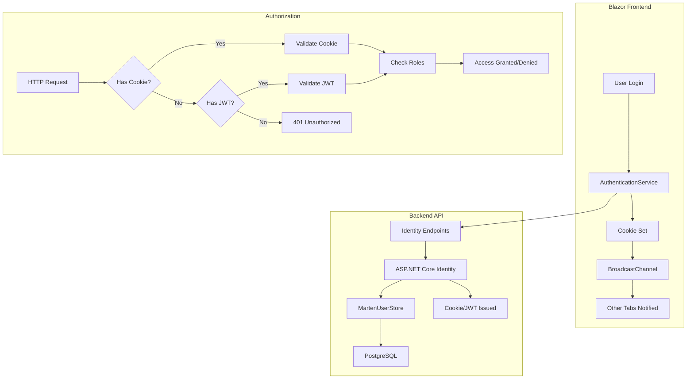

# Authentication Guide

This guide covers user authentication and authorization in the BookStore application using ASP.NET Core Identity with **hybrid cookie-based authentication** and **.NET 10 passkey support**.

## Overview

The BookStore implements a modern, secure authentication system with:

- **Cookie Authentication** for Blazor Server frontend (primary)
- **JWT Bearer Tokens** for external apps and APIs (secondary)
- **Passkey/WebAuthn Support** for passwordless authentication (.NET 10)
- **Cross-Tab Synchronization** for consistent login state across browser tabs
- **Role-Based Authorization** for admin endpoints
- **Marten Integration** for user storage (no Entity Framework Core)

## Architecture

### Authentication Flow



### Components

#### Frontend (Blazor Server)
- **AuthenticationService** - Handles login/logout/registration
- **BookStoreAuthenticationStateProvider** - Revalidates auth state every 30 seconds
- **BroadcastChannel** - Synchronizes logout across browser tabs
- **Cookie Storage** - HttpOnly, Secure cookies (automatic)

#### Backend (API)
- **ASP.NET Core Identity** - User management and authentication
- **MartenUserStore** - Custom user store for PostgreSQL
- **Dual Authentication Schemes** - Cookie + JWT Bearer
- **Passkey Support** - Built-in WebAuthn/FIDO2 integration

### ApplicationUser Model

Users are stored as documents in Marten:

```csharp
public sealed class ApplicationUser
{
    public Guid Id { get; set; }
    public string? UserName { get; set; }
    public string? NormalizedUserName { get; set; }
    public string? Email { get; set; }
    public string? NormalizedEmail { get; set; }
    public bool EmailConfirmed { get; set; }
    public string? PasswordHash { get; set; }
    public string? SecurityStamp { get; set; }
    public ICollection<string> Roles { get; set; } = [];
    
    // Passkey credentials stored automatically by .NET 10 Identity
}
```

## Cookie-Based Authentication (Blazor Frontend)

### How It Works

1. **Login** - User submits credentials
2. **Cookie Issued** - Server sets HttpOnly, Secure cookie
3. **Automatic Transmission** - Browser sends cookie with every request
4. **Server Validation** - ASP.NET Core validates cookie automatically
5. **Logout** - Cookie cleared, SecurityStamp updated

### Security Features

✅ **HttpOnly** - JavaScript cannot access cookies (XSS protection)  
✅ **Secure** - Cookies only sent over HTTPS  
✅ **SameSite=Lax** - CSRF protection for same-domain scenarios  
✅ **Sliding Expiration** - Cookie refreshed on activity  
✅ **24-hour expiration** - Automatic logout after inactivity

### Login Example

```csharp
@inject AuthenticationService AuthService
@inject NavigationManager Navigation

private async Task HandleLogin()
{
    var result = await AuthService.LoginAsync(email, password);
    
    if (result.Success)
    {
        // Cookie is set automatically by the API
        // Notify other tabs
        await JS.InvokeVoidAsync("authBroadcast.notifyLogin");
        Navigation.NavigateTo("/", forceLoad: true);
    }
    else
    {
        errorMessage = result.Error;
    }
}
```

### Logout Example

```csharp
private async Task HandleLogout()
{
    await AuthService.LogoutAsync();
    
    // Notify other tabs via BroadcastChannel
    await JS.InvokeVoidAsync("authBroadcast.notifyLogout");
    
    Navigation.NavigateTo("/login", forceLoad: true);
}
```

## Cross-Tab Synchronization

### The Problem

Each Blazor Server tab maintains its own SignalR circuit with independent authentication state. Without synchronization, logging out in one tab doesn't affect other tabs.

### The Solution: Dual-Layer Approach

#### Layer 1: BroadcastChannel API (Immediate)

JavaScript-based cross-tab communication for instant synchronization:

```javascript
// wwwroot/js/auth-broadcast.js
const authChannel = new BroadcastChannel('bookstore-auth');

// Listen for logout events
authChannel.onmessage = (event) => {
    if (event.data.type === 'logout') {
        window.location.href = '/login';
    }
};

// Notify other tabs on logout
function notifyLogout() {
    authChannel.postMessage({ type: 'logout' });
}
```

**Benefits:**
- Instant synchronization (milliseconds)
- No server round-trip required
- Event-driven architecture

#### Layer 2: Server-Side Revalidation (Fallback)

Periodic validation of authentication state:

```csharp
public class BookStoreAuthenticationStateProvider 
    : RevalidatingServerAuthenticationStateProvider
{
    public BookStoreAuthenticationStateProvider(
        ILoggerFactory loggerFactory,
        IServiceScopeFactory scopeFactory)
        : base(loggerFactory)
    {
        RevalidationInterval = TimeSpan.FromSeconds(30);
    }

    protected override async Task<bool> ValidateAuthenticationStateAsync(
        AuthenticationState authenticationState,
        CancellationToken cancellationToken)
    {
        // Check if SecurityStamp has changed (indicates logout)
        var user = authenticationState.User;
        var userId = user.FindFirst(ClaimTypes.NameIdentifier)?.Value;
        
        var appUser = await userManager.FindByIdAsync(userId);
        var securityStamp = user.FindFirst("AspNet.Identity.SecurityStamp")?.Value;
        
        return securityStamp == appUser.SecurityStamp;
    }
}
```

**Benefits:**
- Guaranteed eventual consistency
- Works even if BroadcastChannel fails
- Server-authoritative validation

### How It Works Together

1. **User logs out in Tab A**
   - SecurityStamp updated in database
   - Cookie cleared
   - BroadcastChannel message sent

2. **Tab B receives message** (within milliseconds)
   - Immediately redirects to login

3. **Tab C** (if BroadcastChannel failed)
   - Next revalidation cycle (within 30 seconds)
   - Detects SecurityStamp mismatch
   - Automatically logs out

## JWT Bearer Authentication (External Apps)

For scenarios where cookies don't work (mobile apps, third-party integrations):

### Login

**POST** `/identity/login`

```json
{
  "email": "user@example.com",
  "password": "SecurePassword123!"
}
```

**Response:**
```json
{
  "tokenType": "Bearer",
  "accessToken": "eyJhbGc...",
  "expiresIn": 3600,
  "refreshToken": "CfDJ8..."
}
```

### Using JWT Tokens

Include the access token in the `Authorization` header:

```bash
curl -X GET http://localhost:5000/api/admin/books \
  -H "Authorization: Bearer eyJhbGc..."
```

### Token Refresh

**POST** `/identity/refresh`

```json
{
  "refreshToken": "CfDJ8..."
}
```

## Passkey Authentication

> [!NOTE]
> Passkey support is built into .NET 10 ASP.NET Core Identity. No external libraries required.

### What are Passkeys?

Passkeys are a **passwordless authentication method** based on WebAuthn/FIDO2 standards:

- **Phishing-resistant** - Credentials bound to specific domains
- **No shared secrets** - Only public keys stored on server
- **Biometric/PIN** - Uses device authentication (Face ID, Touch ID, Windows Hello)
- **Cross-device sync** - Supported by modern passkey providers

### Registering a Passkey

**POST** `/identity/passkey/register`

The API returns a WebAuthn challenge that the browser uses to create a credential:

```javascript
// Browser WebAuthn API
const credential = await navigator.credentials.create({
    publicKey: {
        challenge: /* from server */,
        rp: { name: "BookStore" },
        user: {
            id: /* user ID */,
            name: email,
            displayName: email
        },
        pubKeyCredParams: [{ alg: -7, type: "public-key" }],
        authenticatorSelection: {
            authenticatorAttachment: "platform",
            userVerification: "required"
        }
    }
});
```

### Logging in with Passkey

**POST** `/identity/passkey/login`

```javascript
const assertion = await navigator.credentials.get({
    publicKey: {
        challenge: /* from server */,
        rpId: "localhost", // or your domain
        userVerification: "required"
    }
});
```

### Passkey Configuration

```csharp
// appsettings.json
{
  "Authentication": {
    "Passkey": {
      "ServerDomain": "localhost" // Change for production
    }
  }
}

// Program.cs
builder.Services.AddIdentityCore<ApplicationUser>(options =>
{
    options.Passkey.ServerDomain = configuration["Authentication:Passkey:ServerDomain"];
    options.Passkey.AuthenticatorTimeout = TimeSpan.FromMinutes(2);
    options.Passkey.ChallengeSize = 32;
})
.AddApiEndpoints()
.AddUserStore<MartenUserStore>();
```

> [!WARNING]
> **Domain Configuration is Critical**
> 
> Passkeys are bound to the domain specified in `ServerDomain`. Changing this in production requires all users to re-register their passkeys.

## Identity Endpoints

All authentication endpoints are available under `/identity`:

### Registration

**POST** `/identity/register`

```json
{
  "email": "user@example.com",
  "password": "SecurePassword123!"
}
```

### Login (Cookie)

**POST** `/identity/login?useCookies=true`

```json
{
  "email": "user@example.com",
  "password": "SecurePassword123!"
}
```

### Login (JWT)

**POST** `/identity/login`

```json
{
  "email": "user@example.com",
  "password": "SecurePassword123!"
}
```

### Logout

**POST** `/identity/logout`

Clears the authentication cookie and updates SecurityStamp.

### Account Management

- **GET** `/identity/manage/info` - Get user information
- **POST** `/identity/manage/info` - Update user information
- **POST** `/identity/forgotPassword` - Request password reset
- **POST** `/identity/resetPassword` - Reset password
- **POST** `/identity/resendConfirmationEmail` - Resend email confirmation

### Passkey Endpoints

- **POST** `/identity/passkey/register` - Register a new passkey
- **POST** `/identity/passkey/login` - Login with passkey
- **GET** `/identity/passkey/list` - List registered passkeys
- **DELETE** `/identity/passkey/{id}` - Delete a passkey

## Authorization

### Role-Based Authorization

The API uses role-based authorization to protect admin endpoints.

#### Available Roles

- **Admin** - Full access to all admin endpoints

#### Protecting Endpoints

```csharp
public static RouteGroupBuilder MapAdminBookEndpoints(this RouteGroupBuilder group)
{
    group.MapPost("/", CreateBook);
    group.MapPut("/{id:guid}", UpdateBook);
    group.MapDelete("/{id:guid}", DeleteBook);
    
    return group.RequireAuthorization("Admin");
}
```

### Authorization Responses

- **401 Unauthorized** - No authentication provided
- **403 Forbidden** - Authenticated but insufficient permissions

## Development Setup

### Default Admin User

In development, a default admin user is automatically seeded:

> [!WARNING]
> **Development Only** - Change these credentials in production!

- **Email**: `admin@bookstore.com`
- **Password**: `Admin123!`
- **Role**: `Admin`

### Testing Authentication

#### 1. Login as Admin (Cookie)

```bash
curl -X POST http://localhost:5000/identity/login?useCookies=true \
  -H "Content-Type: application/json" \
  -c cookies.txt \
  -d '{
    "email": "admin@bookstore.com",
    "password": "Admin123!"
  }'
```

#### 2. Access Admin Endpoint (with Cookie)

```bash
curl -X GET http://localhost:5000/api/admin/books \
  -b cookies.txt
```

#### 3. Login as Admin (JWT)

```bash
curl -X POST http://localhost:5000/identity/login \
  -H "Content-Type: application/json" \
  -d '{
    "email": "admin@bookstore.com",
    "password": "Admin123!"
  }'
```

Save the `accessToken` from the response.

#### 4. Access Admin Endpoint (with JWT)

```bash
curl -X GET http://localhost:5000/api/admin/books \
  -H "Authorization: Bearer <access_token>"
```

## Production Considerations

### Security Best Practices

> [!IMPORTANT]
> Follow these security guidelines in production:

1. **HTTPS Only** - Never send cookies or tokens over HTTP
2. **Strong Passwords** - Enforce password complexity requirements
3. **Short Cookie Expiration** - Default 24 hours with sliding expiration
4. **Passkey Preferred** - Encourage users to register passkeys
5. **Rate Limiting** - Protect login endpoints from brute force attacks
6. **Security Headers** - Configure HSTS, CSP, X-Frame-Options

### Cookie Configuration

```csharp
builder.Services.ConfigureApplicationCookie(options =>
{
    options.Cookie.HttpOnly = true;
    options.Cookie.SecurePolicy = CookieSecurePolicy.Always;
    options.Cookie.SameSite = SameSiteMode.Strict; // Strict for production
    options.ExpireTimeSpan = TimeSpan.FromHours(24);
    options.SlidingExpiration = true;
});
```

### Redis Session Storage (Optional)

For distributed deployments with multiple API instances:

```csharp
builder.Services.AddStackExchangeRedisCache(options =>
{
    options.Configuration = builder.Configuration.GetConnectionString("cache");
    options.InstanceName = "BookStore:Sessions:";
});

builder.Services.ConfigureApplicationCookie(options =>
{
    options.SessionStore = new RedisTicketStore(
        builder.Services.BuildServiceProvider()
            .GetRequiredService<IDistributedCache>());
});
```

**Benefits:**
- Centralized session management
- Instant logout propagation across all servers
- Session revocation capability
- Scalability for load-balanced deployments

### User Management in Production

To create admin users in production:

```csharp
var userManager = serviceProvider.GetRequiredService<UserManager<ApplicationUser>>();

var adminUser = new ApplicationUser
{
    UserName = "admin@production.com",
    Email = "admin@production.com",
    EmailConfirmed = true
};

await userManager.CreateAsync(adminUser, "SecurePassword123!");
await userManager.AddToRoleAsync(adminUser, "Admin");
```

## Troubleshooting

### Common Issues

#### 401 Unauthorized

**Cause**: No authentication provided or invalid credentials

**Solution**: 
- For cookies: Ensure cookies are being sent with requests
- For JWT: Verify `Authorization: Bearer <token>` header is set
- Check token/cookie hasn't expired

#### 403 Forbidden

**Cause**: Valid authentication but insufficient permissions

**Solution**: Verify the user has the required role:
```bash
curl -X GET http://localhost:5000/identity/manage/info \
  -b cookies.txt
```

#### Cross-Tab Logout Not Working

**Cause**: BroadcastChannel not supported or disabled

**Solution**: 
- Verify browser supports BroadcastChannel (all modern browsers)
- Check browser console for JavaScript errors
- Fallback: Revalidation will log out within 30 seconds

#### Passkey Registration Fails

**Cause**: Domain mismatch or browser doesn't support WebAuthn

**Solution**:
- Verify `ServerDomain` matches your actual domain
- Ensure HTTPS is enabled (required for WebAuthn)
- Check browser supports WebAuthn (all modern browsers)
- Verify biometric/PIN authentication is set up on device

## Comparison: Cookie vs JWT

| Aspect | Cookie Authentication | JWT Bearer Tokens |
|--------|----------------------|-------------------|
| **Use Case** | Blazor Server, same-domain | Mobile apps, third-party APIs |
| **Security** | HttpOnly prevents XSS | Vulnerable to XSS if stored in LocalStorage |
| **Storage** | Browser (automatic) | Client must manage storage |
| **Cross-Tab Sync** | Supported with BroadcastChannel | Requires manual synchronization |
| **Scalability** | Requires session storage (Redis) | Stateless, no server storage |
| **CSRF Protection** | SameSite attribute | Not vulnerable to CSRF |

## Related Guides

- [Passkey Guide](passkey-guide.md) - Detailed passkey implementation
- [API Conventions](api-conventions-guide.md) - API design patterns
- [Marten Guide](marten-guide.md) - Document storage
- [Testing Guide](testing-guide.md) - Testing authentication
- [Configuration Guide](configuration-guide.md) - Configuration options
- [Production Scaling](production-scaling-guide.md) - Scaling authentication
