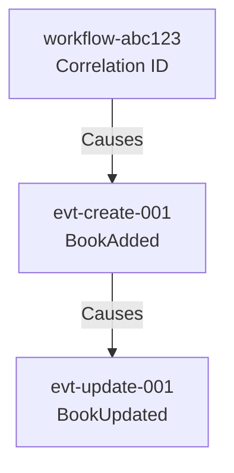
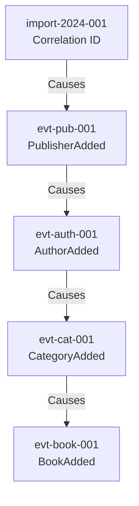

# Causation and Correlation ID Guide

## Overview

The Book Store API implements **causation** and **correlation** IDs for distributed tracing and event chain tracking. This enables you to trace the entire lifecycle of a business transaction across multiple services and events.

## Concepts

### Correlation ID
- **Purpose**: Tracks an entire business transaction from start to finish
- **Scope**: Remains the same throughout the entire workflow
- **Use Case**: Trace all events related to a single user action (e.g., "Create a book with authors and categories")

### Causation ID
- **Purpose**: Tracks the immediate cause of an event
- **Scope**: Changes with each event in the chain
- **Use Case**: Understand what triggered a specific event (e.g., "This projection update was caused by a BookAdded event")

### Event ID
- **Purpose**: Unique identifier for each specific event
- **Scope**: Unique per event
- **Use Case**: Reference a specific event in the event store

## HTTP Headers

### Request Headers

| Header | Description | Required | Example |
|--------|-------------|----------|---------|
| `X-Correlation-ID` | Business transaction identifier | No* | `550e8400-e29b-41d4-a716-446655440000` |
| `X-Causation-ID` | Immediate cause identifier | No* | `660e8400-e29b-41d4-a716-446655440001` |

*If not provided, the system will auto-generate these IDs

### Response Headers

The system automatically echoes the correlation ID in the response headers. If no ID was provided in the request, a new one is generated and returned.

| Header | Description | Example |
|--------|-------------|---------|
| `X-Correlation-ID` | Echo of correlation ID (or generated) | `550e8400-e29b-41d4-a716-446655440000` |

## Event Metadata Structure

Every event in the system includes metadata stored in Marten's dedicated columns and a technical `headers` JSON column:

### Primary Metadata (Columns)
- **CorrelationId**: Tracks the entire business transaction.
- **CausationId**: Tracks the immediate cause (usually the message ID).

### Technical Metadata (Headers Column)
Additional context is stored in the JSON `headers` column for auditability:

```json
{
  "user-id": "550e8400-e29b-41d4-a716-446655440000",
  "remote-ip": "::1",
  "user-agent": "Mozilla/5.0..."
}
```

> [!TIP]
> **Metadata Propagation**: The application implements a propagation system (via `ForwardedHeaders` and `AuthorizationMessageHandler`) that ensures the original browser's IP and User-Agent are preserved even when requests cross boundaries between the Blazor frontend and the backend API.

## Usage Examples

### Example 1: Simple Book Creation

**Request**:
```bash
curl -X POST http://localhost:5000/api/admin/books \
  -H "Content-Type: application/json" \
  -H "X-Correlation-ID: txn-12345" \
  -d '{
    "title": "Clean Code",
    "isbn": "978-0132350884",
    "description": "A handbook of agile software craftsmanship",
    "publisherId": "pub-001",
    "authorIds": ["author-001"],
    "categoryIds": ["cat-001"]
  }'
```

**Response Headers**:
```
X-Correlation-ID: txn-12345
X-Event-ID: evt-67890
```

**Event Stored**:
```json
{
  "eventType": "BookAdded",
  "data": {
    "id": "book-001",
    "title": "Clean Code",
    "metadata": {
      "eventId": "evt-67890",
      "correlationId": "txn-12345",
      "causationId": "txn-12345",  // Same as correlation (root event)
      "timestamp": "2024-12-24T12:00:00Z"
    }
  }
}
```

### Example 2: Event Chain - Update Following Creation

**Step 1: Create Book**
```bash
curl -X POST http://localhost:5000/api/admin/books \
  -H "X-Correlation-ID: workflow-abc123" \
  -H "Content-Type: application/json" \
  -d '{"title": "Domain-Driven Design", ...}'
```

Response: `X-Event-ID: evt-create-001`

**Step 2: Update Book (using previous event as causation)**
```bash
curl -X PUT http://localhost:5000/api/admin/books/book-001 \
  -H "X-Correlation-ID: workflow-abc123" \
  -H "X-Causation-ID: evt-create-001" \
  -H "Content-Type: application/json" \
  -d '{"title": "Domain-Driven Design (Revised)", ...}'
```

Response: `X-Event-ID: evt-update-001`

**Event Chain**:


### Example 3: Distributed Workflow

Imagine a workflow where creating a book triggers multiple operations:

**1. Create Publisher**
```bash
POST /api/admin/publishers
X-Correlation-ID: import-2024-001
```
Response: `X-Event-ID: evt-pub-001`

**2. Create Author**
```bash
POST /api/admin/authors
X-Correlation-ID: import-2024-001
X-Causation-ID: evt-pub-001
```
Response: `X-Event-ID: evt-auth-001`

**3. Create Category**
```bash
POST /api/admin/categories
X-Correlation-ID: import-2024-001
X-Causation-ID: evt-auth-001
```
Response: `X-Event-ID: evt-cat-001`

**4. Create Book**
```bash
POST /api/admin/books
X-Correlation-ID: import-2024-001
X-Causation-ID: evt-cat-001
{
  "publisherId": "...",
  "authorIds": ["..."],
  "categoryIds": ["..."]
}
```
Response: `X-Event-ID: evt-book-001`

**Complete Event Chain**:


## Querying Events by Correlation ID

You can query the Marten event store to find all events related to a correlation ID and inspect their technical headers:

```sql
-- PostgreSQL query in Marten event store
SELECT 
    id,
    stream_id,
    type,
    correlation_id,
    causation_id,
    headers->>'user-id' as user_id,
    headers->>'remote-ip' as remote_ip,
    headers->>'user-agent' as user_agent,
    timestamp
FROM mt_events
WHERE correlation_id = 'import-2024-001'
ORDER BY timestamp;
```

## Best Practices

### 1. Always Propagate Correlation ID
When making multiple related API calls, always use the same correlation ID:
```bash
CORRELATION_ID="workflow-$(date +%s)"

# All related calls use the same correlation ID
curl -H "X-Correlation-ID: $CORRELATION_ID" ...
curl -H "X-Correlation-ID: $CORRELATION_ID" ...
```

### 2. Use Event IDs as Causation IDs
When one operation triggers another, use the previous event ID as the causation ID:
```bash
# First call
RESPONSE=$(curl -i -X POST ... -H "X-Correlation-ID: $CORRELATION_ID")
EVENT_ID=$(echo "$RESPONSE" | grep "X-Event-ID" | cut -d' ' -f2)

# Second call caused by first
curl -H "X-Correlation-ID: $CORRELATION_ID" \
     -H "X-Causation-ID: $EVENT_ID" \
     ...
```

### 3. Generate Meaningful Correlation IDs
Use descriptive correlation IDs for easier debugging:
```bash
# Good
X-Correlation-ID: book-import-2024-12-24-batch-001

# Also good
X-Correlation-ID: user-registration-john-doe-20241224

# Less helpful
X-Correlation-ID: 12345
```

### 4. Log Correlation IDs
Always log correlation IDs in your application logs:
```csharp
logger.LogInformation(
    "Processing book creation. CorrelationId: {CorrelationId}, CausationId: {CausationId}",
    metadata.CorrelationId,
    metadata.CausationId);
```

## Debugging with Correlation IDs

### Scenario: Find all events in a failed workflow

1. **Get the correlation ID** from your application logs or error message
2. **Query the event store**:
   ```sql
   SELECT * FROM mt_events 
   WHERE data->'metadata'->>'correlationId' = 'failed-workflow-123'
   ORDER BY timestamp;
   ```
3. **Analyze the event chain** to find where the workflow failed

### Scenario: Trace projection updates

1. **Find the source event** that triggered a projection update
2. **Use the causation ID** to link back to the original command
3. **Follow the correlation ID** to see the entire business transaction

## Implementation Details

### Middlewares

1. **`MartenMetadataMiddleware`**:
   - Captures `X-Correlation-ID` from headers or generates a new one.
   - Sets `CorrelationId` and `CausationId` on the `IDocumentSession`.
   - Captures `RemoteIpAddress` and `User-Agent`.
   - Sets technical headers on the session.
   - Echoes `X-Correlation-ID` in the response.

2. **`WolverineCorrelationMiddleware`**:
   - Bridges the HTTP-scoped metadata to Wolverine's background handlers.
   - Uses `IHttpContextAccessor` to retrieve the current request's context.

3. **`LoggingEnricherMiddleware`**:
   - Automatically adds `CorrelationId` and `CausationId` to the structured logging scope for every request.

### Blazor Frontend Implementation

The Blazor frontend automatically manages and propagates these IDs using a dedicated service and message handler:

1. **`CorrelationService`**:
   - Stores the current `CorrelationId` (persistent per circuit/session).
   - Manages the `CausationId`, which updates dynamically.

2. **`AuthorizationMessageHandler`**:
   - Automatically injects `X-Correlation-ID` and `X-Causation-ID` headers into all outgoing API requests.
   - Captures `X-Event-ID` from backend responses to update the `CausationId` for subsequent calls.

3. **`BookStoreEventsService`**:
   - Updates the `CorrelationService` with the `EventId` from incoming Server-Sent Events (SSE).
   - Ensures that reactive UI updates and subsequent background data reloads are correctly linked to the event that triggered them.

## Summary

- **Correlation ID**: Tracks the entire business workflow
- **Causation ID**: Tracks immediate event causes
- **Event ID**: Unique identifier for each event
- **Headers**: `X-Correlation-ID`, `X-Causation-ID`, `X-Event-ID`
- **Automatic**: System generates IDs if not provided
- **Propagation**: Always returned in response headers
