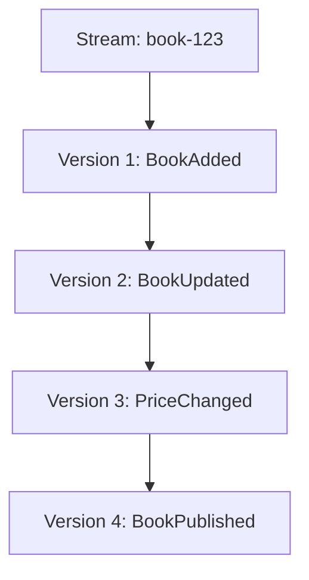
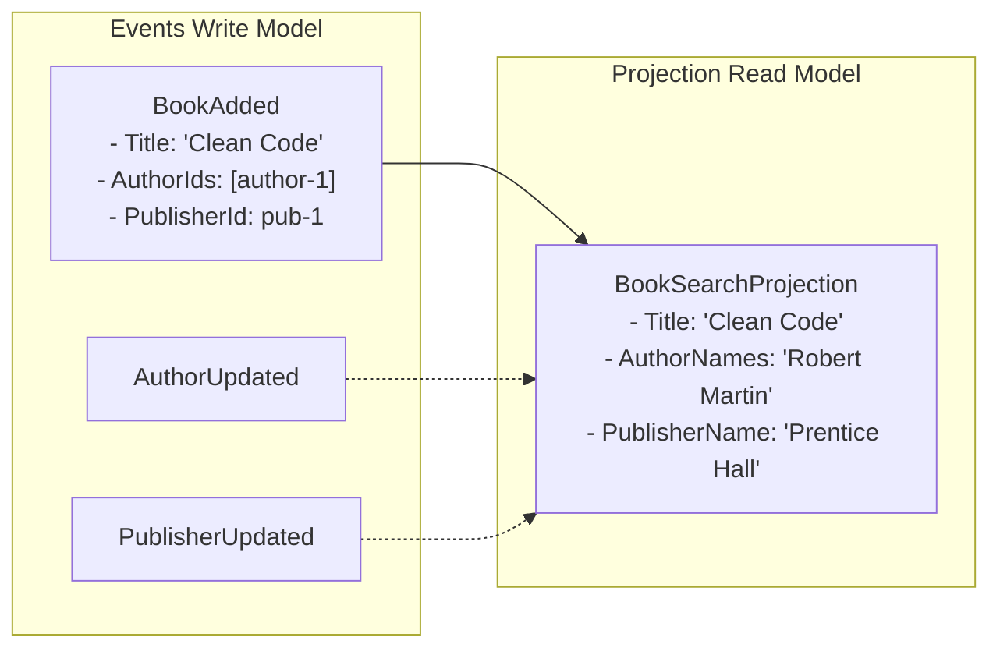

# Event Sourcing Guide

## Overview

**Event Sourcing** is an architectural pattern where state changes are stored as a sequence of immutable events, rather than storing only the current state. This guide explains the concepts, benefits, and implementation patterns used in the Book Store API.

> [!NOTE]
> This guide focuses on event sourcing concepts and patterns. For Marten-specific implementation details, see the [Marten Guide](marten-guide.md).

## What is Event Sourcing?

### Traditional State Storage (CRUD)

In traditional applications, we store the **current state** of entities:

```csharp
// Database: books table
| id  | title       | price | status    |
|-----|-------------|-------|-----------|
| 123 | Clean Code  | 45.00 | published |
```

**Problems**:
- ❌ History is lost when state changes
- ❌ No audit trail of who changed what and when
- ❌ Can't reconstruct past states
- ❌ Difficult to debug issues that happened in the past
- ❌ Can't replay events to test new features

### Event Sourcing Approach

Instead, we store **all changes as events**:

```csharp
// Event Store: mt_events table
| id | stream_id | type           | data                    | timestamp  |
|----|-----------|----------------|-------------------------|------------|
| 1  | book-123  | BookAdded      | {title: "Clean Code"}   | 2025-01-01 |
| 2  | book-123  | PriceChanged   | {price: 45.00}          | 2025-01-02 |
| 3  | book-123  | BookPublished  | {status: "published"}   | 2025-01-03 |
```

**Benefits**:
- ✅ Complete history preserved
- ✅ Full audit trail
- ✅ Can reconstruct any past state
- ✅ Can replay events to debug or test
- ✅ Events are immutable (never modified)

## Core Concepts

### 1. Events

**Events** are immutable records that represent facts that have occurred.

```csharp
namespace BookStore.ApiService.Events;

/// <summary>
/// Event: A book was added to the catalog
/// </summary>
public record BookAdded(
    Guid Id,
    string Title,
    string? Isbn,
    string? Description,
    DateOnly? PublicationDate,
    Guid? PublisherId,
    List<Guid> AuthorIds,
    List<Guid> CategoryIds);
```

**Event Naming**:
- ✅ Use past tense: `BookAdded`, `PriceChanged`, `OrderShipped`
- ❌ Not imperative: `AddBook`, `ChangePrice`, `ShipOrder`
- Events describe **what happened**, not **what to do**

**Event Properties**:
- **Immutable**: Once created, never modified
- **Self-contained**: Include all necessary data
- **Timestamped**: Automatically tracked by Marten
- **Ordered**: Events in a stream have sequential versions

See [Marten Guide - Events](marten-guide.md#events) for implementation details.

### 2. Streams

A **stream** is a sequence of events for a single aggregate instance.



**Stream Properties**:
- Each stream has a unique ID (typically the aggregate ID)
- Events are ordered by version number
- Streams are append-only (events never deleted)
- Stream version increments with each new event

See [Marten Guide - Working with Streams](marten-guide.md#working-with-streams) for stream operations.

### 3. Aggregates

An **aggregate** is a domain object that:
- Enforces business rules
- Builds current state by applying events
- Generates new events from commands

```csharp
public class BookAggregate
{
    // Current state (built from events)
    public Guid Id { get; set; }
    public string Title { get; set; } = string.Empty;
    public decimal Price { get; set; }
    public bool IsPublished { get; set; }
    
    // Apply methods: Rebuild state from events
    void Apply(BookAdded @event)
    {
        Id = @event.Id;
        Title = @event.Title;
        IsPublished = false;
    }
    
    void Apply(PriceChanged @event)
    {
        Price = @event.NewPrice;
    }
    
    void Apply(BookPublished @event)
    {
        IsPublished = true;
    }
    
    // Command methods: Generate new events
    public PriceChanged ChangePrice(decimal newPrice)
    {
        // Business rule: Can't change price of unpublished book
        if (!IsPublished)
            throw new InvalidOperationException("Cannot change price of unpublished book");
        
        // Business rule: Price must be positive
        if (newPrice <= 0)
            throw new ArgumentException("Price must be positive");
        
        return new PriceChanged(Id, Price, newPrice);
    }
}
```

**Aggregate Responsibilities**:
1. **Validate** business rules
2. **Generate** events
3. **Apply** events to update state

See [Marten Guide - Aggregates](marten-guide.md#aggregates) for implementation patterns.

### 4. Projections

**Projections** transform events into read models optimized for queries.



**Projection Types**:
- **Inline**: Updated immediately (slower writes, consistent reads)
- **Async**: Updated asynchronously (faster writes, eventual consistency)
- **Live**: Real-time updates via WebSockets

See [Marten Guide - Projections](marten-guide.md#projections) for projection patterns.

## Event Sourcing Benefits

### 1. Complete Audit Trail

Every change is recorded with:
- What changed (event data)
- When it changed (timestamp)
- Who changed it (correlation ID from user context)
- Why it changed (causation ID from triggering event)

```csharp
// Query all changes to a book
var events = await session.Events.FetchStreamAsync(bookId);

foreach (var evt in events)
{
    Console.WriteLine($"{evt.Timestamp}: {evt.EventType}");
    Console.WriteLine($"  By: {evt.CorrelationId}");
    Console.WriteLine($"  Data: {JsonSerializer.Serialize(evt.Data)}");
}
```

**Use Cases**:
- Compliance and regulatory requirements
- Fraud detection and investigation
- Customer support and debugging
- Performance reviews and analytics

### 2. Time Travel

Reconstruct the state of any aggregate at any point in time:

```csharp
// Get current state
var currentBook = await session.Events
    .AggregateStreamAsync<BookAggregate>(bookId);

// Get state as of specific date
var pastBook = await session.Events
    .AggregateStreamAsync<BookAggregate>(bookId, timestamp: DateTime.Parse("2025-01-15"));

// Get state at specific version
var versionBook = await session.Events
    .AggregateStreamAsync<BookAggregate>(bookId, version: 5);
```

**Use Cases**:
- Debugging production issues
- Analyzing historical trends
- Legal discovery and investigations
- Testing "what-if" scenarios

### 3. Event Replay

Replay events to:
- Build new projections from historical data
- Test new features against real data
- Migrate to new schemas
- Fix bugs in projection logic

```csharp
// Rebuild projection from all historical events
await daemon.RebuildProjectionAsync<BookSearchProjection>(CancellationToken.None);
```

**Use Cases**:
- Add new features without data migration
- Fix bugs in read models
- Test new projection logic
- Create new analytics views

See [Marten Guide - Event Sourcing for Analytics](marten-guide.md#event-sourcing-for-analytics) for analytics patterns.

### 4. Natural Fit for Distributed Systems

Events are:
- **Immutable**: Safe to cache and replicate
- **Self-contained**: No foreign key dependencies
- **Ordered**: Natural causality tracking
- **Publishable**: Easy to integrate with message buses

```csharp
// Publish events to external systems
public class EventPublisher
{
    public async Task PublishEvent(IEvent @event)
    {
        // Publish to Kafka, RabbitMQ, Azure Service Bus, etc.
        await messageBus.PublishAsync(@event.Data);
    }
}
```

**Use Cases**:
- Microservices communication
- Event-driven architectures
- CQRS implementations
- Real-time data synchronization

### 5. Debugging and Testing

Events provide a complete record for debugging:

```csharp
// Find all events that led to an error
var errorContext = await session.Events
    .QueryAllRawEvents()
    .Where(e => e.CorrelationId == errorCorrelationId)
    .OrderBy(e => e.Timestamp)
    .ToListAsync();

// Replay events in test environment
foreach (var evt in errorContext)
{
    await testSession.Events.Append(evt.StreamId, evt.Data);
}
```

**Use Cases**:
- Root cause analysis
- Reproducing production bugs
- Integration testing
- Load testing with real data

## Event Sourcing Patterns

### Pattern 1: Command → Event → State

```
1. User sends command
2. Aggregate validates business rules
3. Aggregate generates event
4. Event is stored in stream
5. Event is applied to aggregate
6. Projection is updated asynchronously
```

**Example**:
```csharp
// 1. Command
public record ChangeBookPrice(Guid BookId, decimal NewPrice);

// 2. Handler validates and generates event
public static async Task<IResult> Handle(
    ChangeBookPrice command,
    IDocumentSession session)
{
    var book = await session.Events
        .AggregateStreamAsync<BookAggregate>(command.BookId);
    
    // 3. Aggregate validates and returns event
    var @event = book.ChangePrice(command.NewPrice);
    
    // 4. Store event
    session.Events.Append(command.BookId, @event);
    
    return Results.NoContent();
}

// 5. Event is applied automatically by Marten
void Apply(PriceChanged @event)
{
    Price = @event.NewPrice;
}

// 6. Projection updates asynchronously
public void Apply(PriceChanged @event, BookSearchProjection projection)
{
    projection.Price = @event.NewPrice;
}
```

See [Wolverine Guide](wolverine-guide.md) for command/handler patterns.

### Pattern 2: Event Versioning

As your system evolves, event schemas may need to change:

```csharp
// V1: Original event
public record BookAddedV1(Guid Id, string Title);

// V2: Added ISBN field
public record BookAddedV2(Guid Id, string Title, string? Isbn);

// Upcaster: Convert V1 to V2
public class BookAddedUpcaster : EventUpcaster<BookAddedV1, BookAddedV2>
{
    public override BookAddedV2 Upcast(BookAddedV1 old)
    {
        return new BookAddedV2(old.Id, old.Title, Isbn: null);
    }
}
```

**Strategies**:
- **Upcasting**: Transform old events to new schema on read
- **Versioned Events**: Keep multiple versions, handle in Apply methods
- **Event Migration**: Replay and rewrite events (rare, use with caution)

### Pattern 3: Snapshots

For aggregates with many events, snapshots improve performance:

```csharp
// Instead of replaying 10,000 events
var book = await session.Events
    .AggregateStreamAsync<BookAggregate>(bookId); // Slow!

// Use snapshot + recent events
var book = await session.Events
    .AggregateStreamAsync<BookAggregate>(
        bookId, 
        fromSnapshot: true); // Fast!
```

**When to Use**:
- Streams with > 100 events
- Frequently accessed aggregates
- Performance-critical operations

**Trade-offs**:
- More storage space
- Snapshot versioning complexity
- Potential consistency issues

> [!NOTE]
> Marten supports automatic snapshots. See [Marten Documentation - Snapshots](https://martendb.io/events/projections/aggregate-projections.html#snapshots).

### Pattern 4: Saga / Process Manager

Coordinate long-running processes across multiple aggregates:

```csharp
public class OrderFulfillmentSaga
{
    public void Apply(OrderPlaced @event)
    {
        // Reserve inventory
        // Charge payment
        // Schedule shipping
    }
    
    public void Apply(PaymentFailed @event)
    {
        // Release inventory
        // Cancel order
    }
}
```

**Use Cases**:
- Multi-step workflows
- Distributed transactions
- Compensation logic
- Business processes

## Event Sourcing Challenges

### 1. Eventual Consistency

**Challenge**: Projections are updated asynchronously, so reads may be slightly stale.

**Solutions**:
- Use inline projections for critical reads
- Return command result immediately (don't wait for projection)
- Design UI to handle eventual consistency
- Use polling or WebSockets for updates

```csharp
// Return immediately after command
public static IResult Handle(CreateBook command, IDocumentSession session)
{
    var @event = BookAggregate.Create(...);
    session.Events.StartStream(command.Id, @event);
    
    // Don't wait for projection - return immediately
    return Results.Created($"/api/books/{command.Id}", new { id = command.Id });
}
```

### 2. Event Schema Evolution

**Challenge**: Events are immutable, but requirements change.

**Solutions**:
- Use upcasters to transform old events
- Design events with optional fields
- Version events explicitly
- Never delete old event types

```csharp
// Design for evolution
public record BookAdded(
    Guid Id,
    string Title,
    string? Isbn,              // Optional from day 1
    Dictionary<string, object>? Metadata = null  // Extensibility
);
```

### 3. Querying Events

**Challenge**: Events are optimized for writes, not complex queries.

**Solutions**:
- Use projections for queries (CQRS)
- Create multiple projections for different query needs
- Use PostgreSQL JSON operators for ad-hoc queries
- Export to data warehouse for complex analytics

```csharp
// Don't query events directly for UI
var books = await session.Query<BookSearchProjection>()  // ✅ Use projection
    .Where(b => b.Title.Contains("Code"))
    .ToListAsync();

// Not this
var events = await session.Events.QueryAllRawEvents()    // ❌ Slow!
    .Where(e => e.Data.ToString().Contains("Code"))
    .ToListAsync();
```

See [Marten Guide - Querying Projections](marten-guide.md#querying-projections) for query patterns.

### 4. Deleting Data (GDPR)

**Challenge**: Events are immutable, but GDPR requires data deletion.

**Solutions**:
- **Soft Delete**: Mark as deleted, don't show in projections
- **Anonymization**: Replace PII with anonymized data
- **Crypto Shredding**: Encrypt events, delete encryption key
- **Stream Archival**: Move stream to separate archive store

```csharp
// Soft delete (preferred)
public record BookSoftDeleted(Guid Id);

// Anonymization (for GDPR)
public async Task AnonymizeUserData(Guid userId)
{
    var events = await session.Events.FetchStreamAsync(userId);
    
    foreach (var evt in events)
    {
        // Replace PII with anonymized data
        await session.Events.Append(userId, new UserAnonymized(userId));
    }
}
```

## Best Practices

### 1. Event Design

- ✅ Use past tense names (`BookAdded`, not `AddBook`)
- ✅ Include all necessary data in the event
- ✅ Make events immutable (`record` types)
- ✅ Add XML documentation explaining business meaning
- ✅ Design for evolution (optional fields, metadata)
- ❌ Don't include computed values (calculate in projections)
- ❌ Don't reference other aggregates (use IDs only)

### 2. Aggregate Design

- ✅ Keep aggregates focused (single responsibility)
- ✅ Validate in command methods, not Apply methods
- ✅ Apply methods should only update state
- ✅ Use static factory methods for creation
- ✅ Keep streams small (< 1000 events per aggregate)
- ❌ Don't load other aggregates in command methods
- ❌ Don't perform I/O in Apply methods

### 3. Projection Design

- ✅ Create separate projections for different queries
- ✅ Denormalize data for query performance
- ✅ Use async projections for scalability
- ✅ Keep projections simple (no business logic)
- ✅ Make projections idempotent (can replay safely)
- ❌ Don't share projections across bounded contexts
- ❌ Don't perform writes in projections

### 4. Testing

```csharp
// Test aggregates with events
[Fact]
public void ChangePrice_WhenPublished_ShouldGenerateEvent()
{
    // Arrange: Build aggregate from events
    var book = new BookAggregate();
    book.Apply(new BookAdded(Guid.NewGuid(), "Clean Code", ...));
    book.Apply(new BookPublished(book.Id));
    
    // Act: Execute command
    var @event = book.ChangePrice(49.99m);
    
    // Assert: Verify event
    Assert.Equal(49.99m, @event.NewPrice);
}

// Test projections with events
[Fact]
public async Task Apply_BookAdded_ShouldCreateProjection()
{
    // Arrange
    var builder = new BookSearchProjectionBuilder();
    var @event = new BookAdded(Guid.NewGuid(), "Clean Code", ...);
    
    // Act
    var projection = await builder.Create(@event, session);
    
    // Assert
    Assert.Equal("Clean Code", projection.Title);
}
```

## Integration with Marten

This project uses **Marten** for event sourcing implementation. Marten provides:

- **Event Store**: PostgreSQL-based event storage
- **Stream Management**: Automatic versioning and concurrency
- **Projections**: Async projection daemon with Wolverine integration
- **Metadata**: Correlation/causation tracking
- **Querying**: LINQ support for events and projections

See the [Marten Guide](marten-guide.md) for complete implementation details.

### Key Marten Features

| Feature | Description | Guide Section |
|---------|-------------|---------------|
| Events | Immutable event records | [Events](marten-guide.md#events) |
| Streams | Event sequences per aggregate | [Working with Streams](marten-guide.md#working-with-streams) |
| Aggregates | Domain objects built from events | [Aggregates](marten-guide.md#aggregates) |
| Projections | Read models from events | [Projections](marten-guide.md#projections) |
| Metadata | Correlation/causation tracking | [Metadata Tracking](marten-guide.md#metadata-tracking) |
| Concurrency | Optimistic locking with ETags | [Optimistic Concurrency](marten-guide.md#optimistic-concurrency) |
| Analytics | Real-time and offline analysis | [Event Sourcing for Analytics](marten-guide.md#event-sourcing-for-analytics) |

## External Resources

### Official Documentation

- **[Marten Documentation](https://martendb.io/)** - Official Marten docs
- **[Marten Event Sourcing](https://martendb.io/events/)** - Event sourcing guide
- **[Marten Projections](https://martendb.io/events/projections/)** - Projection patterns

### Books

- **[Implementing Domain-Driven Design](https://www.oreilly.com/library/view/implementing-domain-driven-design/9780133039900/)** by Vaughn Vernon
- **[Versioning in an Event Sourced System](https://leanpub.com/esversioning)** by Greg Young
- **[Event Sourcing Distilled](https://www.eventstore.com/event-sourcing)** by Event Store

### Articles

- **[Event Sourcing Pattern](https://martinfowler.com/eaaDev/EventSourcing.html)** by Martin Fowler
- **[CQRS Journey](https://docs.microsoft.com/en-us/previous-versions/msp-n-p/jj554200(v=pandp.10))** by Microsoft
- **[Event Sourcing Basics](https://eventstore.com/blog/event-sourcing-basics/)** by Event Store

### Videos

- **[Event Sourcing You are doing it wrong](https://www.youtube.com/watch?v=GzrZworHpIk)** by David Schmitz
- **[CQRS and Event Sourcing](https://www.youtube.com/watch?v=JHGkaShoyNs)** by Greg Young

## Summary

Event Sourcing provides:
- ✅ Complete audit trail of all changes
- ✅ Time travel and historical analysis
- ✅ Event replay for new features
- ✅ Natural fit for distributed systems
- ✅ Powerful analytics capabilities

**Key Concepts**:
1. **Events** = Immutable facts about what happened
2. **Streams** = Ordered sequences of events
3. **Aggregates** = Domain objects built from events
4. **Projections** = Read models optimized for queries

**Trade-offs**:
- More complex than CRUD
- Eventual consistency
- Event schema evolution
- Learning curve

## Next Steps

- **[Marten Guide](marten-guide.md)** - Implementation with Marten
- **[Wolverine Guide](wolverine-guide.md)** - Command/handler pattern
- **[Architecture Overview](architecture.md)** - System design
- **[Getting Started](getting-started.md)** - Setup and running
