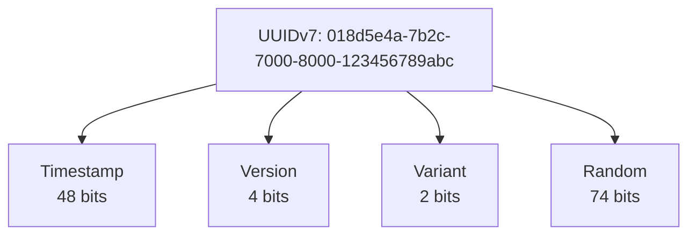

# API Conventions Guide

## Overview

The BookStore API follows strict standards for time handling, JSON serialization, endpoint organization, and error handling to ensure consistency, interoperability, and maintainability.

---

## Endpoint Organization

### Static Class + RouteGroupBuilder Extension Pattern

**Rule**: Each feature area is a `static` class with a single extension method on `RouteGroupBuilder`. Handler methods are `private static` (or `internal static`) named methods below the registration method.

```csharp
public static class BookEndpoints
{
    public static RouteGroupBuilder MapBookEndpoints(this RouteGroupBuilder group)
    {
        _ = group.MapGet("/", SearchBooks)
            .WithName("GetBooks")
            .WithSummary("Get all books");

        _ = group.MapGet("/{id:guid}", GetBook)
            .WithName("GetBook")
            .WithSummary("Get book by ID");

        return group;
    }

    // Handler methods: named, static
    static async Task<Ok<PagedListDto<BookDto>>> SearchBooks(...) { ... }
    static async Task<IResult> GetBook(Guid id, ...) { ... }
}
```

### Route Structure

- **Public API**: `/api/{resource}` — e.g., `/api/books`, `/api/authors`
- **Admin API**: `/api/admin/{resource}` — e.g., `/api/admin/books`, `/api/admin/authors`

Both tiers are wired up in `EndpointMappingExtensions.MapApiEndpoints()`:

```csharp
// Public endpoints
publicApi.MapGroup("/books")
    .WithMetadata(new AllowAnonymousTenantAttribute())
    .MapBookEndpoints()
    .WithTags("Books");

// Admin endpoints (authorization applied inside MapAdminBookEndpoints)
adminApi.MapGroup("/books")
    .MapAdminBookEndpoints()
    .WithTags("Admin - Books");
```

### OpenAPI Metadata Conventions

- `.WithName("...")` — unique operation name, on **every** endpoint
- `.WithSummary("...")` — short description, on **every** endpoint
- `.WithTags("...")` — applied at the **group level** in `EndpointMappingExtensions`, not per endpoint
- `.RequireAuthorization()` — on individual endpoints or entire groups
- `.RequireAuthorization("Admin")` — applied to the admin group as a whole (via `return group.RequireAuthorization("Admin")`)
- `.WithMetadata(new AllowAnonymousTenantAttribute())` — applied to public groups to allow access without requiring a resolved tenant (public read endpoints only)
- `.DisableAntiforgery().Accepts<IFormFile>("multipart/form-data")` — for file upload endpoints

```csharp
_ = group.MapPost("/{id:guid}/cover", UploadCover)
    .WithName("UploadBookCover")
    .WithSummary("Upload book cover image")
    .DisableAntiforgery()
    .Accepts<IFormFile>("multipart/form-data");
```

### API Versioning Setup

Groups are associated with an `ApiVersionSet` built in `MapApiEndpoints`:

```csharp
var apiVersionSet = app.NewApiVersionSet()
    .HasApiVersion(new Asp.Versioning.ApiVersion(1))
    .ReportApiVersions()
    .Build();

var publicApi = app.MapGroup("/api")
    .WithApiVersionSet(apiVersionSet);
```

---

## Parameter Binding

### Binding Sources

| Source | Attribute | Example |
|--------|-----------|---------|
| Route segment | implicit (or `[FromRoute]`) | `Guid id` from `/{id:guid}` |
| Query string object | `[AsParameters]` | `[AsParameters] BookSearchRequest request` |
| Request body (JSON) | `[FromBody]` | `[FromBody] CreateBookRequest request` |
| DI services | `[FromServices]` | `[FromServices] IQuerySession session` |
| Query string single param | `[FromQuery]` | `[FromQuery] string? tenantId` |
| Raw HTTP context | *(direct parameter)* | `HttpContext context` |
| Cancellation | *(direct parameter)* | `CancellationToken cancellationToken` |

### Example: Read Endpoint

```csharp
static async Task<Ok<PagedListDto<BookDto>>> SearchBooks(
    [FromServices] IQuerySession session,
    [FromServices] HybridCache cache,
    [FromServices] ITenantContext tenantContext,
    [AsParameters] BookSearchRequest request,  // query string object
    HttpContext context,
    CancellationToken cancellationToken)
{
    // ...
    return TypedResults.Ok(pagedResult);
}
```

### Example: Write Endpoint

```csharp
static Task<IResult> CreateBook(
    [FromBody] CreateBookRequest request,   // JSON body
    [FromServices] IMessageBus bus,
    [FromServices] ITenantContext tenantContext,
    CancellationToken cancellationToken)
{
    var command = new CreateBook(...);
    return bus.InvokeAsync<IResult>(command,
        new DeliveryOptions { TenantId = tenantContext.TenantId },
        cancellationToken);
}
```

### ETag from Headers

For write operations that require optimistic concurrency, extract the `If-Match` header directly from `HttpContext`:

```csharp
static Task<IResult> UpdateBook(
    Guid id,
    [FromBody] UpdateBookRequest request,
    [FromServices] IMessageBus bus,
    [FromServices] ITenantContext tenantContext,
    HttpContext context,
    CancellationToken cancellationToken)
{
    var etag = context.Request.Headers["If-Match"].FirstOrDefault();
    var command = new UpdateBook(id, ...) { ETag = etag };
    return bus.InvokeAsync<IResult>(command, ...);
}
```

---

## TypedResults and Return Types

### When to Use `Task<Ok<T>>` vs `Task<IResult>`

| Scenario | Return Type |
|----------|-------------|
| Read endpoint with one success response | `Task<Ok<PagedListDto<T>>>` or `Task<Ok<T>>` |
| Read endpoint that may return NotFound | `Task<IResult>` |
| Write endpoint (delegates to Wolverine) | `Task<IResult>` |
| Handler returning error via Result pattern | `IResult` |

**Rule (endpoint handlers)**: Always use `TypedResults.*` (not `Results.*`) in endpoint handler methods — even when the declared return type is `Task<IResult>` — so TypedResults benefits apply where possible.

**Rule (Wolverine handlers)**: Wolverine command handlers return `Task<IResult>` and use `Results.*` for success responses (e.g., `Results.Created`) and `Result.Failure(...).ToProblemDetails()` for all error responses.

### Read Endpoints (single return type)

Use the concrete typed form for single-return-type handlers — this gives automatic OpenAPI schema generation:

```csharp
static async Task<Ok<PagedListDto<AuthorDto>>> GetAuthors(...)
{
    // ...
    return TypedResults.Ok(pagedResult);
}
```

### Read Endpoints (may return NotFound)

Use `Task<IResult>` when the handler may return `NotFound` or needs to attach an `ETag` header. Internally still use `TypedResults.*` for the actual return values. Use the `WithETag()` extension to attach the `ETag` response header:

```csharp
static async Task<IResult> GetAuthor(Guid id, ...)
{
    var author = await LoadAuthorAsync(id, ...);
    if (author is null)
    {
        return TypedResults.NotFound();
    }
    return TypedResults.Ok(author).WithETag(author.ETag!); // WithETag wraps to IResult
}
```

`ETagHelper.PreconditionFailed()` is used in Wolverine handlers when an optimistic concurrency version check fails:

```csharp
var expectedVersion = ETagHelper.ParseETag(command.ETag);
if (expectedVersion.HasValue && aggregate.Version != expectedVersion.Value)
{
    return ETagHelper.PreconditionFailed(); // 412 PreconditionFailed
}
```

### Write Endpoints (Wolverine)

Write endpoints dispatch commands to Wolverine handlers, which return `IResult` directly:

```csharp
// Endpoint: thin dispatch layer
static Task<IResult> CreateBook(
    [FromBody] CreateBookRequest request,
    [FromServices] IMessageBus bus,
    [FromServices] ITenantContext tenantContext,
    CancellationToken cancellationToken)
{
    var command = new CreateBook(...);
    return bus.InvokeAsync<IResult>(command,
        new DeliveryOptions { TenantId = tenantContext.TenantId },
        cancellationToken);
}

// Handler: owns the response
public static async Task<IResult> Handle(
    CreateBook command,
    IDocumentSession session, ...)
{
    if (invalid)
    {
        return Result.Failure(Error.Validation(ErrorCodes.Books.LanguageInvalid, "Invalid language code"))
            .ToProblemDetails();
    }

    // ... persist event ...
    return Results.Created($"/api/admin/books/{command.Id}", new { id = command.Id });
}
```

---

## Time Standards

### Always Use UTC

**Rule**: All timestamps MUST use UTC timezone.

✅ **Correct**:
```csharp
var timestamp = DateTimeOffset.UtcNow;
var eventTime = DateTimeOffset.UtcNow;
```

❌ **Incorrect**:
```csharp
var timestamp = DateTime.Now;           // Local timezone - NEVER use
var eventTime = DateTimeOffset.Now;     // Local timezone - NEVER use
```

### Always Use DateTimeOffset

**Rule**: Use `DateTimeOffset` instead of `DateTime` for all timestamps.

✅ **Correct**:
```csharp
public DateTimeOffset Timestamp { get; set; }
public DateTimeOffset LastModified { get; set; }
```

❌ **Incorrect**:
```csharp
public DateTime Timestamp { get; set; }  // No timezone info - NEVER use
```

### ISO 8601 Format

All date/time values are automatically serialized in **ISO 8601** format:

```json
{
  "timestamp": "2025-12-26T17:16:09.123Z",
  "lastModified": "2025-12-26T17:16:09Z",
  "publicationDate": "2008-08-01"
}
```

**Format Details**:
- `DateTimeOffset`: `YYYY-MM-DDTHH:mm:ss.fffZ` (with milliseconds)
- `DateOnly`: `YYYY-MM-DD`
- Timezone: Always `Z` (UTC)

### Partial Dates

**Rule**: Use `PartialDate` for incomplete dates (e.g., publication year only).

```csharp
public record BookDto(
    string Title,
    PartialDate? PublicationDate // ✅ Can be year, year-month, or full date
);
```

**Capabilities**:
- **Year only**: `2008`
- **Year-Month**: `2008-08`
- **Full Date**: `2008-08-01`

**Client Usage**:
Always check for value before access:
```csharp
if (book.PublicationDate.HasValue)
{
    var year = book.PublicationDate.Value.Year;
    var display = book.PublicationDate.Value.ToDisplayString();
}
```

## JSON Serialization Standards

### camelCase

**Rule**: All JSON properties use camelCase.

```json
{
  "bookId": "018d5e4a-7b2c-7000-8000-123456789abc",
  "title": "Clean Code",
  "publicationDate": "2008-08-01",
  "lastModified": "2025-12-26T17:16:09Z"
}
```

### Enums: String Serialization

**Rule**: Enums are serialized as strings, not integers.

✅ **Correct** (String):
```json
{
  "status": "Active",
  "role": "Administrator",
  "orderStatus": "Shipped"
}
```

❌ **Incorrect** (Integer):
```json
{
  "status": 0,
  "role": 1,
  "orderStatus": 2
}
```

**Benefits**:
- **Readable**: `"Active"` is clearer than `0`
- **Evolvable**: Can reorder enum values without breaking API
- **Self-documenting**: No need to look up enum definitions
- **Debuggable**: Easier to understand logs and database queries

### Configuration

#### ASP.NET Core (API Responses)

Configured in `Program.cs`:
```csharp
builder.Services.ConfigureHttpJsonOptions(options =>
{
    options.SerializerOptions.PropertyNamingPolicy = JsonNamingPolicy.CamelCase;
    options.SerializerOptions.Converters.Add(
        new JsonStringEnumConverter(JsonNamingPolicy.CamelCase));
});
```

#### Marten (Database Storage)

Configured in `Program.cs`:
```csharp
options.UseDefaultSerialization(
    enumStorage: EnumStorage.AsString,
    casing: Casing.CamelCase);
```

---

## Identifier Standards

### UUIDv7 for All IDs

**Rule**: Use `Guid.CreateVersion7()` for all entity identifiers.

✅ **Correct**:
```csharp
public record CreateBook(
    Guid Id, // ✅ Assigned by client (UUIDv7)
    string Title,
    string? Isbn,
    IReadOnlyList<Guid> AuthorIds);

var bookId = Guid.CreateVersion7();
```

❌ **Incorrect**:
```csharp
var bookId = Guid.NewGuid();  // WRONG - creates random UUIDv4
```

**Benefits of UUIDv7**:
- ✅ **Time-ordered**: Naturally sortable by creation time
- ✅ **Database performance**: Better index locality and reduced fragmentation
- ✅ **Distributed systems**: Safe to generate across multiple servers
- ✅ **No collisions**: Globally unique without coordination

**Format**:


> [!NOTE]
> The BookStore project includes a Roslyn analyzer (BS1006) that enforces this convention by flagging any use of `Guid.NewGuid()`.

---

## Type Conventions

### Use Record Types

**Rule**: Use `record` types for immutable data structures (DTOs, commands, events).

✅ **Correct**:
```csharp
// DTOs
// DTOs (in BookStore.Shared.Models)
public record BookDto(
    Guid Id,
    string Title,
    string? Isbn,
    PublisherDto? Publisher,
    IReadOnlyList<AuthorDto> Authors); // ✅ Use IReadOnlyList for collections

// Commands
public record CreateBook(
    Guid Id,
    string Title,
    string? Isbn,
    IReadOnlyList<Guid> AuthorIds); // ✅ Use IReadOnlyList for collections

// Events
public record BookAdded(
    Guid Id,
    string Title,
    DateTimeOffset Timestamp);
```

❌ **Incorrect**:
```csharp
// WRONG - using class for immutable data
public class BookDto
{
    public Guid Id { get; set; }
    public string Title { get; set; }
}
```

**Benefits**:
- ✅ **Immutability**: Value-based equality by default
- ✅ **Concise**: Less boilerplate code
- ✅ **Thread-safe**: Immutable objects are inherently thread-safe
- ✅ **Event sourcing**: Perfect for immutable events

### Nullable Reference Types

**Rule**: Enable nullable reference types and use `?` for optional values.

✅ **Correct**:
```csharp
public record BookDto(
    Guid Id,
    string Title,           // Required
    string? Isbn,           // Optional
    string? Description,    // Optional
    PublisherDto? Publisher // Optional
);
```

❌ **Incorrect**:
```csharp
public record BookDto(
    Guid Id,
    string Title,
    string Isbn,        // WRONG - should be string? if optional
    string Description  // WRONG - should be string? if optional
);
```

**Configuration**:
```xml
<!-- In .csproj -->
<PropertyGroup>
  <Nullable>enable</Nullable>
</PropertyGroup>
```

---

## Pagination Standards

### PagedListDto Structure

**Rule**: Use consistent pagination response format.

```csharp
public record PagedListDto<T>(
    IReadOnlyList<T> Items,
    long PageNumber,
    long PageSize,
    long TotalItemCount)
{
    public long PageCount { get; init; } = 
        (long)double.Ceiling(TotalItemCount / (double)PageSize);
    public bool HasPreviousPage { get; init; } = PageNumber > 1;
    public bool HasNextPage { get; init; } = 
        PageNumber < (long)double.Ceiling(TotalItemCount / (double)PageSize);
}
```

**JSON Response**:
```json
{
  "items": [
    { "id": "...", "title": "Clean Code" },
    { "id": "...", "title": "Design Patterns" }
  ],
  "pageNumber": 1,
  "pageSize": 20,
  "totalItemCount": 42,
  "pageCount": 3,
  "hasPreviousPage": false,
  "hasNextPage": true
}
```

### Pagination Query Parameters

**Rule**: Use `page` and `pageSize` query parameters.

```
GET /api/books?page=2&pageSize=20&search=architecture
```

**Default Values**:
- `page`: 1
- `pageSize`: 20 (configurable via `PaginationOptions`)

---

## Request Cancellation Standards

### Propagate CancellationToken

**Rule**: All async API endpoints and handlers MUST accept and propagate `CancellationToken`.

✅ **Correct**:
```csharp
static async Task<Ok<BookDto>> GetBook(
    Guid id,
    [FromServices] IDocumentStore store,
    CancellationToken cancellationToken) // ✅ Accepted
{
    await using var session = store.QuerySession();
    var book = await session.LoadAsync<BookProjection>(id, cancellationToken); // ✅ Propagated
    return TypedResults.Ok(book);
}
```

❌ **Incorrect**:
```csharp
static async Task<Ok<BookDto>> GetBook(
    Guid id,
    [FromServices] IDocumentStore store) // ❌ Missing parameter
{
    await using var session = store.QuerySession();
    var book = await session.LoadAsync<BookProjection>(id); // ❌ Not propagated
    return TypedResults.Ok(book);
}
```

**Benefits**:
- ✅ **Resource Hygiene**: Frees up database connections and memory immediately when a client disconnects.
- ✅ **Responsiveness**: Prevents ghost processes from consuming CPU for abandoned requests.
- ✅ **Throughput**: Improves overall system capacity under load.

---

## HTTP Header Standards

### Standard Headers

The API uses the following standard headers:

#### Request Headers

| Header | Required | Description | Example |
|--------|----------|-------------|---------|
| `Accept-Language` | No | Preferred language for localized content | `pt-PT`, `en-US` |
| `If-None-Match` | No | ETag for conditional requests (caching) | `"5"` |
| `If-Match` | **Yes*** | ETag for optimistic concurrency control | `"5"` |

*\* Mandatory for all write operations (PUT, DELETE, Restore). Missing header results in 428 Precondition Required.*

#### Response Headers

| Header | Description | Example |
|--------|-------------|---------|
| `ETag` | Entity version for caching and concurrency | `"5"` |
| `Cache-Control` | Caching directives | `private, max-age=60` |

### Custom Headers

#### Correlation and Causation IDs

**Rule**: Use `X-Correlation-ID` and `X-Causation-ID` for distributed tracing.

```http
POST /api/admin/books
X-Correlation-ID: workflow-123
X-Causation-ID: user-action-456
Content-Type: application/json

{
  "title": "Clean Code",
  ...
}
```

**Behavior**:
- If `X-Correlation-ID` is not provided, the API generates a new UUIDv7
- The API echoes back the correlation ID in the response
- All events in the event store are tagged with correlation and causation IDs

**Benefits**:
- ✅ **Traceability**: Track requests across services
- ✅ **Debugging**: Correlate logs and events
- ✅ **Auditing**: Understand cause-and-effect relationships

---

## API Versioning

### Header-Based Versioning

**Rule**: Use `api-version` header for API versioning.

```http
GET /api/books
api-version: 1.0
```

**Current Version**: `1.0`

**Benefits**:
- ✅ **Clean URLs**: No version in the path
- ✅ **Flexible**: Can version individual endpoints
- ✅ **Backward compatible**: Defaults to latest version

---

## Localization Standards

### Supported Languages

The API supports multiple languages as configured in `appsettings.json`.
    
Example configuration:
```json
"Localization": {
  "DefaultCulture": "en",
  "SupportedCultures": ["pt", "en", "fr", "de", "es"]
}
```

### Accept-Language Header

**Rule**: Use `Accept-Language` header for localized content.

```http
GET /api/categories
Accept-Language: pt-PT
```

**Response**:
```json
{
  "items": [
    { "id": "...", "name": "Ficção" },
    { "id": "...", "name": "Mistério" }
  ]
}
```

### Fallback Strategy

The API uses a **5-step fallback** strategy via `LocalizationHelper`:

1.  **Exact culture match** - e.g., "pt-PT"
2.  **Two-letter user culture** - e.g., "pt" from "pt-PT"
3.  **Default culture** - configured in `LocalizationOptions`
4.  **Two-letter default culture** - e.g., "en" from "en-US"
5.  **Fallback value** - empty string or "Unknown"

This ensures users always see content, even if their preferred language isn't available.

### Implementation

Translations are stored in `Dictionary<string, string>` properties within projection documents:

```csharp
public class CategoryProjection
{
    public Dictionary<string, string> Names { get; set; } = [];
}
```

Endpoints use `LocalizationHelper` to extract the correct translation:

```csharp
var localizedName = LocalizationHelper.GetLocalizedValue(
    category.Names, 
    culture, 
    defaultCulture, 
    "Unknown");
```

See the [Localization Guide](localization-guide.md) for complete details.

---

## Error Handling Standards

### Result Pattern

**Rule**: Use the `Result` pattern for domain logic and validation. Avoid exceptions for control flow.

The `Result` and `Result<T>` types (in `BookStore.Shared`) encapsulate success/failure state and error details.

✅ **Correct**:
```csharp
public Result<BookAdded> CreateEvent(...)
{
    if (invalid)
    {
        return Result.Failure<BookAdded>(Error.Validation("ERR_CODE", "Message"));
    }
    return new BookAdded(...);
}
```

❌ **Incorrect**:
```csharp
public BookAdded CreateEvent(...)
{
    if (invalid)
    {
        throw new DomainException("Message"); // Avoid exceptions
    }
    return new BookAdded(...);
}
```

### Problem Details (RFC 7807)

**Rule**: All error responses use the Problem Details format (RFC 7807), mapped from `Result` errors.

Use `result.ToProblemDetails()` extension method (defined in `ResultExtensions`) in handlers to automatically map errors to `IResult`:

- `ErrorType.Validation` → `400 Bad Request`
- `ErrorType.NotFound` → `404 Not Found`
- `ErrorType.Conflict` → `409 Conflict`
- `ErrorType.Unauthorized` → `401 Unauthorized`
- `ErrorType.Forbidden` → `403 Forbidden`
- `ErrorType.InternalServerError` / `ErrorType.Failure` → `500 Internal Server Error`

Rate-limit rejections use the same RFC 7807 structure with `429 Too Many Requests`:

```json
{
    "type": "https://tools.ietf.org/html/rfc6585#section-4",
    "title": "Too Many Requests",
    "status": 429,
    "detail": "Rate limit exceeded. Please retry after the specified duration.",
    "error": "ERR_AUTH_RATE_LIMIT_EXCEEDED",
    "retryAfter": 12.5
}
```

#### Standard Error Response Format

```json
{
  "type": "https://tools.ietf.org/html/rfc7231#section-6.5.1",
  "title": "Bad Request",
  "status": 400,
  "detail": "The language code 'xx' is not valid.",
  "error": "ERR_BOOK_LANGUAGE_INVALID"
}
```

> [!NOTE]
> The `error` field is a top-level extension member of the RFC 7807 document (not nested under an `extensions` object). This is how `Results.Problem(extensions: ...)` serializes the dictionary entries.

### Global Exception Handler

**Rule**: Unhandled exceptions are caught by a global handler and returned as `500 Internal Server Error` Problem Details with code `ERR_INTERNAL_ERROR`.

---

## Tenant Information

### Multi-Tenancy Strategy

The application uses a **fixed-per-tenant** strategy for database schemas (Marten) and logical isolation for other resources.

### Tenant Identification

**Rule**: Tenants are identified via the `X-Tenant-ID` header.

```http
GET /api/books
X-Tenant-ID: default
```

- **Development**: Defaults to `default` if missing.
- **Production**: Required for all tenant-specific endpoints.

### Tenant Context

In code, inject `ITenantContext` to access the current tenant:

```csharp
public static async Task<IResult> GetBooks(
    [FromServices] ITenantContext tenant,
    ...)
{
    var tenantId = tenant.TenantId;
    // ...
}
```

---

## Validation


### Creating Events

Always use `DateTimeOffset.UtcNow` for event timestamps:

```csharp
public static BookAdded Create(Guid id, string title, ...)
{
    return new BookAdded(
        id,
        title,
        ...,
        DateTimeOffset.UtcNow  // ✅ Always UTC
    );
}
```

### Storing Timestamps

Use `DateTimeOffset` for all timestamp properties:

```csharp
public record BookAdded(
    Guid Id,
    string Title,
    DateTimeOffset Timestamp  // ✅ DateTimeOffset with UTC
);
```

### Querying by Time

Use `DateTimeOffset.UtcNow` for time-based queries:

```csharp
var recentBooks = await session.Query<BookSearchProjection>()
    .Where(b => b.LastModified > DateTimeOffset.UtcNow.AddDays(-7))
    .ToListAsync();
```

---

## Benefits

### UTC Timezone
- ✅ No timezone conversion errors
- ✅ Consistent across all servers
- ✅ Works globally without confusion
- ✅ Simplifies distributed systems

### ISO 8601 Format
- ✅ Universal standard (RFC 3339)
- ✅ Sortable as strings
- ✅ Human-readable
- ✅ Supported by all platforms

### UUIDv7
- ✅ Time-ordered for better performance
- ✅ Database index optimization
- ✅ Natural sorting by creation time
- ✅ Distributed generation without conflicts

### Record Types
- ✅ Immutability by default
- ✅ Value-based equality
- ✅ Less boilerplate code
- ✅ Perfect for DTOs and events

### Enum Strings
- ✅ Self-documenting APIs
- ✅ Safe enum reordering
- ✅ Easier debugging
- ✅ Better database queries

### camelCase
- ✅ JavaScript/TypeScript convention
- ✅ Consistent with web standards
- ✅ Better readability in JSON

---

## Common Pitfalls

### ❌ Using DateTime.Now
```csharp
var timestamp = DateTime.Now;  // WRONG - uses local timezone
```

### ❌ Using DateTime instead of DateTimeOffset
```csharp
public DateTime Timestamp { get; set; }  // WRONG - no timezone info
```

### ❌ Using Guid.NewGuid()
```csharp
var id = Guid.NewGuid();  // WRONG - creates random UUIDv4
```

### ❌ Using classes for DTOs
```csharp
public class BookDto  // WRONG - should use record
{
    public Guid Id { get; set; }
}
```

### ❌ Manual date formatting
```csharp
var dateStr = date.ToString("yyyy-MM-dd");  // WRONG - use serialization
```

### ❌ Integer enum serialization
```csharp
// WRONG - will serialize as integer without configuration
public enum Status { Active, Inactive }
```

### ❌ Not using nullable reference types
```csharp
public record BookDto(
    string Isbn  // WRONG - should be string? if optional
);
```

---

## Validation

### Unit Tests

Test JSON serialization format:

```csharp
[Test]
public async Task DateTimeOffset_Should_Serialize_As_ISO8601()
{
    var obj = new { timestamp = DateTimeOffset.UtcNow };
    var json = JsonSerializer.Serialize(obj);
    
    // Should match ISO 8601 format: "2025-12-26T17:16:09.123Z"
    await Assert.That(json).Matches(@"\d{4}-\d{2}-\d{2}T\d{2}:\d{2}:\d{2}(\.\d+)?Z");
}

[Test]
public async Task Enum_Should_Serialize_As_String()
{
    var obj = new { status = Status.Active };
    var json = JsonSerializer.Serialize(obj);
    
    await Assert.That(json).Contains("\"Active\"");
    await Assert.That(json).DoesNotContain("0");
}

[Test]
public async Task Guid_Should_Be_Version7()
{
    var id = Guid.CreateVersion7();
    var bytes = id.ToByteArray();
    
    // Version 7 has version bits set to 0111
    await Assert.That((bytes[7] & 0xF0) >> 4).IsEqualTo(7);
}
```

---

## Summary

**Golden Rules**:
1. ✅ Always use `DateTimeOffset.UtcNow` (never `DateTime.Now`)
2. ✅ Always use `DateTimeOffset` type (never `DateTime`)
3. ✅ Always use `Guid.CreateVersion7()` (never `Guid.NewGuid()`)
4. ✅ Always use `record` types for DTOs, commands, and events
5. ✅ ISO 8601 format is automatic (don't format manually)
6. ✅ Enums serialize as strings (configured globally)
7. ✅ JSON properties use camelCase (configured globally)
8. ✅ Use nullable reference types (`string?` for optional values)
9. ✅ Use `X-Correlation-ID` and `X-Causation-ID` for tracing
10. ✅ Use `Accept-Language` header for localization
11. ✅ Use Problem Details (RFC 7807) for error responses
12. ✅ Propagate `CancellationToken` in all async methods

These standards ensure the API is:
- **Consistent**: Same format everywhere
- **Interoperable**: Works with all clients
- **Maintainable**: Easy to understand and debug
- **Scalable**: Works across timezones and regions
- **Performant**: Optimized for databases and distributed systems
