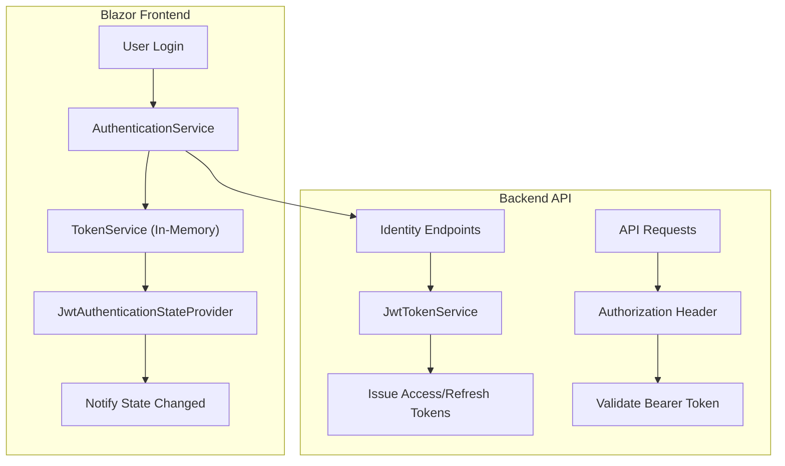

# Authentication Guide

This guide covers the authentication and authorization system in the BookStore application. The system uses a **JWT-based architecture** where the Blazor Server frontend acts as a client to the backend API, storing tokens in memory for security.

## Architecture

The system uses a pure **Token-Based** approach to unify the auth model for web, mobile, and third-party clients.

### Authentication Flow



### Key Components

#### Frontend (Blazor Server)
- **`AuthenticationService`**: High-level service for Login, Register, and Logout operations.
- **`TokenService`**: Stores Access and Refresh tokens in **Scoped Memory** (per user session).
    - *Security Note*: Tokens are **NOT** stored in LocalStorage or Cookies to prevent XSS attacks.
    - Tokens persist only for the lifetime of the user's session (browser tab).
- **`JwtAuthenticationStateProvider`**: Custom provider that:
    - Reads tokens from `TokenService`.
    - Parses JWT claims to set the user's `AuthenticationState`.
    - Automatically handles **Silent Refresh** when the access token is close to expiry.

#### Backend (API)
- **`JwtTokenService`**: Central service for generating access tokens, rotating refresh tokens, and building standardized user claims (supports `HS256` by default and optional `RS256` signing).
- **`JwtAuthenticationEndpoints`**:
    - `POST /account/login`: Exchange credentials for tokens.
    - `POST /account/resend-verification`: Returns a generic success payload to avoid account enumeration; validation failures (for example, missing email) return RFC7807 `ProblemDetails` with a machine-readable error code.
    - `POST /account/refresh-token`: Exchange refresh token for new access token (with automatic rotation).
- **`MartenUserStore`**: Custom Identity store implementing `IUserSecurityStampStore`, `IUserLockoutStore`, and `IUserTwoFactorStore` for full Identity compatibility.
- **Passkey Integration**: Passkey login flow (`/account/assertion/result`) also results in the issuance of standard JWTs, making the frontend agnostic to *how* the user logged in.
    Passkey registration flow (`/account/attestation/result`) returns generic attestation failure messages to clients and keeps detailed failure diagnostics in server logs.
    During passkey assertion, lookup (`FindByPasskeyIdAsync`) validates that the active Marten session tenant matches the request tenant context as a defense-in-depth tenant-isolation invariant.

### JWT Signing Key Requirements

- **HS256 minimum secret length**: `Jwt:SecretKey` must be at least **32 bytes** when encoded as UTF-8.
- Startup validation enforces this rule for HS256 configuration.
- `JwtTokenService` also enforces this rule when creating signing credentials as a defense-in-depth guard.
- In production, the development placeholder secret remains blocked even if it satisfies length requirements.
- **Production recommendation**: Use `RS256` with a managed asymmetric key pair (for example, Azure Key Vault-backed key material). `HS256` is still supported for compatibility, but startup now emits a warning when a non-development environment uses `HS256`.

### Tenant Admin Seeding Password

- Tenant admin seeding now requires an explicit password outside Development/Test contexts.
- Configure a default seed password with `Seeding:AdminPassword` (or the environment variable `Seeding__AdminPassword`) when startup seeding is enabled.
- In Development/Test only, if no explicit password is provided, the legacy fallback `Admin123!` is still used to keep local and automated test flows deterministic.
- For CI, staging, and production environments, always provide `Seeding__AdminPassword` through your secret store or deployment pipeline variables.

### Email Delivery Startup Guard

- Startup configuration validation now blocks `Email:DeliveryMethod=None` outside Development.
- This allows local development flows that skip email delivery while failing fast in Test, Staging, and Production if email delivery is disabled.
- Use `Email:DeliveryMethod=Logging` for non-delivery diagnostics or `Email:DeliveryMethod=Smtp` for real delivery in non-development environments.

Example configuration:

```json
{
    "Seeding": {
        "Enabled": true,
        "AdminPassword": "ChangeThisForYourEnvironment!"
    }
}
```

## Multi-Tenancy Security

Authentication is tightly integrated with multi-tenancy to prevent cross-tenant access.

### Tenant Claims in JWT

Every JWT access token includes a `tenant_id` claim:
```json
{
  "sub": "user-guid",
  "email": "user@example.com",
  "tenant_id": "acme",
  "role": "Admin"
}
```

### Token Rotation & Security

Refresh tokens follow a strict rotation policy:
- **Single-session enforcement on login**: Successful password and passkey logins clear all previously issued refresh tokens before issuing a new one.
- **Rotation**: A new refresh token is issued every time an access token is refreshed. The old token is marked as used (not deleted) to enable replay detection.
- **History**: The latest active tokens plus recently-used ones (within 24 hours) are retained per user for security/concurrency balance.
- **Tenant Context**: Refresh tokens store their originating tenant for defense-in-depth.
- **Security Stamp Snapshot**: Each refresh token captures the user's security stamp at issuance. If the user's stamp has since changed (e.g., password reset), the token is rejected.
- **Token Families**: Each login session starts a new *token family* (`FamilyId`). Replaying a used token invalidates all tokens in that family (refresh token theft detection).

Single-session enforcement is verified by integration tests for both login mechanisms:
- `AuthTests.Login_ShouldInvalidatePreviousRefreshTokens`
- `PasskeySecurityTests.PasskeyLogin_ClearsAllExistingRefreshTokens`

```csharp
public record RefreshTokenInfo(
    string Token,           // SHA-256 hash of the raw token (never stored in plaintext)
    DateTimeOffset Expires,
    DateTimeOffset Created,
    string TenantId,        // Prevents cross-tenant token usage
    string SecurityStamp,   // Snapshot at issuance for replay detection
    string FamilyId,        // Groups related tokens for theft detection
    bool IsUsed = false);   // Marked true after rotation, kept for replay detection
```

### Refresh Token Hashing

Refresh tokens are **never stored in plaintext**. The raw token is issued to the client once, then immediately hashed before persistence.

```csharp
// Generate a cryptographically secure raw token (64 random bytes)
public string GenerateRefreshToken()
{
    var randomBytes = new byte[64];
    using var rng = RandomNumberGenerator.Create();
    rng.GetBytes(randomBytes);
    return Convert.ToBase64String(randomBytes);
}

// Compute a deterministic SHA-256 hash for storage and lookup
public string HashRefreshToken(string refreshToken)
{
    var tokenBytes = Encoding.UTF8.GetBytes(refreshToken);
    var hash = SHA256.HashData(tokenBytes);
    return Convert.ToHexString(hash);
}
```

All lookups (login, token refresh, logout) hash the incoming plaintext value before querying stored tokens. A database compromise exposes only hashes — the raw tokens cannot be recovered.

Refresh token validation uses a tenant-first lookup path:
- First query the current tenant context for the refresh token hash.
- Only if not found, perform a cross-tenant fallback lookup for theft-detection handling.

This keeps the common path scoped and fast while preserving cross-tenant security checks.

### Security Stamp Validation

`MartenUserStore` implements `IUserSecurityStampStore`. Every JWT access token must include a `security_stamp` claim. On each authenticated API request the `OnTokenValidated` handler enforces claim presence and verifies the token's stamp still matches the current value in the database:

```csharp
OnTokenValidated = async context =>
{
    var cache = context.HttpContext.RequestServices.GetRequiredService<HybridCache>();
    // ...
    var currentSecurityStamp = await cache.GetOrCreateAsync(
        key: SecurityStampCache.GetCacheKey(tenantId, userGuid),
        factory: async ct =>
        {
            var user = await session.Query<ApplicationUser>()
                .FirstOrDefaultAsync(u => u.Id == userGuid, ct);
            return user?.SecurityStamp ?? "__missing__";
        },
        options: SecurityStampCache.CreateEntryOptions(),  // 30 s L2 / 15 s L1
        tags: [SecurityStampCache.GetCacheTag(tenantId, userGuid)]);

    if (currentSecurityStamp == "__missing__")  // User deleted
        context.Fail("User not found.");
    if (string.IsNullOrEmpty(tokenSecurityStamp))
        context.Fail("Token missing required security stamp claim.");
    else if (tokenSecurityStamp != currentSecurityStamp)
        context.Fail("Token has been revoked due to security stamp change.");
};
```

The entire handler body is wrapped in a `try/catch`. Any unexpected exception (e.g., transient database error, cache failure) is caught, logged at `Error` level, the `ClaimsPrincipal` is cleared, and `context.Fail("Authentication failed.")` is called. This ensures the exception is never silently swallowed or allowed to propagate as an unhandled middleware exception.

The stamp is cached with a **30 s L2 / 15 s L1 TTL** (intentionally short) to avoid a database round-trip on every request. The cache is tag-invalidated immediately after any security event:

Tokens missing `security_stamp` are rejected with `401 Unauthorized`.

| Event | Invalidation trigger |
|---|---|
| Password change | `JwtAuthenticationEndpoints.ChangePasswordAsync` |
| Password removed | `JwtAuthenticationEndpoints.RemovePasswordAsync` |
| Password added | `JwtAuthenticationEndpoints.AddPasswordAsync` |
| Passkey added | `PasskeyEndpoints` attestation result handler |
| Passkey deleted | `PasskeyEndpoints` delete handler |

- **Security Stamp**: `MartenUserStore` implements `IUserSecurityStampStore`, allowing global token invalidation (e.g., on password change).

### Clock Skew Tolerance

JWT access token validation uses a **30-second** clock skew tolerance:

```csharp
ClockSkew = TimeSpan.FromSeconds(30)
```

This keeps validation strict while avoiding false 401 responses from minor client/server clock drift.

### Cross-Tenant Protection

`TenantSecurityMiddleware` blocks requests where the JWT's `tenant_id` differs from the `X-Tenant-ID` header:
- **Mismatch detected**: Returns `403 Forbidden`
- **Refresh endpoint**: Validates stored token's tenant matches request tenant

## Authentication Methods

### 1. Password Authentication

Standard email/password login flow.

**Endpoint**: `POST /account/login`
**Request**: `{ "email": "...", "password": "..." }`
**Response**:
```json
{
  "tokenType": "Bearer",
  "accessToken": "ey...",
  "expiresIn": 3600,
  "refreshToken": "..."
}
```

Password validation limits:
- **Maximum length**: 128 characters.
- **Reason**: Mitigates oversized-input DoS risk while still allowing long passphrases.
- **Boundary behavior**: 128 characters is valid; 129 characters is invalid.
- **Validation message**: "At most 128 characters".

### 2. Passkey Authentication (Passwordless)

The application supports WebAuthn/FIDO2 for passwordless login. This flow is fully integrated with the JWT system.

**Flow**:
1.  Frontend gets assertion options (`/account/assertion/options`).
2.  User authenticates with FaceID/TouchID.
3.  Frontend sends assertion to `/account/assertion/result`.
4.  **Backend issues JWT tokens** just like a password login.

See [Passkey Guide](passkey-guide.md) for implementation details.

## State Management & Re-Authentication

### In-Memory Token Storage
We store tokens in a Scoped service (`TokenService`). This means:
- **Pros**: Immune to XSS — malicious JavaScript running in the browser cannot access service memory.
- **Cons**: User is logged out if they refresh the page (F5) or the Blazor circuit is recreated.

This is the intentional, final design for Blazor Server. Because all code (including `TokenService`) executes server-side, tokens are never serialised to the browser — not even as HttpOnly cookies. Refreshing the page requires re-login, which is an acceptable trade-off for high-security applications.

### Authorization Headers
All outgoing HTTP requests to the API are intercepted by `AuthorizationMessageHandler`, which attaches the Bearer token:

```csharp
protected override async Task<HttpResponseMessage> SendAsync(HttpRequestMessage request, CancellationToken cancellationToken)
{
    var token = await _tokenService.GetAccessTokenAsync();
    if (!string.IsNullOrEmpty(token))
    {
        request.Headers.Authorization = new AuthenticationHeaderValue("Bearer", token);
    }
    return await base.SendAsync(request, cancellationToken);
}
```

## Authorization

Role-based authorization is enforced via standard ASP.NET Core policies.

### Roles
- **Admin**: Full access to management endpoints.
- **User**: Standard access (can manage own profile/orders).

### Backend Enforcement
Endpoints are protected using the `[Authorize]` attribute or `.RequireAuthorization()` extension method.

```csharp
app.MapPost("/api/admin/books", ...)
   .RequireAuthorization("Admin");
```

## User Model (`ApplicationUser`)

Users are stored in **Marten** (PostgreSQL) as JSON documents, scoped per tenant.

```csharp
```csharp
public class ApplicationUser
{
    public Guid Id { get; set; }
    public string Email { get; set; }
    public string PasswordHash { get; set; }
    public string SecurityStamp { get; set; }   // Rotated on every security event
    public bool LockoutEnabled { get; set; }
    public DateTimeOffset? LockoutEnd { get; set; }
    public int AccessFailedCount { get; set; }
    public ICollection<string> Roles { get; set; }
    public IList<RefreshTokenInfo> RefreshTokens { get; set; }  // Hashed tokens only
    public IList<UserPasskeyInfo> Passkeys { get; set; }
}
```

## Rate Limiting

To protect against abuse and Denial of Service (DoS) attacks, all authentication endpoints are protected by the **AuthPolicy**.

- **Partition key**: `tenantId:clientIp`.
    - Uses resolved tenant context plus caller IP address.
    - Does **not** use request-body fields (for example, `email`) for partitioning.
    - This prevents attackers from bypassing throttles by rotating email values.
- **Limit**: Configurable via auth-specific settings:
    - `RateLimit:AuthPermitLimit`
    - `RateLimit:AuthWindowSeconds`
    - `RateLimit:AuthQueueLimit`
- **Scope**: Applied globally to all endpoint in the `/account` group (Login, Register, Passkeys, etc.).
- **Response**: `429 Too Many Requests` when exceeded.

The policy remains tenant-aware while preserving anonymity-safe behavior: responses do not expose whether a specific email exists, and throttling is enforced at the tenant+IP boundary.

## Related Guides

- [Multi-Tenancy Guide](multi-tenancy-guide.md)
- [Passkey Guide](passkey-guide.md)
- [API Conventions](api-conventions-guide.md)
- [Marten Guide](marten-guide.md)
