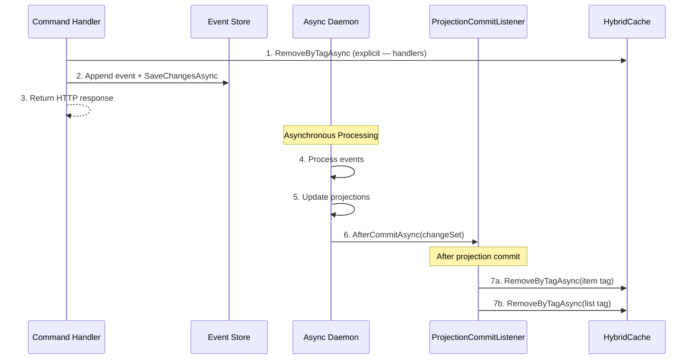

# Caching Guide

This guide explains how to configure and use caching in the BookStore API, specifically focusing on the hybrid caching strategy integrated with Aspire and localization.

## Overview

The BookStore API uses **Hybrid Caching** (`HybridCache`), enriched by **Aspire** for seamless distributed cache orchestration.

**Components:**
- **L1 Cache (In-Memory)**: Local, fast access per instance
- **L2 Cache (Distributed)**: Redis, orchestrated by Aspire, shared across instances
- **Stampede Protection**: Built-in request coalescing prevents cache stampedes
- **Localization Awareness**: Automatically scopes cache keys to the user's UI culture

## Configuration

### Aspire Orchestration

The caching infrastructure is automatically wired up by Aspire.

1.  **AppHost**: Declares the Redis resource using the `ResourceNames.Cache` constant.
    ```csharp
    var cache = builder.AddRedis(ResourceNames.Cache);
    builder.AddProject<Projects.BookStore_ApiService>("apiservice")
           .WithReference(cache)
           .WaitFor(cache);
    ```

2.  **API Service**: Redis is registered as the L2 distributed cache via Aspire service discovery. `AddHybridCache` layers L1 on top.
    ```csharp
    // In Program.cs — L2 distributed cache backed by Redis
    builder.AddRedisDistributedCache(ResourceNames.Cache);

    // In ApplicationServicesExtensions.cs — registers HybridCache (L1 + L2)
    services.AddHybridCache();
    ```

## CacheTags Constants

All cache tags and their item-tag helpers live in `Infrastructure/CacheTags.cs`. **Always use these constants** — never inline raw tag strings — so invalidation sites and read sites stay in sync.

```csharp
public static class CacheTags
{
    // Category tags
    public const string CategoryItemPrefix = "category";
    public const string CategoryList = "categories";

    // Book tags
    public const string BookItemPrefix = "book";
    public const string BookList = "books";

    // Author tags
    public const string AuthorItemPrefix = "author";
    public const string AuthorList = "authors";

    // Publisher tags
    public const string PublisherItemPrefix = "publisher";
    public const string PublisherList = "publishers";

    // Security stamp tags
    public const string SecurityStampPrefix = "security-stamp";

    /// <summary>Creates a cache tag for a specific item by ID.</summary>
    public static string ForItem(string prefix, Guid id) => $"{prefix}:{id}";

    /// <summary>Creates a cache tag for a user's security stamp in a tenant.</summary>
    public static string ForSecurityStamp(string tenantId, Guid userId)
        => $"{SecurityStampPrefix}:{tenantId}:{userId:D}";
}
```

Two tags per entity are the standard pattern:

- **Item tag** (`CacheTags.ForItem(prefix, id)` → `"book:123"`): clears every language/tenant variant of a single entity.
- **List tag** (`CacheTags.BookList` → `"books"`): clears all paginated, filtered, and sorted list variants.

## Usage in Endpoints

### Localized Content (Categories, Authors, Books)

For content that varies by language, use `GetOrCreateLocalizedAsync`. This extension method (in `Infrastructure/Extensions/HybridCacheExtensions.cs`) automatically appends `CultureInfo.CurrentUICulture` to the cache key using the format `{key}|{culture}`.

**Example from CategoryEndpoints**:
```csharp
var culture = CultureInfo.CurrentUICulture.Name;      // ← CurrentUICulture, not CurrentCulture
var defaultCulture = localizationOptions.Value.DefaultCulture;

var cacheKey = $"categories:tenant={tenantContext.TenantId}:culture={culture}:search={request.Search}:page={paging.Page}:size={paging.PageSize}:sort={normalizedSortBy}:{normalizedSortOrder}";

var response = await cache.GetOrCreateLocalizedAsync(
    cacheKey,
    async cancel =>
    {
        await using var session = store.QuerySession(tenantContext.TenantId);
        // ... query logic
        return new PagedListDto<CategoryDto>(...);
    },
    options: new HybridCacheEntryOptions
    {
        Expiration = TimeSpan.FromMinutes(5),           // L2 (Redis) expiration
        LocalCacheExpiration = TimeSpan.FromMinutes(2)  // L1 (in-memory) expiration
    },
    tags: [CacheTags.CategoryList],
    token: cancellationToken);
```

**Cache key format**: The localization extension appends the culture with a pipe delimiter, so the final stored key is e.g. `categories:tenant=acme:culture=en-US:search=...|en-US`.

### Non-Localized Content (Publishers)

For content that doesn't vary by language, use the standard `GetOrCreateAsync`.

**Example from PublisherEndpoints**:
```csharp
var response = await cache.GetOrCreateAsync(
    $"publisher:{id}",
    async cancel =>
    {
        var publisher = await session.LoadAsync<PublisherProjection>(id, cancel);
        return publisher == null ? null : new PublisherDto(publisher.Id, publisher.Name);
    },
    options: new HybridCacheEntryOptions
    {
        Expiration = TimeSpan.FromMinutes(5),
        LocalCacheExpiration = TimeSpan.FromMinutes(2)
    },
    tags: [CacheTags.ForItem(CacheTags.PublisherItemPrefix, id)],
    cancellationToken: cancellationToken);
```

### Complex Queries with Parameters

For search or list endpoints, include all query parameters in the cache key — including tenant ID and admin flag — to avoid serving stale or incorrect results.

**Example from BookEndpoints (book search)**:
```csharp
var cacheKey = $"books:search={request.Search}:author={request.AuthorId}:category={request.CategoryId}:publisher={request.PublisherId}:onSale={request.OnSale}:minPrice={request.MinPrice}:maxPrice={request.MaxPrice}:currency={request.Currency}:page={paging.Page}:size={paging.PageSize}:sort={normalizedSortBy}:{normalizedSortOrder}:admin={isAdmin}:tenant={tenantContext.TenantId}";

var response = await cache.GetOrCreateLocalizedAsync(
    cacheKey,
    async cancel => { /* query logic */ },
    options: new HybridCacheEntryOptions
    {
        Expiration = TimeSpan.FromMinutes(2),  // Shorter for dynamic content
        LocalCacheExpiration = TimeSpan.FromMinutes(1)
    },
    tags: [CacheTags.BookList],
    token: cancellationToken);
```

**Single book** (`GetBook`) uses a per-item tag:
```csharp
var response = await cache.GetOrCreateLocalizedAsync(
    $"book:{id}:admin={isAdmin}:tenant={tenantContext.TenantId}",
    async cancel => { /* load book */ },
    options: new HybridCacheEntryOptions { ... },
    tags: [CacheTags.ForItem(CacheTags.BookItemPrefix, id)],
    token: cancellationToken);
```

## Cache Invalidation

### Explicit Invalidation in Command Handlers

Command handlers call `RemoveByTagAsync` **directly after appending events**, before `SaveChangesAsync` returns. This provides immediate invalidation from the write side.

```csharp
// Create — invalidate the list only (item doesn't exist yet)
await cache.RemoveByTagAsync([CacheTags.CategoryList], default);

// Update / SoftDelete — invalidate both the item and the list
await cache.RemoveByTagAsync(
    [CacheTags.CategoryList, CacheTags.ForItem(CacheTags.CategoryItemPrefix, command.Id)],
    default);
```

Handlers that follow this pattern: `CategoryHandlers`, `PublisherHandlers`, `UserCommandHandler`.

### Automatic Invalidation via ProjectionCommitListener

`ProjectionCommitListener` (`Infrastructure/MartenCommitListener.cs`) implements both `IDocumentSessionListener` and `IChangeListener`, and is registered as a singleton.

It fires **after the async daemon commits projections** to PostgreSQL, giving a second invalidation pass that is guaranteed to run after the read model is updated.

```csharp
public async Task AfterCommitAsync(IDocumentSession session, IChangeSet commit, CancellationToken token)
{
    try
    {
        await ProcessDocumentChangesAsync(commit.Inserted, ChangeType.Insert, eventId, token);
        await ProcessDocumentChangesAsync(commit.Updated, ChangeType.Update, eventId, token);
        await ProcessDocumentChangesAsync(commit.Deleted, ChangeType.Delete, eventId, token);
    }
    catch (Exception ex)
    {
        Log.Infrastructure.ErrorProcessingProjectionCommit(_logger, ex);
    }
}
```

**Key characteristics:**

1. **Tied to projection commits**: Runs only after the async daemon writes updated read models to the database, so the cache is never invalidated before the new data is available.
2. **Error-isolated**: Failures are logged but never surface to the daemon — projection writes always succeed.
3. **Awaited invalidation**: Each `RemoveByTagAsync` call is awaited; only the outer `AfterCommitAsync` is fire-and-forget relative to HTTP responses.

#### Projection Types Handled

| Projection | Item tag prefix | List tag |
|---|---|---|
| `CategoryProjection` | `CacheTags.CategoryItemPrefix` | `CacheTags.CategoryList` |
| `BookSearchProjection` | `CacheTags.BookItemPrefix` | `CacheTags.BookList` |
| `AuthorProjection` | `CacheTags.AuthorItemPrefix` | `CacheTags.AuthorList` |
| `PublisherProjection` | `CacheTags.PublisherItemPrefix` | `CacheTags.PublisherList` |
| `BookStatistics` | `CacheTags.BookItemPrefix` | `CacheTags.BookList` |
| `CategoryStatistics` | `CacheTags.CategoryItemPrefix` | `CacheTags.CategoryList` |
| `AuthorStatistics` | `CacheTags.AuthorItemPrefix` | `CacheTags.AuthorList` |
| `PublisherStatistics` | `CacheTags.PublisherItemPrefix` | `CacheTags.PublisherList` |
| `UserProfile` | _(SSE notification only, no cache tags)_ | — |
| `ApplicationUser` | _(SSE notification only, no cache tags)_ | — |
| `Tenant` | _(SSE notification only, no cache tags)_ | — |

> [!WARNING]
> If you add a new projection type that requires cache invalidation, update the `ProcessDocumentChangeAsync` switch in `ProjectionCommitListener.cs` to handle it. Unrecognised types emit a debug-level warning log.

#### Shared InvalidateCacheTagsAsync Helper

```csharp
async Task InvalidateCacheTagsAsync(Guid id, string entityPrefix, string collectionTag, CancellationToken token)
{
    var itemTag = CacheTags.ForItem(entityPrefix, id);   // e.g. "book:123"
    await _cache.RemoveByTagAsync(itemTag, token);       // all language/tenant variants of this item
    await _cache.RemoveByTagAsync(collectionTag, token); // all list/search variants
    Log.Infrastructure.CacheInvalidated(_logger, itemTag, collectionTag);
}
```

#### Execution Flow



### User-Specific Data — The Overlay Pattern

Caching personalized data (e.g., "Is this book in my favourites?") naively leads to **cache explosion** (one entry per user × book). The overlay pattern avoids this:

1. **Cache the shared content**: `BookDto` is stored with `IsFavorite = false` and `UserRating = 0`.
2. **Fetch user state separately**: Load the lightweight `UserProfile` from the database.
3. **Merge at response time**:

```csharp
// 1. Get cached book (generic, shared by all users)
var response = await cache.GetOrCreateLocalizedAsync(...);

// 2. Overlay user-specific fields for authenticated callers
if (context.User.Identity?.IsAuthenticated == true && response.Items.Count > 0)
{
    var profile = await session.LoadAsync<UserProfile>(userId, cancellationToken);
    if (profile != null)
    {
        var updatedItems = response.Items.Select(b =>
        {
            var result = b;
            if (profile.FavoriteBookIds.Contains(b.Id))
                result = result with { IsFavorite = true };
            if (profile.BookRatings.TryGetValue(b.Id, out var rating))
                result = result with { UserRating = rating };
            return result;
        }).ToList();

        response = response with { Items = updatedItems };
    }
}
```

This keeps the cache hit-rate high (shared entries) while delivering personalised responses.

### Manual Invalidation

If you need to invalidate outside a handler or listener, call `RemoveByTagAsync` with `CacheTags` constants:

```csharp
// Invalidate specific entity (all language/tenant variants)
await cache.RemoveByTagAsync(CacheTags.ForItem(CacheTags.BookItemPrefix, id), cancellationToken);

// Invalidate all lists for an entity type
await cache.RemoveByTagAsync(CacheTags.BookList, cancellationToken);
```

## Security Stamp Caching

The `OnTokenValidated` JWT Bearer event verifies each access token's embedded `security_stamp` claim against the current value in the database. To avoid a database round-trip on **every authenticated API request**, the stamp is cached with a deliberately short TTL via `SecurityStampCache`.

### Cache Key & Tag Format

```csharp
// Key:  auth:security-stamp:{tenantId}:{userId}
// Tag:  security-stamp:{tenantId}:{userId}
public static string GetCacheKey(string tenantId, Guid userId)
    => $"auth:security-stamp:{tenantId}:{userId:D}";

public static string GetCacheTag(string tenantId, Guid userId)
    => CacheTags.ForSecurityStamp(tenantId, userId);
```

The key is scoped per-tenant to prevent cross-tenant leakage.

### TTL Strategy

```csharp
public static HybridCacheEntryOptions CreateEntryOptions() => new()
{
    Expiration = TimeSpan.FromSeconds(30),           // L2 (Redis) — shared across instances
    LocalCacheExpiration = TimeSpan.FromSeconds(15)  // L1 (in-memory) — per instance
};
```

The TTL is intentionally short (30 s) to bound the window during which a revoked token might still be accepted. After a security event the cache is **immediately invalidated** so there is no forced wait.

### Sentinel Value for Deleted Users

If the user no longer exists in the database, the factory returns the sentinel `"__missing__"` instead of `null`. This prevents `null` from being cached (which could mask a real missing-user condition on the next lookup).

```csharp
var user = await session.Query<ApplicationUser>()
    .FirstOrDefaultAsync(u => u.Id == userGuid, ct);
return user?.SecurityStamp ?? "__missing__";

// Caller checks:
if (currentSecurityStamp == "__missing__")
    context.Fail("User not found.");
```

### Invalidation

The security stamp cache is invalidated immediately after any event that rotates the stamp:

```csharp
// Called in password change, passkey add/delete, etc.
public static ValueTask InvalidateAsync(
    HybridCache cache, string tenantId, Guid userId,
    CancellationToken cancellationToken = default)
    => cache.RemoveByTagAsync([GetCacheTag(tenantId, userId)], cancellationToken);
```

> [!NOTE]
> Unlike content cache invalidation (which runs in `ProjectionCommitListener`), security stamp invalidation is **awaited inline** in the endpoint handler — revocation is immediate and synchronous with the response.

## Cache Expiration Strategy

| Content Type | L2 (Redis) | L1 (In-Memory) | Rationale |
|-------------|-----------|----------------|-----------|
| Single entities (book, author, category) | 5 min | 2 min | Relatively stable, infrequent updates |
| Search results / lists | 2 min | 1 min | Dynamic, parameter-dependent |
| Paginated lists | 5 min | 2 min | Moderate stability |
| Security stamp | 30 s | 15 s | Short to bound revocation window; invalidated immediately on security events |

## Best Practices

1. **Use `CacheTags` constants**: Never inline raw tag strings. Always use the constants and helpers from `CacheTags.cs` so invalidation sites stay in sync with read sites.
2. **Use `GetOrCreateLocalizedAsync` for localized content**: Prefer this extension over `GetOrCreateAsync` for any content that may vary by language — even if it isn't localised yet.
3. **Include all discriminating parameters in the cache key**: For search/filter endpoints, include tenant, admin flag, culture, pagination, sort, and all filter values.
4. **Tag with both item and list tags**: A write operation should invalidate both `CacheTags.ForItem(prefix, id)` and the relevant list tag to keep single-item and list endpoints consistent.
5. **Set appropriate expiration**: Dynamic/search content → shorter TTLs (2 min L2, 1 min L1). Stable entities → longer TTLs (5 min L2, 2 min L1).
6. **Aspire manages connections**: Don't configure Redis connection strings manually. Aspire injects them via service discovery automatically in both dev (container) and production (managed Redis).

## Architecture Benefits

✅ **Two-Tier Caching**: L1 (fast, local) + L2 (shared, distributed)
✅ **Stampede Protection**: Built-in request coalescing
✅ **Localization-Aware**: `CultureInfo.CurrentUICulture`-based keys via `GetOrCreateLocalizedAsync`
✅ **Tag-Based Invalidation**: Clears all language/tenant variants at once
✅ **Dual Invalidation**: Immediate (handlers) + guaranteed (ProjectionCommitListener after async daemon)
✅ **Aspire Integration**: Automatic Redis orchestration and service discovery
