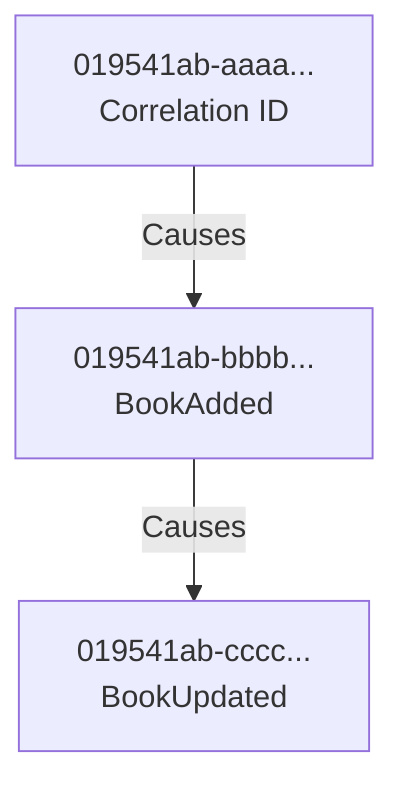
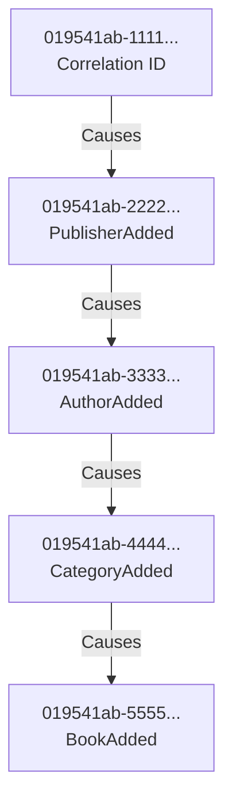

# Causation and Correlation ID Guide

## Overview

The Book Store API implements **causation** and **correlation** IDs for distributed tracing and event chain tracking. This enables you to trace the entire lifecycle of a business transaction across multiple services and events.

## Concepts

### Correlation ID
- **Purpose**: Tracks an entire business transaction from start to finish
- **Scope**: Remains the same throughout the entire workflow
- **Use Case**: Trace all events related to a single user action (e.g., "Create a book with authors and categories")

### Causation ID
- **Purpose**: Tracks the immediate cause of an event
- **Scope**: Changes with each event in the chain
- **Use Case**: Understand what triggered a specific event (e.g., "This projection update was caused by a BookAdded event")

### Event ID
- **Purpose**: Unique identifier for each specific event
- **Scope**: Unique per event
- **Use Case**: Reference a specific event in the event store

## HTTP Headers

### Request Headers

| Header | Description | Required | Example |
|--------|-------------|----------|---------|
| `X-Correlation-ID` | Business transaction identifier | No* | `019541ab-1234-7000-a000-000000000001` |
| `X-Causation-ID` | Immediate cause identifier | No* | `019541ab-5678-7000-b000-000000000002` |

*If not provided, the system auto-generates these IDs using `Guid.CreateVersion7()`.

### Response Headers

`MartenMetadataMiddleware` automatically echoes the correlation ID in every response. `EventMetadataService.SetResponseHeaders()` additionally emits `X-Event-ID` when an endpoint explicitly creates event metadata.

| Header | Description | Example |
|--------|-------------|---------|
| `X-Correlation-ID` | Echo of the request correlation ID (or generated) | `019541ab-1234-7000-a000-000000000001` |
| `X-Event-ID` | ID of the event appended during this request | `019541ab-9abc-7000-c000-000000000003` |

## Event Metadata Structure

Every event in the system includes metadata stored in Marten's dedicated columns and a technical `headers` JSON column:

### Primary Metadata (Columns)
- **CorrelationId**: Tracks the entire business transaction.
- **CausationId**: Tracks the immediate cause (usually the message ID).

### Technical Metadata (Headers Column)
Additional context is stored in the JSON `headers` column for auditability:

```json
{
  "tenant-id": "my-tenant",
  "user-id": "019541ab-0000-7000-0000-000000000000",
  "remote-ip": "::1",
  "user-agent": "Mozilla/5.0..."
}
```

> [!TIP]
> **Metadata Propagation**: `AuthorizationMessageHandler` in the Blazor frontend forwards the original browser's `User-Agent` and remote IP (`X-Forwarded-For`) on every API call, so these values are preserved even when requests cross the Blazor → API boundary.

## Usage Examples

### Example 1: Simple Book Creation

**Request**:
```bash
curl -X POST http://localhost:5000/api/admin/books \
  -H "Content-Type: application/json" \
  -H "X-Correlation-ID: 019541ab-1234-7000-a000-000000000001" \
  -d '{
    "title": "Clean Code",
    "isbn": "978-0132350884",
    "description": "A handbook of agile software craftsmanship",
    "publisherId": "019541ab-0001-7000-a000-000000000001",
    "authorIds": ["019541ab-0002-7000-a000-000000000001"],
    "categoryIds": ["019541ab-0003-7000-a000-000000000001"]
  }'
```

**Response Headers**:
```
X-Correlation-ID: 019541ab-1234-7000-a000-000000000001
X-Event-ID: 019541ab-9abc-7000-c000-000000000003
```

**Event Stored**:
```json
{
  "eventType": "BookAdded",
  "data": {
    "id": "019541ab-0004-7000-a000-000000000001",
    "title": "Clean Code"
  },
  "correlationId": "019541ab-1234-7000-a000-000000000001",
  "causationId": "019541ab-1234-7000-a000-000000000001"
}
```

### Example 2: Event Chain - Update Following Creation

**Step 1: Create Book**
```bash
curl -X POST http://localhost:5000/api/admin/books \
  -H "X-Correlation-ID: 019541ab-aaaa-7000-a000-000000000001" \
  -H "Content-Type: application/json" \
  -d '{"title": "Domain-Driven Design", ...}'
```

Response: `X-Event-ID: 019541ab-bbbb-7000-a000-000000000001`

**Step 2: Update Book (using previous event as causation)**
```bash
curl -X PUT http://localhost:5000/api/admin/books/019541ab-0004-7000-a000-000000000001 \
  -H "X-Correlation-ID: 019541ab-aaaa-7000-a000-000000000001" \
  -H "X-Causation-ID: 019541ab-bbbb-7000-a000-000000000001" \
  -H "Content-Type: application/json" \
  -d '{"title": "Domain-Driven Design (Revised)", ...}'
```

Response: `X-Event-ID: 019541ab-cccc-7000-a000-000000000001`

**Event Chain**:


### Example 3: Distributed Workflow

Imagine a workflow where creating a book triggers multiple operations:

**1. Create Publisher**
```bash
POST /api/admin/publishers
X-Correlation-ID: 019541ab-1111-7000-a000-000000000001
```
Response: `X-Event-ID: 019541ab-2222-7000-a000-000000000001`

**2. Create Author**
```bash
POST /api/admin/authors
X-Correlation-ID: 019541ab-1111-7000-a000-000000000001
X-Causation-ID: 019541ab-2222-7000-a000-000000000001
```
Response: `X-Event-ID: 019541ab-3333-7000-a000-000000000001`

**3. Create Category**
```bash
POST /api/admin/categories
X-Correlation-ID: 019541ab-1111-7000-a000-000000000001
X-Causation-ID: 019541ab-3333-7000-a000-000000000001
```
Response: `X-Event-ID: 019541ab-4444-7000-a000-000000000001`

**4. Create Book**
```bash
POST /api/admin/books
X-Correlation-ID: 019541ab-1111-7000-a000-000000000001
X-Causation-ID: 019541ab-4444-7000-a000-000000000001
{
  "publisherId": "...",
  "authorIds": ["..."],
  "categoryIds": ["..."]
}
```
Response: `X-Event-ID: 019541ab-5555-7000-a000-000000000001`

**Complete Event Chain**:


## Querying Events by Correlation ID

You can query the Marten event store to find all events related to a correlation ID and inspect their technical headers:

```sql
-- PostgreSQL query in Marten event store
SELECT 
    id,
    stream_id,
    type,
    correlation_id,
    causation_id,
    headers->>'tenant-id' as tenant_id,
    headers->>'user-id' as user_id,
    headers->>'remote-ip' as remote_ip,
    headers->>'user-agent' as user_agent,
    timestamp
FROM mt_events
WHERE correlation_id = '019541ab-1111-7000-a000-000000000001'
ORDER BY timestamp;
```

## Best Practices

### 1. Always Propagate Correlation ID
When making multiple related API calls, always use the same correlation ID:
```bash
CORRELATION_ID="$(uuidgen)"

# All related calls use the same correlation ID
curl -H "X-Correlation-ID: $CORRELATION_ID" ...
curl -H "X-Correlation-ID: $CORRELATION_ID" ...
```

### 2. Use Event IDs as Causation IDs
When one operation triggers another, use the previous event ID as the causation ID:
```bash
# First call
RESPONSE=$(curl -i -X POST ... -H "X-Correlation-ID: $CORRELATION_ID")
EVENT_ID=$(echo "$RESPONSE" | grep "X-Event-ID:" | tr -d '\r' | awk '{print $2}')

# Second call caused by first
curl -H "X-Correlation-ID: $CORRELATION_ID" \
     -H "X-Causation-ID: $EVENT_ID" \
     ...
```

### 3. Use Version 7 GUIDs for Correlation IDs
The system generates `Guid.CreateVersion7()` values for all IDs. Use the same format when constructing IDs externally so they sort chronologically:
```bash
# Generate a time-ordered UUID v7 (e.g., via uuidgen or a UUID v7 library)
CORRELATION_ID="$(uuidgen)"   # Use a UUID v7 generator if available
```

### 4. Use Structured Logging — Never Inline Log Methods
All logging in this codebase must use the `[LoggerMessage]` source generator. Never call `_logger.LogInformation(...)` directly:
```csharp
// ✅ Correct — use source-generated log methods
[LoggerMessage(Level = LogLevel.Information, Message = "Processing {EventType} for {EntityId}. CorrelationId: {CorrelationId}")]
static partial void LogProcessing(ILogger logger, string eventType, Guid entityId, string correlationId);

// ❌ Wrong — forbidden in this codebase
_logger.LogInformation("Processing {EventType}. CorrelationId: {CorrelationId}", eventType, correlationId);
```

## Debugging with Correlation IDs

### Scenario: Find all events in a failed workflow

1. **Get the correlation ID** from your application logs or error message
2. **Query the event store** — `correlation_id` is a first-class column on `mt_events`:
   ```sql
   SELECT * FROM mt_events 
   WHERE correlation_id = '019541ab-1111-7000-a000-000000000001'
   ORDER BY timestamp;
   ```
3. **Analyze the event chain** to find where the workflow failed

### Scenario: Trace projection updates

1. **Find the source event** that triggered a projection update
2. **Use the causation ID** to link back to the original command
3. **Follow the correlation ID** to see the entire business transaction

## Implementation Details

### API Service Middlewares

1. **`MartenMetadataMiddleware`** (`Infrastructure/MartenMetadataMiddleware.cs`):
   - Registered explicitly via `app.UseMartenMetadata()` in `Program.cs`.
   - Reads `X-Correlation-ID` from the request header; falls back to `Activity.Current?.RootId` then `Guid.CreateVersion7()`.
   - Reads `X-Causation-ID` from the request header; falls back to `Activity.Current?.ParentId` then the correlation ID.
   - Sets `session.CorrelationId` and `session.CausationId` on the Marten `IDocumentSession`.
   - Caches values in `context.Items["CorrelationId"]` and `context.Items["CausationId"]` for downstream components.
   - Sets `correlation_id` and `causation_id` tags on the current `Activity`.
   - Sets technical headers on the session: `tenant-id`, `user-id`, `remote-ip`, `user-agent`.
   - Echoes `X-Correlation-ID` in the response.

2. **`WolverineCorrelationMiddleware`** (`Infrastructure/WolverineCorrelationMiddleware.cs`):
   - A Wolverine handler middleware (not an ASP.NET middleware), registered via `opts.Policies.AddMiddleware(typeof(WolverineCorrelationMiddleware))`.
   - Runs `Before` every Wolverine handler to propagate IDs from the HTTP scope to Wolverine's nested Marten session.
   - `CorrelationId` lookup order: `HttpContext.Items` → `X-Correlation-ID` header → Wolverine `context.CorrelationId` → `Activity` tag.
   - `CausationId` lookup order: `envelope.Headers["X-Causation-ID"]` → `HttpContext.Items` → `Activity` tag → `envelope.Id`.
   - Also propagates `user-id`, `remote-ip`, and `user-agent` technical headers to the session.

3. **`LoggingEnricherMiddleware`** (`Infrastructure/LoggingEnricher.cs`):
   - Registered explicitly via `app.UseLoggingEnricher()` in `Program.cs`.
   - Begins a structured log scope for every request containing: `CorrelationId`, `CausationId`, `TraceId`, `SpanId`, `UserId`, `TenantId`, `RequestPath`, `RequestMethod`, `RemoteIp`, `UserAgent`.
   - Reads `CorrelationId`/`CausationId` preferring `HttpContext.Items` (set by `MartenMetadataMiddleware`) then falls back to headers and `Activity`.

4. **`EventMetadataService`** (`Infrastructure/EventMetadataService.cs`):
   - Not a middleware — a scoped service used by endpoint handlers.
   - `CreateMetadata()` builds an `EventMetadata` record containing a fresh `Guid.CreateVersion7()` event ID plus `CorrelationId`, `CausationId`, and `UserId` read from `IHttpContextAccessor`.
   - `SetResponseHeaders()` writes `X-Correlation-ID` and `X-Event-ID` to the response — endpoints call this explicitly after appending events.

### Blazor Frontend Implementation

The Blazor frontend automatically manages and propagates these IDs using a dedicated service and handler pipeline.

1. **`ClientContextService`** (`src/BookStore.Client/Services/ClientContextService.cs`):
   - Registered as `Scoped` — one instance per Blazor circuit.
   - `CorrelationId`: Initialized once with `Guid.CreateVersion7()` on construction; never changes for the lifetime of the circuit.
   - `CausationId`: Starts equal to `CorrelationId`; updated via `UpdateCausationId(string id)` and reset via `ResetCausationId()`.
   - Thread-safe; all mutations use a lock.
   - Also holds `BrowserInfo` (UserAgent, Screen, Language, Timezone) set from JS interop.

2. **`AuthorizationMessageHandler`** (`src/BookStore.Web/Services/AuthorizationMessageHandler.cs`):
   - Runs outermost in the handler chain (before Tenant, Headers, and network handlers).
   - Injects `X-Correlation-ID` and `X-Causation-ID` headers from `ClientContextService` on every outgoing API request.
   - Attaches the JWT Bearer token.
   - Forwards the original browser's `User-Agent` and `X-Forwarded-For` IP from `IHttpContextAccessor`.
   - After each response: reads `X-Event-ID` from the response headers and calls `ClientContextService.UpdateCausationId(eventId)`, automatically advancing the causation chain.
   - On HTTP 401: clears stored tokens.

3. **`BookStoreHeaderHandler`** (`src/BookStore.Client/Infrastructure/BookStoreHeaderHandler.cs`):
   - Runs after `AuthorizationMessageHandler` in the chain (inner handler).
   - Adds `api-version: 1.0` and `Accept-Language` if missing.
   - Adds `X-Correlation-ID` from `Activity.TraceId` and `X-Causation-ID` from `Activity.ParentId` only if those headers are not already present — acts as a fallback for non-authenticated clients.

4. **`BookStoreEventsService`** (`src/BookStore.Client/BookStoreEventsService.cs`):
   - Subscribes to the SSE stream from the API.
   - When a notification with a non-empty `EventId` arrives, calls `ClientContextService.UpdateCausationId(eventId)`, ensuring that reactive UI reloads triggered by SSE events are linked to the correct cause.

**Handler chain order** (outer → inner):
```
ResilienceHandler → AuthorizationMessageHandler → TenantHeaderHandler → BookStoreHeaderHandler → HttpClientHandler
```

## Summary

- **Correlation ID**: Tracks the entire business workflow
- **Causation ID**: Tracks immediate event causes
- **Event ID**: Unique identifier for each event
- **Headers**: `X-Correlation-ID`, `X-Causation-ID`, `X-Event-ID`
- **Automatic**: System generates `Guid.CreateVersion7()` IDs if not provided
- **Propagation**: `X-Correlation-ID` always returned in response headers; `X-Event-ID` returned when an endpoint appends an event
