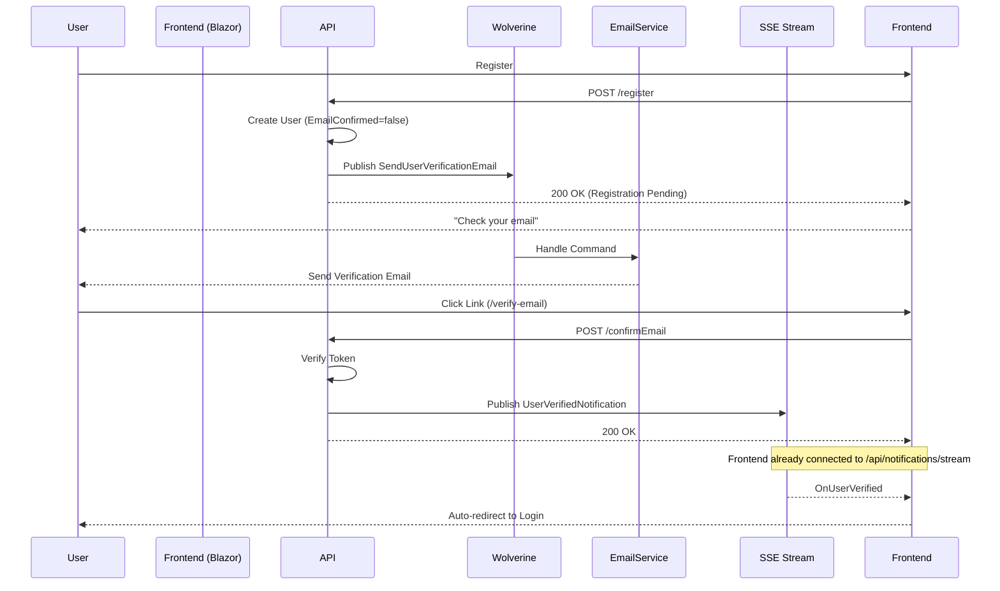

# Email Verification Guide

This guide details the implementation of the email verification feature in the BookStore application.

## Overview

The email verification system ensures that users provide valid email addresses during registration. It supports:
- **Conditional Validation:** Enabled/Disabled via configuration.
- **Delivery Methods:** SMTP (Production) or Logging (Development).
- **Reactive Experience:** Real-time updates via Server-Sent Events (SSE) when verification completes.
- **Passkey Integration:** Compatible with both password-based and passkey-based registration.

## Architecture

The verification process follows an asynchronous, event-driven flow:

1.  **Registration:** User signs up (`/identity/register`).
2.  **Check Configuration:** System checks `Email:DeliveryMethod`.
    -   If `None`: User is auto-confirmed.
    -   If configured: `EmailConfirmed` is set to `false`.
3.  **Command Publishing:** A `SendUserVerificationEmail` Wolverine command is published.
4.  **Email Handling:** `EmailHandlers` processes the command:
    -   Generates a verification link pointing to the Frontend (`/verify-email`).
    -   Uses `EmailTemplateService` to create the email body.
    -   Sends the email via `IEmailService` (SMTP or Logging).
5.  **User Verification:** User clicks the link.
6.  **Confirmation:** Frontend calls `POST /identity/confirmEmail` with the token.
7.  **Notification:** Backend verifies the token and publishes a `UserVerifiedNotification` domain event.
8.  **Real-time Update:** SSE stream broadcasts the notification to the client, redirecting the user to login automatically.

### Component Diagram



## Configuration

Email settings are configured in `appsettings.json` under the `Email` section.

### Options

| Setting | Type | Description | Default |
| :--- | :--- | :--- | :--- |
| `DeliveryMethod` | string | `None`, `Logging`, or `Smtp` | `None` |
| `BaseUrl` | string | Base URL of the frontend application | `https://localhost:7260` |
| `FromEmail` | string | Sender email address | `noreply@bookstore.com` |
| `FromName` | string | Sender display name | `BookStore` |
| `SmtpHost` | string | SMTP server hostname | - |
| `SmtpPort` | int | SMTP server port | `587` |
| `SmtpUsername` | string | SMTP username | - |
| `SmtpPassword` | string | SMTP password | - |

### Development Setup (Logging)

For local development, use the `Logging` method to see emails in the console output without sending actual emails.

```json
"Email": {
  "DeliveryMethod": "Logging",
  "BaseUrl": "https://localhost:7260"
}
```

### Production Setup (SMTP)

For production, configure your SMTP provider details.

```json
"Email": {
  "DeliveryMethod": "Smtp",
  "BaseUrl": "https://bookstore.com",
  "FromEmail": "auth@bookstore.com",
  "SmtpHost": "smtp.sendgrid.net",
  "SmtpPort": 587,
  "SmtpUsername": "apikey",
  "SmtpPassword": "<your-api-key>"
}
```

## Unverified Account Cleanup

To prevent the accumulation of unverified accounts, the system includes an automatic cleanup job. This job runs periodically and deletes accounts that have not verified their email within a specified timeframe.

### Configuration

The cleanup job is configured under the `Account:Cleanup` section in `appsettings.json`.

| Setting | Type | Description | Default |
| :--- | :--- | :--- | :--- |
| `Enabled` | bool | Whether the cleanup job is active. | `true` |
| `UnverifiedAccountExpirationHours` | int | Hours after which an unverified account expires. | `24` |
| `CleanupIntervalHours` | int | Frequency (in hours) of the cleanup job. | `1` |

### Implementation details

- **Wolverine Recurring Job**: The cleanup is registered as a recurring job in Wolverine, ensuring it runs reliably in the background.
- **Marten Query**: The job performs a bulk deletion of accounts matching the criteria `EmailConfirmed == false` and `CreatedAt < SnapshotTime - Expiration`.
- **Structured Logging**: All cleanup activities are logged under the `Log.Maintenance` category.

## Implementation Details

### Services

-   **`EmailTemplateService`**: A lightweight service using string replacement for templates. Avoids Razor overhead for simple emails.
-   **`SmtpEmailService`**: Uses `MailKit` for robust SMTP handling. It creates a new `SmtpClient` per request to ensure thread safety and low memory footprint.
-   **`LoggingEmailService`**: Writes email content to `ILogger` for debugging.

### Extensibility

To add a new delivery method (e.g., SendGrid API):
1.  Implement `IEmailService`.
2.  Update `ApplicationServicesExtensions.cs` to register your service based on a new `DeliveryMethod` value.
