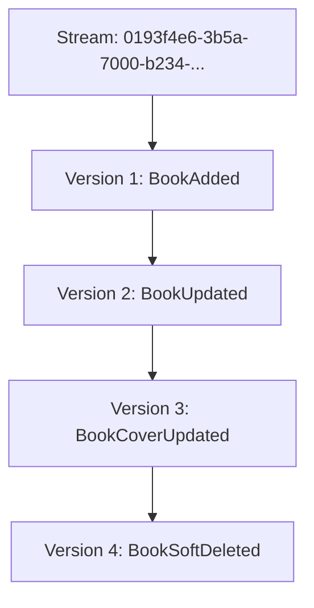
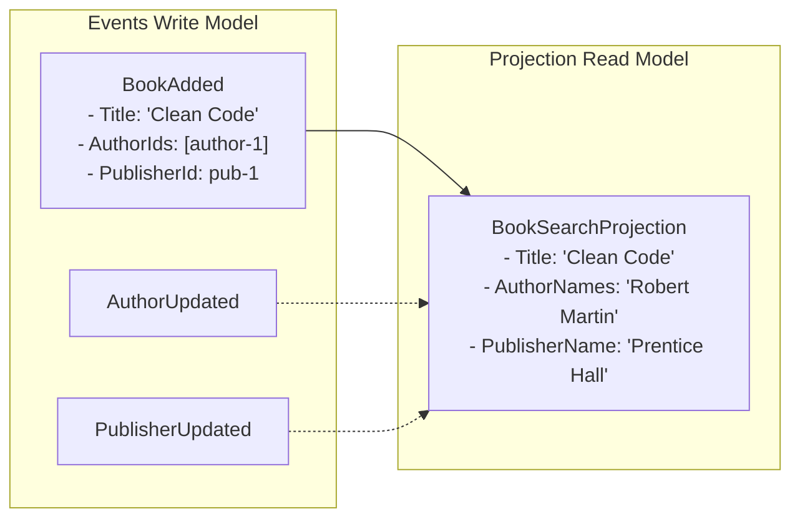

# Event Sourcing Guide

## Overview

**Event Sourcing** is an architectural pattern where state changes are stored as a sequence of immutable events, rather than storing only the current state. This guide explains the concepts, benefits, and implementation patterns used in the Book Store API.

> [!NOTE]
> This guide focuses on event sourcing concepts and patterns. For Marten-specific implementation details, see the [Marten Guide](marten-guide.md).

## What is Event Sourcing?

### Traditional State Storage (CRUD)

In traditional applications, we store the **current state** of entities:

```csharp
// Database: books table
| id  | title       | price | status    |
|-----|-------------|-------|-----------|
| 123 | Clean Code  | 45.00 | published |
```

**Problems**:
- ❌ History is lost when state changes
- ❌ No audit trail of who changed what and when
- ❌ Can't reconstruct past states
- ❌ Difficult to debug issues that happened in the past
- ❌ Can't replay events to test new features

### Event Sourcing Approach

Instead, we store **all changes as events**:

```csharp
// Event Store: mt_events table (stream_id is a Guid, e.g. Guid.CreateVersion7())
| id | stream_id                            | type             | data                       | timestamp  |
|----|--------------------------------------|------------------|----------------------------|------------|
| 1  | 0193f4e6-3b5a-7000-b234-...          | book_added       | {title: "Clean Code", ...} | 2025-01-01 |
| 2  | 0193f4e6-3b5a-7000-b234-...          | book_updated     | {title: "Clean Code 2e"}   | 2025-01-02 |
| 3  | 0193f4e6-3b5a-7000-b234-...          | book_soft_deleted| {timestamp: ...}           | 2025-01-03 |
```

**Benefits**:
- ✅ Complete history preserved
- ✅ Full audit trail
- ✅ Can reconstruct any past state
- ✅ Can replay events to debug or test
- ✅ Events are immutable (never modified)

## Core Concepts

### 1. Events

**Events** are immutable records that represent facts that have occurred.

```csharp
namespace BookStore.ApiService.Events;

/// <summary>
/// Event: A book was added to the catalog
/// </summary>
public record BookAdded(
    Guid Id,
    string Title,
    string? Isbn,
    string Language,
    Dictionary<string, BookTranslation> Translations,
    PartialDate? PublicationDate,
    Guid? PublisherId,
    List<Guid> AuthorIds,
    List<Guid> CategoryIds,
    Dictionary<string, decimal> Prices);
```

**Event Naming**:
- ✅ Use past tense: `BookAdded`, `PriceChanged`, `OrderShipped`
- ❌ Not imperative: `AddBook`, `ChangePrice`, `ShipOrder`
- Events describe **what happened**, not **what to do**

**Event Properties**:
- **Immutable**: Once created, never modified
- **Self-contained**: Include all necessary data
- **Timestamped**: Automatically tracked by Marten
- **Ordered**: Events in a stream have sequential versions

See [Marten Guide - Events](marten-guide.md#events) for implementation details.

### 2. Streams

A **stream** is a sequence of events for a single aggregate instance.



**Stream Properties**:
- Each stream has a unique ID — always a `Guid` (the aggregate's ID, created with `Guid.CreateVersion7()`)
- Streams are typed: `session.Events.StartStream<BookAggregate>(id, firstEvent)` binds the stream to the aggregate type
- Events are ordered by version number
- Streams are append-only (events never deleted)
- Stream version increments with each new event and is exposed on the aggregate as `public long Version { get; private set; }`

See [Marten Guide - Working with Streams](marten-guide.md#working-with-streams) for stream operations.

### 3. Aggregates

An **aggregate** is a domain object that:
- Enforces business rules
- Builds current state by applying events
- Generates new events from commands

```csharp
using Marten.Metadata;

// Aggregates implement ISoftDeleted to support Marten's soft-delete conventions
public class BookAggregate : ISoftDeleted
{
    // All properties use private setters (analyzer rule BS3005)
    public Guid Id { get; private set; }
    public string Title { get; private set; } = string.Empty;
    public string Language { get; private set; } = string.Empty;
    public Dictionary<string, BookTranslation> Translations { get; private set; } = [];
    public Dictionary<string, decimal> Prices { get; private set; } = [];

    // Marten sets Version automatically; used for ETag-based optimistic concurrency
    public long Version { get; private set; }

    // ISoftDeleted requires public setters; suppressed via pragma (Marten requirement)
#pragma warning disable BS3005
    public bool Deleted { get; set; }
    public DateTimeOffset? DeletedAt { get; set; }
#pragma warning restore BS3005

    // Apply methods: rebuild state only — NO validation or side effects here
    void Apply(BookAdded @event)
    {
        Id = @event.Id;
        Title = @event.Title;
        Language = @event.Language;
        Translations = @event.Translations;
        Prices = @event.Prices;
        Deleted = false;
    }

    void Apply(BookUpdated @event)
    {
        Title = @event.Title;
        Language = @event.Language;
        Translations = @event.Translations;
        Prices = @event.Prices;
    }

    void Apply(BookSoftDeleted _)
    {
        Deleted = true;
        DeletedAt = DateTimeOffset.UtcNow;
    }

    void Apply(BookRestored _)
    {
        Deleted = false;
        DeletedAt = null;
    }

    // Static factory: generates the creation event for a new stream.
    // Returns Result<TEvent> — business errors flow through Result, never thrown.
    public static Result<BookAdded> CreateEvent(
        Guid id, string title, string? isbn, string language,
        Dictionary<string, BookTranslation> translations,
        PartialDate? publicationDate, Guid? publisherId,
        List<Guid> authorIds, List<Guid> categoryIds,
        Dictionary<string, decimal> prices)
    {
        if (id == Guid.Empty)
            return Result.Failure<BookAdded>(Error.Validation(ErrorCodes.Books.IdRequired, "Book ID is required"));

        // ... additional validation

        return new BookAdded(id, title, isbn, language, translations,
            publicationDate, publisherId, authorIds, categoryIds, prices);
    }

    // Instance command: generates an update event from an existing aggregate.
    public Result<BookUpdated> UpdateEvent(string title, ...)
    {
        if (Deleted)
            return Result.Failure<BookUpdated>(Error.Conflict(ErrorCodes.Books.AlreadyDeleted, "Cannot update a deleted book"));

        return new BookUpdated(Id, title, ...);
    }

    public Result<BookSoftDeleted> SoftDeleteEvent()
    {
        if (Deleted)
            return Result.Failure<BookSoftDeleted>(Error.Conflict(ErrorCodes.Books.AlreadyDeleted, "Book is already deleted"));

        return new BookSoftDeleted(Id, DateTimeOffset.UtcNow);
    }

    public Result<BookRestored> RestoreEvent()
    {
        if (!Deleted)
            return Result.Failure<BookRestored>(Error.Conflict(ErrorCodes.Books.NotDeleted, "Book is not deleted"));

        return new BookRestored(Id, DateTimeOffset.UtcNow);
    }
}
```

**Aggregate Responsibilities**:
1. **Validate** business rules
2. **Generate** events
3. **Apply** events to update state

See [Marten Guide - Aggregates](marten-guide.md#aggregates) for implementation patterns.

### 4. Projections

**Projections** transform events into read models optimized for queries.



**Projection Types**:
- **Inline**: Updated immediately (slower writes, consistent reads)
- **Async**: Updated asynchronously (faster writes, eventual consistency)
- **Live**: Real-time updates via WebSockets

See [Marten Guide - Projections](marten-guide.md#projections) for projection patterns.

## Event Sourcing Benefits

### 1. Complete Audit Trail

Every change is recorded with:
- What changed (event data)
- When it changed (timestamp)
- Who changed it (correlation ID from user context)
- Why it changed (causation ID from triggering event)

```csharp
// Query all changes to a book
var events = await session.Events.FetchStreamAsync(bookId);

foreach (var evt in events)
{
    Console.WriteLine($"{evt.Timestamp}: {evt.EventType}");
    Console.WriteLine($"  By: {evt.CorrelationId}");
    Console.WriteLine($"  Data: {JsonSerializer.Serialize(evt.Data)}");
}
```

**Use Cases**:
- Compliance and regulatory requirements
- Fraud detection and investigation
- Customer support and debugging
- Performance reviews and analytics
- Advanced behavioral analytics and business intelligence

### 2. Time Travel

Reconstruct the state of any aggregate at any point in time:

```csharp
// Get current state
var currentBook = await session.Events
    .AggregateStreamAsync<BookAggregate>(bookId);

// Get state as of specific date
var pastBook = await session.Events
    .AggregateStreamAsync<BookAggregate>(bookId, timestamp: DateTimeOffset.Parse("2025-01-15T00:00:00Z"));

// Get state at specific version
var versionBook = await session.Events
    .AggregateStreamAsync<BookAggregate>(bookId, version: 5);
```

**Use Cases**:
- Debugging production issues
- Analyzing historical trends
- Legal discovery and investigations
- Testing "what-if" scenarios

### 3. Event Replay

Replay events to:
- Build new projections from historical data
- Test new features against real data
- Migrate to new schemas
- Fix bugs in projection logic

```csharp
// Rebuild projection from all historical events
await daemon.RebuildProjectionAsync<BookSearchProjection>(CancellationToken.None);
```

**Use Cases**:
- Add new features without data migration
- Fix bugs in read models
- Test new projection logic
- Create new analytics views
- Machine learning and recommendation engines (e.g., training models on granular user behavior)

See [Marten Guide - Event Sourcing for Analytics](marten-guide.md#event-sourcing-for-analytics) for analytics patterns.

### 4. Natural Fit for Distributed Systems

Events are:
- **Immutable**: Safe to cache and replicate
- **Self-contained**: No foreign key dependencies
- **Ordered**: Natural causality tracking
- **Publishable**: Easy to integrate with message buses

```csharp
// Publish events to external systems
public class EventPublisher
{
    public async Task PublishEvent(IEvent @event)
    {
        // Publish to Kafka, RabbitMQ, Azure Service Bus, etc.
        await messageBus.PublishAsync(@event.Data);
    }
}
```

**Use Cases**:
- Microservices communication
- Event-driven architectures
- CQRS implementations
- Real-time data synchronization

### 5. Debugging and Testing

Events provide a complete record for debugging:

```csharp
// Find all events that led to an error
var errorContext = await session.Events
    .QueryAllRawEvents()
    .Where(e => e.CorrelationId == errorCorrelationId)
    .OrderBy(e => e.Timestamp)
    .ToListAsync();

// Replay events in test environment
foreach (var evt in errorContext)
{
    await testSession.Events.Append(evt.StreamId, evt.Data);
}
```

**Use Cases**:
- Root cause analysis
- Reproducing production bugs
- Integration testing
- Load testing with real data

## Event Sourcing Patterns

### Pattern 1: Command → Event → State

```
1. User sends command
2. Aggregate validates business rules
3. Aggregate generates event
4. Event is stored in stream
5. Event is applied to aggregate
6. Projection is updated asynchronously
```

**Example**:
```csharp
// 1. Command (imperative record — only events use past tense)
public record UpdateBook(Guid Id, string Title, ...);

// 2. Wolverine handler — IDocumentSession is auto-committed by Wolverine
public static async Task<IResult> Handle(
    UpdateBook command,
    IDocumentSession session)
{
    // Rehydrate aggregate by replaying its event stream
    var aggregate = await session.Events
        .AggregateStreamAsync<BookAggregate>(command.Id);

    if (aggregate is null)
        return Results.NotFound();

    // 3. Aggregate validates business rules and returns Result<TEvent>
    var eventResult = aggregate.UpdateEvent(command.Title, ...);
    if (eventResult.IsFailure)
        return eventResult.ToProblemDetails();  // maps to ProblemDetails response

    // 4. Append event to stream (Wolverine commits the session after handler returns)
    _ = session.Events.Append(command.Id, eventResult.Value);

    return Results.NoContent();
}

// 5. Event is applied automatically by Marten during stream rehydration
void Apply(BookUpdated @event)
{
    Title = @event.Title;
}

// 6. Async projection updates the read model (via Marten async daemon)
void Apply(BookUpdated @event, BookSearchProjection projection)
{
    projection.Title = @event.Title;
}
```

See [Wolverine Guide](wolverine-guide.md) for command/handler patterns.

### Pattern 2: Event Versioning

As your system evolves, event schemas may need to change:

```csharp
// V1: Original event
public record BookAddedV1(Guid Id, string Title);

// V2: Added ISBN field
public record BookAddedV2(Guid Id, string Title, string? Isbn);

// Upcaster: Convert V1 to V2
public class BookAddedUpcaster : EventUpcaster<BookAddedV1, BookAddedV2>
{
    public override BookAddedV2 Upcast(BookAddedV1 old)
    {
        return new BookAddedV2(old.Id, old.Title, Isbn: null);
    }
}
```

**Strategies**:
- **Upcasting**: Transform old events to new schema on read
- **Versioned Events**: Keep multiple versions, handle in Apply methods
- **Event Migration**: Replay and rewrite events (rare, use with caution)

### Pattern 3: Snapshots

For aggregates with many events, snapshots improve performance:

```csharp
// Instead of replaying 10,000 events
var book = await session.Events
    .AggregateStreamAsync<BookAggregate>(bookId); // Slow!

// Use snapshot + recent events
var book = await session.Events
    .AggregateStreamAsync<BookAggregate>(
        bookId, 
        fromSnapshot: true); // Fast!
```

**When to Use**:
- Streams with > 100 events
- Frequently accessed aggregates
- Performance-critical operations

**Trade-offs**:
- More storage space
- Snapshot versioning complexity
- Potential consistency issues

> [!NOTE]
> Marten supports automatic snapshots. See [Marten Documentation - Snapshots](https://martendb.io/events/projections/aggregate-projections.html#snapshots).

### Pattern 4: Saga / Process Manager

Coordinate long-running processes across multiple aggregates:

```csharp
public class OrderFulfillmentSaga
{
    public void Apply(OrderPlaced @event)
    {
        // Reserve inventory
        // Charge payment
        // Schedule shipping
    }
    
    public void Apply(PaymentFailed @event)
    {
        // Release inventory
        // Cancel order
    }
}
```

**Use Cases**:
- Multi-step workflows
- Distributed transactions
- Compensation logic
- Business processes

## Event Sourcing Challenges

### 1. Eventual Consistency

**Challenge**: Projections are updated asynchronously, so reads may be slightly stale.

**Solutions**:
- Use inline projections for critical reads
- Return command result immediately (don't wait for projection)
- Design UI to handle eventual consistency
- Use polling or WebSockets for updates

```csharp
// Return immediately after command
public static async Task<IResult> Handle(CreateBook command, IDocumentSession session)
{
    var eventResult = BookAggregate.CreateEvent(command.Id, command.Title, ...);
    if (eventResult.IsFailure)
        return eventResult.ToProblemDetails();

    // StartStream is typed — binds stream to the aggregate type
    _ = session.Events.StartStream<BookAggregate>(command.Id, eventResult.Value);

    // Don't wait for projection — return immediately
    return Results.Created($"/api/admin/books/{command.Id}", new { id = command.Id });
}
```

### 2. Event Schema Evolution

**Challenge**: Events are immutable, but requirements change.

**Solutions**:
- Use upcasters to transform old events
- Design events with optional fields
- Version events explicitly
- Never delete old event types

```csharp
// Design for evolution
public record BookAdded(
    Guid Id,
    string Title,
    string? Isbn,              // Optional from day 1
    Dictionary<string, object>? Metadata = null  // Extensibility
);
```

### 3. Querying Events

**Challenge**: Events are optimized for writes, not complex queries.

**Solutions**:
- Use projections for queries (CQRS)
- Create multiple projections for different query needs
- Use PostgreSQL JSON operators for ad-hoc queries
- Export to data warehouse for complex analytics

```csharp
// Don't query events directly for UI
var books = await session.Query<BookSearchProjection>()  // ✅ Use projection
    .Where(b => b.Title.Contains("Code"))
    .ToListAsync();

// Not this
var events = await session.Events.QueryAllRawEvents()    // ❌ Slow!
    .Where(e => e.Data.ToString().Contains("Code"))
    .ToListAsync();
```

See [Marten Guide - Querying Projections](marten-guide.md#querying-projections) for query patterns.

### 4. Deleting Data (GDPR)

**Challenge**: Events are immutable, but GDPR requires data deletion.

**Solutions**:
- **Soft Delete**: Apply a `SoftDeleted` event which sets a `Deleted` property on the read model.
- **Anonymization**: Replace PII with anonymized data
- **Crypto Shredding**: Encrypt events, delete encryption key
- **Stream Archival**: Move stream to separate archive store

```csharp
// Soft delete (Manual implementation)
public record BookSoftDeleted(Guid Id, DateTimeOffset Timestamp);


// Anonymization (for GDPR)
public async Task AnonymizeUserData(Guid userId)
{
    var events = await session.Events.FetchStreamAsync(userId);
    
    foreach (var evt in events)
    {
        // Replace PII with anonymized data
        await session.Events.Append(userId, new UserAnonymized(userId));
    }
}
```

## Best Practices

### 1. Event Design

- ✅ Use past tense names (`BookAdded`, not `AddBook`)
- ✅ Include all necessary data in the event
- ✅ Make events immutable (`record` types)
- ✅ Add XML documentation explaining business meaning
- ✅ Design for evolution (optional fields, metadata)
- ✅ Use `DateTimeOffset.UtcNow` for timestamps — never `DateTime.Now`
- ❌ Don't include computed values (calculate in projections)
- ❌ Don't reference other aggregates (use IDs only)

### 2. Aggregate Design

- ✅ Keep aggregates focused (single responsibility)
- ✅ All properties use `private set` (analyzer rule BS3005)
- ✅ Implement `ISoftDeleted` for aggregates that support soft-delete
- ✅ Expose `public long Version { get; private set; }` for ETag concurrency
- ✅ Validate in command methods, not Apply methods
- ✅ Apply methods should only update state — no validation, no I/O
- ✅ Command methods return `Result<TEvent>` — never throw for business errors
- ✅ Use static factory (`CreateEvent`) for creation, instance methods for mutations
- ✅ Use `Guid.CreateVersion7()` — never `Guid.NewGuid()`
- ✅ Keep streams small (< 1000 events per aggregate)
- ❌ Don't load other aggregates in command methods
- ❌ Don't perform I/O in Apply methods

### 3. Projection Design

- ✅ Create separate projections for different queries
- ✅ Denormalize data for query performance
- ✅ Use `SnapshotLifecycle.Async` for simple single-stream snapshots
- ✅ Use `ProjectionLifecycle.Async` + custom `MultiStreamProjection` for cross-stream projections
- ✅ Keep projections simple (no business logic)
- ✅ Make projections idempotent (can replay safely)
- ❌ Don't share projections across bounded contexts
- ❌ Don't perform writes in projections

### 4. Testing

```csharp
// Tests use TUnit ([Test] not [Fact]) and await Assert.That(...)
// Apply methods are package-private on classes; test through command methods instead
[Test]
public async Task ScheduleSale_Valid_ShouldSucceed()
{
    // Arrange
    var aggregate = new SaleAggregate();
    var start = DateTimeOffset.UtcNow.AddHours(1);
    var end = DateTimeOffset.UtcNow.AddHours(2);

    // Act — command method returns Result<TEvent>, not raw event
    var result = aggregate.ScheduleSale(20m, start, end);

    // Assert — TUnit async assertions
    _ = await Assert.That(result.IsSuccess).IsTrue();
    _ = await Assert.That(result.Value.Sale.Percentage).IsEqualTo(20m);
}

[Test]
public async Task SoftDeleteEvent_WhenAlreadyDeleted_ShouldFail()
{
    // Arrange: build state by applying events manually (Apply is internal)
    // For classes with internal Apply, integration tests via handlers are preferred
    // For record aggregates (SaleAggregate) direct construction is possible
    var aggregate = new SaleAggregate { Id = Guid.CreateVersion7() };

    // Act
    var result = aggregate.CancelSale(DateTimeOffset.UtcNow); // no sale exists

    // Assert
    _ = await Assert.That(result.IsFailure).IsTrue();
}
```

> [!NOTE]
> The project uses **TUnit** for all tests (`[Test]`, `await Assert.That(...)`). Never use `[Fact]` (xUnit) or `Assert.Equal` (xUnit) — use the TUnit assertion API instead.

## Integration with Marten

This project uses **Marten** for event sourcing implementation. Marten provides:

- **Event Store**: PostgreSQL-based event storage
- **Stream Management**: Automatic versioning and concurrency
- **Projections**: Async projection daemon with Wolverine integration
- **Metadata**: Correlation/causation tracking
- **Querying**: LINQ support for events and projections

See the [Marten Guide](marten-guide.md) for complete implementation details.

### Key Marten Features

| Feature | Description | Guide Section |
|---------|-------------|---------------|
| Events | Immutable event records | [Events](marten-guide.md#events) |
| Streams | Event sequences per aggregate | [Working with Streams](marten-guide.md#working-with-streams) |
| Aggregates | Domain objects built from events | [Aggregates](marten-guide.md#aggregates) |
| Projections | Read models from events | [Projections](marten-guide.md#projections) |
| Metadata | Correlation/causation tracking | [Metadata Tracking](marten-guide.md#metadata-tracking) |
| Concurrency | Optimistic locking with ETags | [Optimistic Concurrency](marten-guide.md#optimistic-concurrency) |
| Analytics | Real-time and offline analysis | [Event Sourcing for Analytics](marten-guide.md#event-sourcing-for-analytics) |

## External Resources

### Official Documentation

- **[Marten Documentation](https://martendb.io/)** - Official Marten docs
- **[Marten Event Sourcing](https://martendb.io/events/)** - Event sourcing guide
- **[Marten Projections](https://martendb.io/events/projections/)** - Projection patterns

### Books

- **[Implementing Domain-Driven Design](https://www.oreilly.com/library/view/implementing-domain-driven-design/9780133039900/)** by Vaughn Vernon
- **[Versioning in an Event Sourced System](https://leanpub.com/esversioning)** by Greg Young
- **[Event Sourcing Distilled](https://www.eventstore.com/event-sourcing)** by Event Store

### Articles

- **[Event Sourcing Pattern](https://martinfowler.com/eaaDev/EventSourcing.html)** by Martin Fowler
- **[CQRS Journey](https://docs.microsoft.com/en-us/previous-versions/msp-n-p/jj554200(v=pandp.10))** by Microsoft
- **[Event Sourcing Basics](https://eventstore.com/blog/event-sourcing-basics/)** by Event Store

### Videos

- **[Event Sourcing You are doing it wrong](https://www.youtube.com/watch?v=GzrZworHpIk)** by David Schmitz
- **[CQRS and Event Sourcing](https://www.youtube.com/watch?v=JHGkaShoyNs)** by Greg Young

## Summary

Event Sourcing provides:
- ✅ Complete audit trail of all changes
- ✅ Time travel and historical analysis
- ✅ Event replay for new features
- ✅ Natural fit for distributed systems
- ✅ Powerful analytics capabilities

**Key Concepts**:
1. **Events** = Immutable facts about what happened
2. **Streams** = Ordered sequences of events
3. **Aggregates** = Domain objects built from events
4. **Projections** = Read models optimized for queries

**Trade-offs**:
- More complex than CRUD
- Eventual consistency
- Event schema evolution
- Learning curve

## Next Steps

- **[Marten Guide](marten-guide.md)** - Implementation with Marten
- **[Wolverine Guide](wolverine-guide.md)** - Command/handler pattern
- [Architecture](../architecture.md)** - System design
- [Getting Started](../getting-started.md)** - Setup and running
