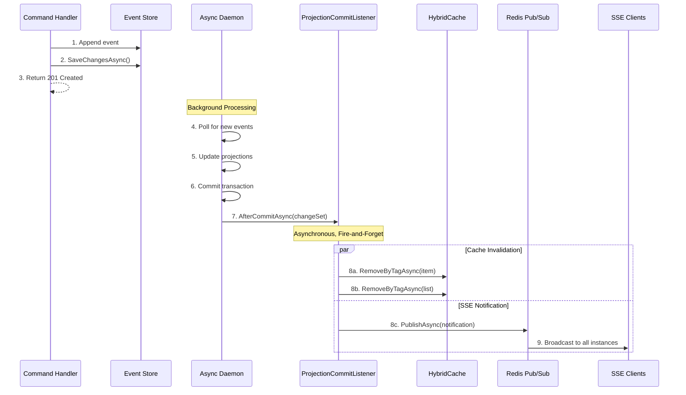

# Marten Integration Guide

## Overview

The Book Store API uses **Marten** - a .NET library that turns PostgreSQL into a powerful document database and event store. Marten provides the foundation for our event sourcing architecture.

## Why Marten?

### Benefits

✅ **Event Store on PostgreSQL**: No additional infrastructure needed  
✅ **Document Database**: Store and query JSON documents  
✅ **Event Sourcing**: Built-in support for event streams  
✅ **Async Projections**: Automatically build read models from events  
✅ **Strong .NET Integration**: LINQ support, type-safe queries  
✅ **Metadata Tracking**: Correlation/causation IDs for distributed tracing  

### What Marten Provides

1. **Event Store**: Append-only event log with stream management
2. **Document Store**: Store and query JSON documents
3. **Projections**: Transform events into read models
4. **Session Management**: Unit of work pattern
5. **Schema Management**: Automatic database schema creation

## Event Sourcing Basics

> [!NOTE]
> For a comprehensive introduction to event sourcing concepts and patterns, see the [Event Sourcing Guide](event-sourcing-guide.md). This section focuses on Marten-specific implementation.

### What is Event Sourcing?

Instead of storing current state, we store **all changes as immutable events**.

**Traditional Approach** (CRUD):
```csharp
// Update book title
book.Title = "New Title";
await db.SaveChangesAsync();
// Old title is lost forever
```

**Event Sourcing Approach**:
```csharp
// Append event to stream
var @event = new BookUpdated(bookId, "New Title", ...);
session.Events.Append(bookId, @event);
await session.SaveChangesAsync();
// All history preserved
```

### Event Store Structure

Marten creates these PostgreSQL tables:

```
mt_events        → All events (append-only)
mt_streams       → Stream metadata (version, type, etc.)
mt_doc_*         → Document tables (projections)
```

**Example Event Record**:
```sql
SELECT id, stream_id, type, data, version, timestamp 
FROM mt_events 
WHERE stream_id = '018d5e4a-7b2c-7000-8000-123456789abc';
```

| id | stream_id | type | data | version | timestamp |
|----|-----------|------|------|---------|-----------|
| 1 | book-123 | BookAdded | {...} | 1 | 2025-01-01 |
| 2 | book-123 | BookUpdated | {...} | 2 | 2025-01-02 |

### Event Sourcing for Analytics

One of the most powerful benefits of event sourcing is the ability to perform **real-time and offline data analysis** on the complete event history.

#### Real-Time Analytics

Stream events to analytics systems as they happen:

```csharp
// Example: Real-time book sales tracking
public class BookSalesAnalytics
{
    public async Task ProcessEvent(IEvent @event)
    {
        switch (@event.Data)
        {
            case BookAdded added:
                await UpdateCatalogMetrics(added);
                break;
            case BookUpdated updated:
                await TrackPriceChanges(updated);
                break;
            case BookSoftDeleted deleted:
                await RecordDeletion(deleted);
                break;
        }
    }
}
```

**Use Cases**:
- **Live Dashboards**: Real-time inventory, sales, and user activity
- **Alerting**: Trigger notifications on specific events (low stock, price changes)
- **Streaming Analytics**: Process events with tools like Apache Kafka, Azure Event Hubs
- **Monitoring**: Track system health and business metrics

#### Offline Analytics

Query the complete event history for deep analysis:

```sql
-- Example: Analyze book pricing trends over time
SELECT 
    DATE_TRUNC('month', timestamp) as month,
    data->>'title' as book_title,
    AVG((data->>'price')::numeric) as avg_price,
    COUNT(*) as price_changes
FROM mt_events
WHERE type = 'BookUpdated'
    AND data->>'price' IS NOT NULL
    AND timestamp > NOW() - INTERVAL '1 year'
GROUP BY month, book_title
ORDER BY month DESC;

-- Example: Find books with most frequent updates
SELECT 
    stream_id,
    COUNT(*) as total_events,
    MAX(timestamp) as last_updated
FROM mt_events
WHERE type IN ('BookUpdated', 'BookAdded')
GROUP BY stream_id
ORDER BY total_events DESC
LIMIT 10;
```

**Use Cases**:
- **Business Intelligence**: Historical trends, patterns, and insights
- **Data Warehousing**: Export events to data lakes (Snowflake, BigQuery, Databricks)
- **Machine Learning**: Train models on historical behavior patterns
- **Compliance & Auditing**: Complete audit trail for regulatory requirements
- **A/B Testing**: Analyze impact of changes over time

#### Event Replay for New Projections

Create new analytics projections from existing events:

```csharp
// Example: Build a new "Popular Books" projection from historical data
public class PopularBooksProjection : MultiStreamProjection<PopularBook, Guid>
{
    public PopularBooksProjection()
    {
        Identity<BookAdded>(x => x.Id);
        Identity<BookViewed>(x => x.BookId);  // New event we're tracking
    }
    
    public PopularBook Create(BookAdded @event)
    {
        return new PopularBook
        {
            Id = @event.Id,
            Title = @event.Title,
            ViewCount = 0
        };
    }
    
    public void Apply(BookViewed @event, PopularBook projection)
    {
        projection.ViewCount++;
        projection.LastViewed = @event.Timestamp;
    }
}

// Rebuild projection from all historical events
await daemon.RebuildProjectionAsync<PopularBooksProjection>(CancellationToken.None);
```

**Benefits**:
- **No Data Loss**: All historical data is preserved
- **Retroactive Analysis**: Answer questions you didn't think to ask before
- **Schema Evolution**: Add new projections without migrating old data
- **Time Travel**: Reconstruct system state at any point in history

#### Integration with Analytics Tools

**Export to Data Warehouse**:
```csharp
// Example: Stream events to Snowflake/BigQuery
public class EventExporter
{
    public async Task ExportEvents(DateTime since)
    {
        var events = await session.Events
            .QueryAllRawEvents()
            .Where(e => e.Timestamp > since)
            .ToListAsync();
        
        foreach (var evt in events)
        {
            await dataWarehouse.InsertAsync(new
            {
                EventId = evt.Id,
                EventType = evt.EventType,
                StreamId = evt.StreamId,
                Data = evt.Data,
                Timestamp = evt.Timestamp,
                CorrelationId = evt.CorrelationId
            });
        }
    }
}
```

**Real-Time Streaming**:
```csharp
// Example: Publish events to Kafka for real-time processing
public class KafkaEventPublisher
{
    public async Task PublishEvent(IEvent @event)
    {
        await kafkaProducer.ProduceAsync("book-events", new Message
        {
            Key = @event.StreamId.ToString(),
            Value = JsonSerializer.Serialize(@event.Data),
            Headers = new Headers
            {
                { "event-type", Encoding.UTF8.GetBytes(@event.EventType) },
                { "correlation-id", Encoding.UTF8.GetBytes(@event.CorrelationId) }
            }
        });
    }
}
```

**Analytics Queries**:
```csharp
// Example: Complex analytics query
var bookLifecycleStats = await session.Events
    .QueryAllRawEvents()
    .Where(e => e.StreamId == bookId)
    .Select(e => new
    {
        EventType = e.EventType,
        Timestamp = e.Timestamp,
        DaysSinceCreation = (e.Timestamp - streamCreated).TotalDays
    })
    .ToListAsync();

// Analyze: How long until first update? How many updates per month?
```

#### Best Practices for Analytics

1. **Use Projections for Performance**: Don't query raw events for real-time dashboards
2. **Partition by Time**: Use PostgreSQL table partitioning for large event stores
3. **Index Strategically**: Add indexes on timestamp, event type, correlation ID
4. **Archive Old Events**: Move historical events to cold storage (S3, Azure Blob)
5. **Stream to Analytics Platform**: Use CDC (Change Data Capture) for real-time sync

## Configuration

### Program.cs Setup

```csharp
using Marten;
using Marten.Events.Daemon;
using Marten.Events.Projections;
using Wolverine.Marten;

builder.Services.AddMarten(sp =>
{
    var connectionString = builder.Configuration.GetConnectionString("bookstore")!;
    
    var options = new StoreOptions();
    options.Connection(connectionString);
    
    // Enable metadata tracking
    options.Events.MetadataConfig.CorrelationIdEnabled = true;
    options.Events.MetadataConfig.CausationIdEnabled = true;
    options.Events.MetadataConfig.HeadersEnabled = true;
    
    // Configure JSON serialization
    options.UseSystemTextJsonForSerialization(
        EnumStorage.AsString, 
        Casing.CamelCase);
    
    // Enable full-text search
    options.Advanced.UseNGramSearchWithUnaccent = true;
    
    // Register event types
    options.Events.AddEventType<BookAdded>();
    options.Events.AddEventType<BookUpdated>();
    
    // Configure projections
    options.Projections.Add<BookSearchProjectionBuilder>(
        ProjectionLifecycle.Async);
    
    // Configure indexes
    options.Schema.For<BookSearchProjection>()
        .Index(x => x.Title)
        .NgramIndex(x => x.Title);
    
    return options;
})
.UseLightweightSessions()      // Faster sessions (no identity map)
.IntegrateWithWolverine();     // Wolverine integration
```

### Key Configuration Options

| Option | Purpose |
|--------|---------|
| `MetadataConfig.CorrelationIdEnabled` | Track request workflows |
| `MetadataConfig.CausationIdEnabled` | Track event chains |
| `MetadataConfig.HeadersEnabled` | Store technical metadata (IP, User-Agent, etc.) in JSON format |
| `UseSystemTextJsonForSerialization` | JSON settings for events |
| `UseNGramSearchWithUnaccent` | Multilingual full-text search |
| `UseLightweightSessions()` | Better performance |
| `IntegrateWithWolverine()` | Auto-commit transactions |

## Events

### Creating Events

Events are **immutable records** that represent facts. In the BookStore project, events include support for localization, multi-currency pricing, and sales scheduling:

```csharp
namespace BookStore.ApiService.Events;

/// <summary>
/// Event: A book was added to the catalog
/// </summary>
public record BookAdded(
    Guid Id,
    string Title,
    string? Isbn,
    string Language,
    Dictionary<string, BookTranslation> Translations,
    PartialDate? PublicationDate,
    Guid? PublisherId,
    List<Guid> AuthorIds,
    List<Guid> CategoryIds,
    Dictionary<string, decimal> Prices);

/// <summary>
/// Event: A book's information was updated
/// </summary>
public record BookUpdated(
    Guid Id,
    string Title,
    string? Isbn,
    string Language,
    Dictionary<string, BookTranslation> Translations,
    PartialDate? PublicationDate,
    Guid? PublisherId,
    List<Guid> AuthorIds,
    List<Guid> CategoryIds,
    Dictionary<string, decimal> Prices);

/// <summary>
/// Event: A book was soft-deleted
/// </summary>
public record BookSoftDeleted(Guid Id, DateTimeOffset Timestamp);

/// <summary>
/// Event: A deleted book was restored
/// </summary>
public record BookRestored(Guid Id, DateTimeOffset Timestamp);

/// <summary>
/// Event: Book cover image was updated
/// </summary>
public record BookCoverUpdated(Guid Id, string CoverImageUrl);

/// <summary>
/// Event: A sale was scheduled for a book
/// </summary>
public record BookSaleScheduled(Guid Id, BookSale Sale);

/// <summary>
/// Event: A scheduled sale was cancelled
/// </summary>
public record BookSaleCancelled(Guid Id, DateTimeOffset SaleStart);

/// <summary>
/// Localized book description
/// </summary>
public record BookTranslation(string Description);
```

**Key Features**:
- **Localization**: `Dictionary<string, BookTranslation>` stores descriptions in multiple languages (e.g., "en", "pt", "es")
- **Multi-Currency**: `Dictionary<string, decimal>` stores prices in different currencies (e.g., "USD", "EUR", "GBP")
- **Partial Dates**: `PartialDate` supports unknown publication dates (e.g., year only)
- **Sales**: `BookSaleScheduled`/`BookSaleCancelled` for promotional pricing
- **Cover Images**: `BookCoverUpdated` for book cover management

### Event Best Practices

1. **Use `record` types**: Immutable by default
2. **Past tense names**: `BookAdded`, not `AddBook`
3. **Include all data**: Events should be self-contained
4. **Never modify events**: Events are immutable facts
5. **Add XML documentation**: Explain business meaning
6. **Use dictionaries for localized/multi-currency data**: Flexible and extensible

### Registering Events

```csharp
options.Events.AddEventType<BookAdded>();
options.Events.AddEventType<BookUpdated>();
options.Events.AddEventType<BookSoftDeleted>();
options.Events.AddEventType<BookRestored>();
options.Events.AddEventType<BookCoverUpdated>();
options.Events.AddEventType<BookSaleScheduled>();
options.Events.AddEventType<BookSaleCancelled>();
```

## Aggregates

### What is an Aggregate?

An **aggregate** is a domain object that:
- Enforces business rules
- Builds state from events
- Generates new events

### Creating an Aggregate

The BookStore aggregate enforces complex business rules around localization, multi-currency pricing, sales scheduling, and soft-deletion:

```csharp
using Marten;
using Marten.Metadata;

namespace BookStore.ApiService.Aggregates;

public class BookAggregate : ISoftDeleted
{
    // Current state
    public Guid Id { get; private set; }
    public string Title { get; private set; } = string.Empty;
    public string? Isbn { get; private set; }
    public string Language { get; private set; } = string.Empty;
    public Dictionary<string, BookTranslation> Translations { get; private set; } = [];
    public PartialDate? PublicationDate { get; private set; }
    public Guid? PublisherId { get; private set; }
    public List<Guid> AuthorIds { get; private set; } = [];
    public List<Guid> CategoryIds { get; private set; } = [];
    public bool Deleted { get; set; }  // ISoftDeleted requirement
    public DateTimeOffset? DeletedAt { get; set; }
    public Dictionary<string, decimal> Prices { get; private set; } = [];
    public List<BookSale> Sales { get; private set; } = [];
    public string? CoverImageUrl { get; private set; }
    
    // Apply methods: Marten calls these to rebuild state from events
    void Apply(BookAdded @event)
    {
        Id = @event.Id;
        Title = @event.Title;
        Isbn = @event.Isbn;
        Language = @event.Language;
        Translations = @event.Translations;
        PublicationDate = @event.PublicationDate;
        PublisherId = @event.PublisherId;
        AuthorIds = @event.AuthorIds;
        CategoryIds = @event.CategoryIds;
        Prices = @event.Prices;
        Deleted = false;
    }
    
    void Apply(BookUpdated @event)
    {
        Title = @event.Title;
        Isbn = @event.Isbn;
        Language = @event.Language;
        Translations = @event.Translations;
        PublicationDate = @event.PublicationDate;
        PublisherId = @event.PublisherId;
        AuthorIds = @event.AuthorIds;
        CategoryIds = @event.CategoryIds;
        Prices = @event.Prices;
    }
    
    void Apply(BookSoftDeleted _)
    {
        Deleted = true;
        DeletedAt = DateTimeOffset.UtcNow;
    }
    
    void Apply(BookRestored _)
    {
        Deleted = false;
        DeletedAt = null;
    }
    
    void Apply(BookCoverUpdated @event) => CoverImageUrl = @event.CoverImageUrl;
    
    void Apply(BookSaleScheduled @event)
    {
        // Remove any existing sale with the same start time
        Sales.RemoveAll(s => s.Start == @event.Sale.Start);
        Sales.Add(@event.Sale);
    }
    
    void Apply(BookSaleCancelled @event) => Sales.RemoveAll(s => s.Start == @event.SaleStart);
    
    // Command methods: Generate events with business rule validation
    public static BookAdded CreateEvent(
        Guid id,
        string title,
        string? isbn,
        string language,
        Dictionary<string, BookTranslation> translations,
        PartialDate? publicationDate,
        Guid? publisherId,
        List<Guid> authorIds,
        List<Guid> categoryIds,
        Dictionary<string, decimal> prices)
    {
        // Validate all inputs before creating event
        ValidateTitle(title);
        ValidateIsbn(isbn);
        ValidateLanguage(language);
        ValidateTranslations(translations);
        ValidatePrices(prices);
        
        return new BookAdded(
            id, title, isbn, language, translations,
            publicationDate, publisherId, authorIds,
            categoryIds, prices);
  }
    
    public BookUpdated UpdateEvent(
        string title,
        string? isbn,
        string language,
        Dictionary<string, BookTranslation> translations,
        PartialDate? publicationDate,
        Guid? publisherId,
        List<Guid> authorIds,
        List<Guid> categoryIds,
        Dictionary<string, decimal> prices)
    {
        // Business rule: cannot update deleted book
        if (Deleted)
            throw new InvalidOperationException("Cannot update a deleted book");
        
        // Validate all inputs before creating event
        ValidateTitle(title);
        ValidateIsbn(isbn);
        ValidateLanguage(language);
        ValidateTranslations(translations);
        ValidatePrices(prices);
        
        return new BookUpdated(
            Id, title, isbn, language, translations,
            publicationDate, publisherId, authorIds,
            categoryIds, prices);
    }
    
    public BookSoftDeleted SoftDeleteEvent()
    {
        if (Deleted)
            throw new InvalidOperationException("Book is already deleted");
        
        return new BookSoftDeleted(Id, DateTimeOffset.UtcNow);
    }
    
    public BookRestored RestoreEvent()
    {
        if (!Deleted)
            throw new InvalidOperationException("Book is not deleted");
        
        return new BookRestored(Id, DateTimeOffset.UtcNow);
    }
    
    public BookSaleScheduled ScheduleSale(
        decimal percentage,
        DateTimeOffset start,
        DateTimeOffset end)
    {
        if (Deleted)
            throw new InvalidOperationException("Cannot schedule sale for a deleted book");
        
        // Validate sale parameters
        var sale = new BookSale(percentage, start, end);
        
        // Check for overlapping sales
        if (Sales.Any(s => (start < s.End && end > s.Start)))
            throw new InvalidOperationException("Sale period overlaps with an existing sale");
        
        return new BookSaleScheduled(Id, sale);
    }
    
    public BookSaleCancelled CancelSale(DateTimeOffset saleStart)
    {
        if (Deleted)
            throw new InvalidOperationException("Cannot cancel sale for a deleted book");
        
        var sale = Sales.FirstOrDefault(s => s.Start == saleStart);
        if (sale.Equals(default(BookSale)))
            throw new InvalidOperationException("No sale found with the specified start time");
        
        return new BookSaleCancelled(Id, saleStart);
    }
    
    // Validation helper methods
    static void ValidateTitle(string title)
    {
        if (string.IsNullOrWhiteSpace(title))
            throw new ArgumentException("Book title cannot be null or empty", nameof(title));
        
        if (title.Length > 500)
            throw new ArgumentException("Title cannot exceed 500 characters", nameof(title));
    }
    
    static void ValidateIsbn(string? isbn)
    {
        if (string.IsNullOrWhiteSpace(isbn))
            return; // ISBN is optional
        
        // Remove hyphens and spaces for validation
        var cleanIsbn = new string(isbn.Where(char.IsDigit).ToArray());
        
        // ISBN-10 or ISBN-13
        if (cleanIsbn.Length is not 10 and not 13)
            throw new ArgumentException("ISBN must be 10 or 13 digits", nameof(isbn));
    }
    
    static void ValidateLanguage(string language)
    {
        if (string.IsNullOrWhiteSpace(language))
            throw new ArgumentException("Language cannot be null or empty", nameof(language));
        
        if (!CultureValidator.IsValidCultureCode(language))
            throw new ArgumentException($"Invalid language code: {language}", nameof(language));
    }
    
    static void ValidateTranslations(Dictionary<string, BookTranslation> translations)
    {
        ArgumentNullException.ThrowIfNull(translations);
        
        if (translations.Count == 0)
            throw new ArgumentException("At least one description translation is required", nameof(translations));
        
        // Validate language codes
        if (!CultureValidator.ValidateTranslations(translations, out var invalidCodes))
            throw new ArgumentException(
                $"Invalid language codes in descriptions: {string.Join(", ", invalidCodes)}",
                nameof(translations));
        
        // Validate translation values and description content
        foreach (var (languageCode, translation) in translations)
        {
            if (translation is null)
                throw new ArgumentException(
                    $"Translation value for language '{languageCode}' cannot be null",
                    nameof(translations));
            
            if (string.IsNullOrWhiteSpace(translation.Description))
                throw new ArgumentException(
                    $"Description for language '{languageCode}' cannot be null or empty",
                    nameof(translations));
            
            if (translation.Description.Length > 5000)
                throw new ArgumentException(
                    $"Description for language '{languageCode}' cannot exceed 5000 characters",
                    nameof(translations));
        }
    }
    
    static void ValidatePrices(Dictionary<string, decimal> prices)
    {
        ArgumentNullException.ThrowIfNull(prices);
        
        if (prices.Count == 0)
            throw new ArgumentException("At least one price is required", nameof(prices));
        
        foreach (var (currencyCode, price) in prices)
        {
            if (string.IsNullOrWhiteSpace(currencyCode) || currencyCode.Length != 3)
                throw new ArgumentException($"Invalid currency code: '{currencyCode}'", nameof(prices));
            
            if (price < 0)
                throw new ArgumentException(
                    $"Price for currency '{currencyCode}' cannot be negative",
                    nameof(prices));
        }
    }
}
```

**Key Features**:
- **ISoftDeleted Interface**: Implements Marten's soft-delete pattern
- **Multi-language Validation**: Validates culture codes for all translations
- **Multi-currency Validation**: Validates currency codes and ensures non-negative prices
- **Sales Business Rules**: Prevents overlapping sales periods
- **Deleted State Protection**: Prevents operations on deleted books
- **Comprehensive Validation**: All inputs validated before event generation

### Aggregate Patterns

**Pattern 1: Static Factory Method** (for creation):
```csharp
public static BookAdded Create(Guid id, string title, ...)
{
    // Validation
    // Return event
}
```

**Pattern 2: Instance Method** (for updates):
```csharp
public BookUpdated Update(string title, ...)
{
    // Check current state
    if (IsDeleted) throw ...
    
    // Validation
    // Return event
}
```

**Pattern 3: Apply Methods** (for state):
```csharp
void Apply(BookAdded @event)
{
    // Update state from event
    Id = @event.Id;
    Title = @event.Title;
}
```

## Working with Streams

> [!NOTE]
> For command/handler patterns with automatic transaction management, see the [Wolverine Guide](wolverine-guide.md).

### Starting a New Stream

Create a new event stream for an aggregate:

```csharp
public static IResult Handle(CreateBook command, IDocumentSession session)
{
    // Generate event from aggregate
    var @event = BookAggregate.Create(
        command.Id,
        command.Title,
        command.Isbn,
        command.Description,
        command.PublicationDate,
        command.PublisherId,
        command.AuthorIds,
        command.CategoryIds);
    
    // Start new stream with initial event
    session.Events.StartStream<BookAggregate>(command.Id, @event);
    
    // With Wolverine: auto-commits
    // Without Wolverine: await session.SaveChangesAsync();
    
    return Results.Created(
        $"/api/admin/books/{command.Id}",
        new { id = command.Id, correlationId = session.CorrelationId });
}
```

**Key Points**:
- Stream ID is typically the aggregate ID
- Use `Guid.CreateVersion7()` for IDs (see performance section below)
- First event initializes the stream
- Stream type (`<BookAggregate>`) is metadata for Marten

### Appending to Existing Stream

Add events to an existing stream:

```csharp
public static async Task<IResult> Handle(
    UpdateBook command,
    IDocumentSession session)
{
    // Load current aggregate state from all events
    var aggregate = await session.Events
        .AggregateStreamAsync<BookAggregate>(command.Id);
    
    if (aggregate == null)
        return Results.NotFound();
    
    // Generate event (aggregate validates business rules)
    var @event = aggregate.Update(
        command.Title,
        command.Isbn,
        command.Description,
        command.PublicationDate,
        command.PublisherId,
        command.AuthorIds,
        command.CategoryIds);
    
    // Append event to stream
    session.Events.Append(command.Id, @event);
    
    // With Wolverine: auto-commits
    // Without Wolverine: await session.SaveChangesAsync();
    
    return Results.NoContent();
}
```

**Key Points**:
- `AggregateStreamAsync` replays all events to build current state
- Aggregate validates business rules before returning event
- `Append` adds event to stream (increments version)
- Stream version automatically increments

### Appending Multiple Events

Append multiple events in a single transaction:

```csharp
public static async Task<IResult> Handle(
    PublishBook command,
    IDocumentSession session)
{
    var aggregate = await session.Events
        .AggregateStreamAsync<BookAggregate>(command.Id);
    
    if (aggregate == null)
        return Results.NotFound();
    
    // Generate multiple events
    var updateEvent = aggregate.Update(...);
    var publishEvent = aggregate.Publish();
    
    // Append all events atomically
    session.Events.Append(command.Id, updateEvent, publishEvent);
    
    return Results.NoContent();
}
```

### Loading Stream State

Get stream metadata without loading the aggregate:

```csharp
// Get stream metadata (lightweight)
var streamState = await session.Events
    .FetchStreamStateAsync(bookId);

if (streamState is not null)
{
    Console.WriteLine($"Stream ID: {streamState.Id}");
    Console.WriteLine($"Stream version: {streamState.Version}");
    Console.WriteLine($"Aggregate type: {streamState.AggregateType}");
    Console.WriteLine($"Created: {streamState.Created}");
    Console.WriteLine($"Last updated: {streamState.LastTimestamp}");
    Console.WriteLine($"Is archived: {streamState.IsArchived}");
}
else
{
    Console.WriteLine("Stream not found");
}
```

**Use Cases**:
- Check if stream exists
- Get current version for ETags
- Validate stream before operations
- Audit trail queries

### Querying Events

```csharp
// Get all events for a stream (as domain events)
var events = await session.Events
    .FetchStreamAsync(bookId);

foreach (var evt in events)
{
    Console.WriteLine($"Version {evt.Version}: {evt.EventType}");
    
    // Access event data
    if (evt.Data is BookAdded added)
    {
        Console.WriteLine($"Book added: {added.Title}");
    }
}

// Get events with full metadata
var eventsWithMetadata = await session.Events
    .QueryAllRawEvents()
    .Where(e => e.StreamId == bookId)
    .OrderBy(e => e.Version)
    .ToListAsync();

foreach (var evt in eventsWithMetadata)
{
    Console.WriteLine($"Event: {evt.EventType}");
    Console.WriteLine($"Version: {evt.Version}");
    Console.WriteLine($"Timestamp: {evt.Timestamp}");
    Console.WriteLine($"Correlation ID: {evt.CorrelationId}");
    Console.WriteLine($"Causation ID: {evt.CausationId}");
}

// Query events across all streams
var recentEvents = await session.Events
    .QueryAllRawEvents()
    .Where(e => e.Timestamp > DateTime.UtcNow.AddHours(-1))
    .OrderByDescending(e => e.Timestamp)
    .Take(100)
    .ToListAsync();
```

### Stream Versioning for Optimistic Concurrency

Use stream versions to prevent lost updates:

```csharp
public static async Task<IResult> Handle(
    UpdateBook command,
    IDocumentSession session,
    HttpContext context)
{
    // Get current stream version
    var streamState = await session.Events.FetchStreamStateAsync(command.Id);
    if (streamState == null)
        return Results.NotFound();
    
    // Check expected version (from ETag)
    var currentETag = $"\"{streamState.Version}\"";
    var ifMatch = context.Request.Headers["If-Match"].FirstOrDefault();
    
    if (!string.IsNullOrEmpty(ifMatch) && ifMatch != currentETag)
    {
        return Results.Problem(
            statusCode: 412,
            title: "Precondition Failed",
            detail: "The resource has been modified since you last retrieved it.");
    }
    
    // Update aggregate
    var aggregate = await session.Events.AggregateStreamAsync<BookAggregate>(command.Id);
    var @event = aggregate.Update(...);
    session.Events.Append(command.Id, @event);
    
    // Return new ETag
    var newStreamState = await session.Events.FetchStreamStateAsync(command.Id);
    context.Response.Headers["ETag"] = $"\"{newStreamState!.Version}\"";
    
    return Results.NoContent();
}
```

See the [ETag Guide](etag-guide.md) for more details on optimistic concurrency.

## Performance: Guid.CreateVersion7()

This project uses **Version 7 GUIDs** (time-ordered) for all aggregate IDs to automatically improve database performance.

### Sequential vs Random GUIDs

**Random GUIDs (`Guid.NewGuid()` - Version 4)**:
```
f47ac10b-58cc-4372-a567-0e02b2c3d479  ← Created first
a1b2c3d4-e5f6-4789-a012-3456789abcde  ← Created second
2c9de4f1-8a3b-4c5d-9e7f-1a2b3c4d5e6f  ← Created third
```
- Completely random order
- Causes database page splits
- Poor cache locality
- Scattered across B-tree index

**Time-ordered GUIDs (`Guid.CreateVersion7()` - Version 7)**:
```
018d5e4a-7b2c-7000-8000-123456789abc  ← Created first
018d5e4a-7b2d-7000-8000-234567890def  ← Created second  
018d5e4a-7b2e-7000-8000-345678901234  ← Created third
```
- Naturally sequential (first 48 bits = Unix timestamp)
- Minimal page splits
- Better cache locality
- Appended to end of B-tree index

### Automatic Performance Benefits

**No configuration required!** PostgreSQL automatically benefits because:

1. **Better Insert Performance**
   - Sequential inserts at end of B-tree
   - Fewer page splits (10-30% faster on large tables)
   - Less write amplification

2. **Smaller Index Size**
   - Better packing efficiency
   - Less fragmentation
   - Reduced storage costs

3. **Improved Query Performance**
   - Related records stored together
   - Better cache hit rates
   - Faster range scans

4. **Temporal Queries**
   - GUID embeds timestamp
   - Can filter by ID for time ranges
   ```csharp
   // Get books created in the last hour
   var oneHourAgo = Guid.CreateVersion7(DateTime.UtcNow.AddHours(-1));
   var recentBooks = await session.Query<BookSearchProjection>()
       .Where(b => b.Id.CompareTo(oneHourAgo) > 0)
       .ToListAsync();
   ```

### Real-World Impact

Inserting 1 million books:

**With Random GUIDs**:
- Records scattered across 1000s of database pages
- Constant page splits and reorganization
- Poor sequential read performance
- Higher I/O overhead

**With Time-ordered GUIDs**:
- Records appended sequentially
- Minimal page splits
- Excellent sequential read performance
- Lower I/O overhead

### Standard Compliance

- Follows **RFC 9562** (UUID Version 7)
- Native support in **.NET 9+**
- Backward compatible with standard GUIDs
- No special database configuration needed
- Works with any PostgreSQL version

### Usage in Commands

```csharp
public record CreateBook(
    string Title,
    string? Isbn,
    ...)
{
    // Auto-generate time-ordered ID
    public Guid Id { get; init; } = Guid.CreateVersion7();
}
```

See the [Wolverine Guide](wolverine-guide.md) for more on command patterns.

## Projections

### What are Projections?

**Projections** transform events into read models optimized for queries.

```
Events (Write Model)          Projections (Read Model)
─────────────────────         ────────────────────────
BookAdded                  →  BookSearchProjection
BookUpdated                →  - Title
AuthorUpdated              →  - AuthorNames (denormalized)
PublisherUpdated           →  - PublisherName (denormalized)
                              - SearchText (computed)
```

### Creating a Simple Projection

```csharp
using Marten.Events.Aggregation;
using Marten.Events.Projections;

namespace BookStore.ApiService.Projections;

// Read model
public class AuthorProjection
{
    public Guid Id { get; set; }
    public string Name { get; set; } = string.Empty;
    public string? Biography { get; set; }
    public DateOnly? BirthDate { get; set; }
}

// Projection builder
public class AuthorProjectionBuilder : SingleStreamProjection<AuthorProjection>
{
    // Create projection from first event
    public AuthorProjection Create(AuthorAdded @event)
    {
        return new AuthorProjection
        {
            Id = @event.Id,
            Name = @event.Name,
            Biography = @event.Biography,
            BirthDate = @event.BirthDate
        };
    }
    
    // Update projection from subsequent events
    public void Apply(AuthorUpdated @event, AuthorProjection projection)
    {
        projection.Name = @event.Name;
        projection.Biography = @event.Biography;
        projection.BirthDate = @event.BirthDate;
    }
    
    // Delete projection
    public void Apply(AuthorSoftDeleted @event, AuthorProjection projection)
    {
        // Projection will be deleted
    }
}
```

### Complex Projection with Denormalization

The BookSearchProjection demonstrates advanced patterns including denormalization, localization, multi-currency, and sales tracking:

```csharp
using Marten.Events.Aggregation;
using Marten.Metadata;

namespace BookStore.ApiService.Projections;

// Read model optimized for search and queries
public class BookSearchProjection
{
    public Guid Id { get; set; }
    public string Title { get; set; } = string.Empty;
    public string? Isbn { get; set; }
    public string OriginalLanguage { get; set; } = string.Empty;
    public PartialDate? PublicationDate { get; set; }
    public bool Deleted { get; set; }
    public DateTimeOffset? DeletedAt { get; set; }
    
    // Localized descriptions as dictionary (key = culture, value = description)
    public Dictionary<string, string> Descriptions { get; set; } = [];
    
    // Multi-currency prices as dictionary (key = currency, value = price)
    public Dictionary<string, decimal> Prices { get; set; } = [];
    
    // Denormalized fields for performance
    public Guid? PublisherId { get; set; }
    public string? PublisherName { get; set; }  // Denormalized from PublisherProjection
    public List<Guid> AuthorIds { get; set; } = [];
    public string AuthorNames { get; set; } = string.Empty;  // Denormalized, concatenated
    public List<Guid> CategoryIds { get; set; } = [];
    
    // Computed search text for ngram matching
    public string SearchText { get; set; } = string.Empty;
    
    // Sales tracking
    public List<BookSale> Sales { get; set; } = [];
    
    // Cover image
    public string? CoverImageUrl { get; set; }
    
    // Create projection from initial event
    public static BookSearchProjection Create(BookAdded @event, IQuerySession session)
    {
        var projection = new BookSearchProjection
        {
            Id = @event.Id,
            Title = @event.Title,
            Isbn = @event.Isbn,
            OriginalLanguage = @event.Language,
            PublicationDate = @event.PublicationDate,
            PublisherId = @event.PublisherId,
            AuthorIds = @event.AuthorIds,
            CategoryIds = @event.CategoryIds,
            Descriptions = @event.Translations?
                .ToDictionary(kvp => kvp.Key, kvp => kvp.Value.Description)
                ?? [],
            Prices = @event.Prices ?? []
        };
        
        // Denormalize related data from other projections
        LoadDenormalizedData(projection, session);
        UpdateSearchText(projection);
        
        return projection;
    }
    
    // Update projection when book data changes
    public BookSearchProjection Apply(BookUpdated @event, IQuerySession session)
    {
        Title = @event.Title;
        Isbn = @event.Isbn;
        OriginalLanguage = @event.Language;
        PublicationDate = @event.PublicationDate;
        PublisherId = @event.PublisherId;
        AuthorIds = @event.AuthorIds;
        CategoryIds = @event.CategoryIds;
        Descriptions = @event.Translations?
            .ToDictionary(kvp => kvp.Key, kvp => kvp.Value.Description)
            ?? [];
        Prices = @event.Prices ?? [];
        
        LoadDenormalizedData(this, session);
        UpdateSearchText(this);
        
        return this;
    }
    
    // Handle soft delete
    public void Apply(BookSoftDeleted @event)
    {
        Deleted = true;
        DeletedAt = @event.Timestamp;
    }
    
    // Handle restore
    public void Apply(BookRestored _)
    {
        Deleted = false;
        DeletedAt = null;
    }
    
    // Handle cover image updates
    public void Apply(BookCoverUpdated @event) => CoverImageUrl = @event.CoverImageUrl;
    
    // Handle sales scheduling
    public void Apply(BookSaleScheduled @event)
    {
        // Remove any existing sale with the same start time
        Sales.RemoveAll(s => s.Start == @event.Sale.Start);
        Sales.Add(@event.Sale);
    }
    
    public void Apply(BookSaleCancelled @event) => Sales.RemoveAll(s => s.Start == @event.SaleStart);
    
    // Helper methods for denormalization
    static void LoadDenormalizedData(BookSearchProjection projection, IQuerySession session)
    {
        // Load publisher name (synchronous query during projection)
        if (projection.PublisherId.HasValue)
        {
            var publisher = session.Query<PublisherProjection>()
                .FirstOrDefault(p => p.Id == projection.PublisherId.Value);
            projection.PublisherName = publisher?.Name;
        }
        else
        {
            projection.PublisherName = null;
        }
        
        // Load and concatenate author names
        if (projection.AuthorIds.Count > 0)
        {
            var authors = session.Query<AuthorProjection>()
                .Where(a => projection.AuthorIds.Contains(a.Id))
                .ToList();
            projection.AuthorNames = string.Join(", ", authors.Select(a => a.Name));
        }
        else
        {
            projection.AuthorNames = string.Empty;
        }
    }
    
    // Compute full-text search field
    static void UpdateSearchText(BookSearchProjection projection) =>
        projection.SearchText = $"{projection.Title} {projection.Isbn ?? string.Empty} {projection.PublisherName ?? string.Empty} {projection.AuthorNames}".Trim();
}
```

**Key Features**:
- **Denormalization**: Publisher and author names loaded from other projections for fast queries
- **Localization**: Descriptions stored as dictionary for language-specific retrieval
- **Multi-Currency**: Prices stored as dictionary for currency-specific retrieval
- **Search Optimization**: `SearchText` field combines multiple fields for efficient full-text search
- **Sales Tracking**: Active and scheduled sales stored in projection
- **Soft Delete Support**: Tracks deleted state without removing the projection

### Projection Lifecycle

| Lifecycle | When to Use |
|-----------|-------------|
| `Inline` | Update immediately (slower writes) |
| `Async` | Update asynchronously (faster writes, eventual consistency) |
| `Live` | Real-time updates via WebSockets |

**Our Choice**: `Async` for all projections
```csharp
options.Projections.Add<BookSearchProjectionBuilder>(ProjectionLifecycle.Async);
```

### Registration: Snapshot vs Add

Marten provides two main ways to register projections, depending on their type:

| Method | Usage | Description | Example |
|--------|-------|-------------|---------|
| `.Snapshot<T>()` | **Single Stream** | The document `T` represents the current state of a **single event stream**. There is a 1-to-1 mapping between the stream and the document. | `CategoryProjection`, `AuthorProjection` |
| `.Add<T>()` | **Multi-Stream** | The document aggregates events from **multiple different streams** (e.g., counting likes from many User streams into one Book document). | `BookStatisticsProjection` |

**Code Example**:
```csharp
// Single Stream: One Category stream -> One Category document
options.Projections.Snapshot<CategoryProjection>(SnapshotLifecycle.Async);

// Multi-Stream: Many User streams -> One BookStatistics document
options.Projections.Add<BookStatisticsProjection>(ProjectionLifecycle.Async);
```

#### Why is `BookStatisticsProjection` Multi-Stream?

Crucially, **aggregate streams must happen in one place**.
-   **User A** likes Book X -> Event stored in `User A` stream.
-   **User B** likes Book X -> Event stored in `User B` stream.

If `BookStatistics` were a single-stream projection on the "Book" stream, it would never see these events, because they live in User streams!

`MultiStreamProjection` allows us to "fan-in" events from thousands of different User streams into a single `BookStatistics` document by slicing the data differently:

```csharp
public BookStatisticsProjection()
{
    // "Hey Marten, whenever you see a BookAddedToFavorites event in ANY stream (e.g. User A),
    // grab the BookId from it and update the statistics for THAT book."
    Identity<BookAddedToFavorites>(e => e.BookId);
}
```

### Querying Projections

```csharp
// Simple query
var books = await session.Query<BookSearchProjection>()
    .Where(b => !b.IsDeleted)
    .OrderBy(b => b.Title)
    .ToListAsync();

// Full-text search
var results = await session.Query<BookSearchProjection>()
    .Where(b => b.SearchText.PlainTextSearch("clean code"))
    .ToListAsync();

// Pagination
var page = await session.Query<BookSearchProjection>()
    .Where(b => !b.IsDeleted)
    .OrderBy(b => b.Title)
    .Skip((pageNumber - 1) * pageSize)
    .Take(pageSize)
    .ToListAsync();
```

## Projection Commit Listeners

### Overview

Marten provides **`IDocumentSessionListener`** to hook into the database session lifecycle. This powerful feature enables automatic reactions to projection updates, such as **cache invalidation** and **real-time notifications via Server-Sent Events (SSE)**.

### IDocumentSessionListener Interface

The `IDocumentSessionListener` interface provides hooks for various stages of the session lifecycle:

```csharp
public interface IDocumentSessionListener
{
    // Before changes are saved to in-memory session
    Task BeforeSaveChangesAsync(IDocumentSession session, CancellationToken token);
    
    // After changes are saved to in-memory session (not yet committed)
    Task AfterSaveChangesAsync(IDocumentSession session, CancellationToken token);
    
    // Before database transaction commit
    Task BeforeCommitAsync(IDocumentSession session, IChangeSet commit, CancellationToken token);
    
    // ⭐ AFTER database transaction commit (most commonly used)
    Task AfterCommitAsync(IDocumentSession session, IChangeSet commit, CancellationToken token);
}
```

**Key Hook: `AfterCommitAsync`**

- Called **after** the database transaction successfully commits
- Receives `IChangeSet` containing all inserted, updated, and deleted documents
- For **async projections**, this means the hook fires after the projection daemon updates read models
- Perfect for cache invalidation and notifications

### Real-Time Notifications with ProjectionCommitListener

The BookStore API implements **`ProjectionCommitListener`** to provide automatic cache invalidation and SSE notifications whenever projections are updated.

#### Implementation

```csharp
public class ProjectionCommitListener : IDocumentSessionListener, IChangeListener
{
    readonly HybridCache _cache;
    readonly INotificationService _notificationService;
    readonly ILogger<ProjectionCommitListener> _logger;
    
    // Called AFTER async projection commits (read models updated)
    public async Task AfterCommitAsync(IDocumentSession _, IChangeSet commit, CancellationToken token)
    {
        // Process all projection changes
        await ProcessDocumentChangesAsync(commit.Inserted, ChangeType.Insert, token);
        await ProcessDocumentChangesAsync(commit.Updated, ChangeType.Update, token);
        await ProcessDocumentChangesAsync(commit.Deleted, ChangeType.Delete, token);
    }
    
    async Task ProcessDocumentChangeAsync(object document, ChangeType changeType, CancellationToken token)
    {
        switch (document)
        {
            case CategoryProjection category:
                await HandleCategoryChangeAsync(category, changeType, token);
                break;
            case BookSearchProjection book:
                await HandleBookChangeAsync(book, changeType, token);
                break;
            // ... other projection types
        }
    }
    
    async Task HandleBookChangeAsync(BookSearchProjection book, ChangeType changeType, CancellationToken token)
    {
        // 1. Invalidate cache (all language variants)
        await _cache.RemoveByTagAsync($"book:{book.Id}", token);
        await _cache.RemoveByTagAsync("books", token);
        
        // 2. Send SSE notification to all connected clients
        var notification = changeType switch
        {
            ChangeType.Insert => new BookCreatedNotification(book.Id, book.Title, DateTimeOffset.UtcNow),
            ChangeType.Update => new BookUpdatedNotification(book.Id, book.Title, DateTimeOffset.UtcNow),
            ChangeType.Delete => new BookDeletedNotification(book.Id, DateTimeOffset.UtcNow),
        };
        
        await _notificationService.NotifyAsync(notification, token);
    }
}
```

#### Execution Flow



**Key Characteristics:**

1. **Asynchronous**: Operations execute asynchronously without blocking projection updates
2. **Fire-and-Forget**: Errors are logged but don't fail the projection commit
3. **After Commit**: Only runs if the database transaction succeeds
4. **Automatic**: No manual notification code needed in endpoints

#### Registering the Listener

```csharp
// In Program.cs or configuration
builder.Services.AddMarten(sp =>
{
    var options = new StoreOptions();
    // ... other configuration
    
    return options;
})
.AddDocumentSessionListener<ProjectionCommitListener>()  // Register listener
.UseLightweightSessions()
.IntegrateWithWolverine();
```

> [!TIP]
> You can register multiple listeners. They execute in the order registered.

### Server-Sent Events (SSE) with Redis Pub/Sub

The notification service uses **Redis pub/sub** to broadcast SSE notifications across all API instances in a multi-instance deployment.

#### RedisNotificationService Implementation

```csharp
public class RedisNotificationService : INotificationService, IDisposable
{
    readonly ConcurrentDictionary<Guid, Channel<SseItem<IDomainEventNotification>>> _subscribers = new();
    readonly IConnectionMultiplexer _redis;
    const string ChannelName = "bookstore:notifications";
    
    public RedisNotificationService(IConnectionMultiplexer redis, ILogger<RedisNotificationService> logger)
    {
        _redis = redis;
        
        // Subscribe to Redis pub/sub
        _redis.GetSubscriber().Subscribe(RedisChannel.Literal(ChannelName), async (channel, message) =>
        {
            var notification = JsonSerializer.Deserialize<IDomainEventNotification>(message.ToString());
            if (notification != null)
            {
                await BroadcastToLocalSubscribersAsync(notification);
            }
        });
    }
    
    // Called by ProjectionCommitListener
    public async ValueTask NotifyAsync(IDomainEventNotification notification, CancellationToken ct = default)
    {
        // Publish to Redis (received by all instances including this one)
        var json = JsonSerializer.Serialize(notification, typeof(IDomainEventNotification));
        await _redis.GetSubscriber().PublishAsync(RedisChannel.Literal(ChannelName), json);
    }
    
    // Stream SSE events to connected clients
    public async IAsyncEnumerable<SseItem<IDomainEventNotification>> Subscribe(
        [EnumeratorCancellation] CancellationToken ct)
    {
        var id = Guid.CreateVersion7();
        var channel = Channel.CreateUnbounded<SseItem<IDomainEventNotification>>();
        
        _subscribers.TryAdd(id, channel);
        
        try
        {
            await foreach (var item in channel.Reader.ReadAllAsync(ct))
            {
                yield return item;
            }
        }
        finally
        {
            _subscribers.TryRemove(id, out _);
        }
    }
}
```

#### Multi-Instance Architecture

```
┌─────────────────┐     ┌─────────────────┐     ┌─────────────────┐
│  API Instance 1 │     │  API Instance 2 │     │  API Instance 3 │
│                 │     │                 │     │                 │
│  - Listener     │     │  - Listener     │     │  - Listener     │
│  - NotifyAsync()│     │  - NotifyAsync()│     │  - NotifyAsync()│
└────────┬────────┘     └────────┬────────┘     └────────┬────────┘
         │                       │                       │
         └───────────────────────┼───────────────────────┘
                                 │
                        ┌────────▼────────┐
                        │  Redis Pub/Sub  │
                        │  "bookstore:    │
                        │   notifications"│
                        └────────┬────────┘
                                 │
         ┌───────────────────────┼───────────────────────┐
         │                       │                       │
    ┌────▼────────┐     ┌────────▼────────┐     ┌───────▼─────┐
    │ SSE Client  │     │  SSE Client     │     │ SSE Client  │
    │ (Blazor)    │     │  (Mobile App)   │     │ (Console)   │
    └─────────────┘     └─────────────────┘     └─────────────┘
```

**Benefits:**
- ✅ **Scalable**: Works across multiple API instances
- ✅ **Reliable**: Redis ensures all instances receive notifications
- ✅ **Automatic**: Tied to projection updates, not manual API calls
- ✅ **Fallback**: Works in-memory if Redis unavailable

#### Client Connection

```javascript
// JavaScript/TypeScript client
const eventSource = new EventSource('/api/notifications/stream');

eventSource.addEventListener('BookUpdated', (event) => {
    const notification = JSON.parse(event.data);
    console.log(`Book ${notification.entityId} was updated`);
    // Refetch data or update UI
});

eventSource.addEventListener('CategoryCreated', (event) => {
    const notification = JSON.parse(event.data);
    console.log(`New category: ${notification.name}`);
});
```

```csharp
// C# client (.NET)
using var client = new HttpClient { BaseAddress = new Uri("https://api.bookstore.com") };
using var response = await client.GetAsync("/api/notifications/stream", HttpCompletionOption.ResponseHeadersRead);
using var stream = await response.Content.ReadAsStreamAsync();
using var reader = new StreamReader(stream);

await foreach (var line in reader.ReadLinesAsync())
{
    if (line.StartsWith("data:"))
    {
        var json = line.Substring(5).Trim();
        var notification = JsonSerializer.Deserialize<IDomainEventNotification>(json);
        Console.WriteLine($"Received: {notification.EventType}");
    }
}
```

### Best Practices

1. **Keep Listeners Lightweight**: Use fire-and-forget pattern for heavy operations
   ```csharp
   // ❌ Don't block the commit
   public async Task AfterCommitAsync(...)
   {
       await ExpensiveOperation();  // Blocks projection daemon
   }
   
   // ✅ Fire and forget
   public async Task AfterCommitAsync(...)
   {
       _ = Task.Run(async () => await ExpensiveOperation());  // Background task
   }
   ```

2. **Handle Errors Gracefully**: Don't let listener errors fail projection updates
   ```csharp
   try
   {
       await ProcessDocumentChangesAsync(commit.Inserted, ChangeType.Insert, token);
   }
   catch (Exception ex)
   {
       _logger.LogError(ex, "Error in listener");
       // Don't rethrow - projection commit should still succeed
   }
   ```

3. **Use Idempotent Operations**: Listeners may be called multiple times for the same change
   - Cache invalidation is naturally idempotent (removing non-existent keys is safe)
   - SSE notifications should be designed for duplicate delivery

4. **Register Early**: Register listeners during application startup before Marten processes events

See the [Caching Guide](caching-guide.md) for cache invalidation implementation details.

## Metadata Tracking

### Correlation and Causation IDs

Track request workflows and event chains:

```csharp
// Enable in configuration
options.Events.MetadataConfig.CorrelationIdEnabled = true;
options.Events.MetadataConfig.CausationIdEnabled = true;
```

**Correlation ID**: Tracks entire workflow
```
User Request → CreateBook → BookAdded → UpdateSearchProjection
     ↓              ↓            ↓                ↓
  corr-123      corr-123     corr-123         corr-123
```

**Causation ID**: Tracks event chains
```
BookAdded (event-1)
    ↓ causes
UpdateSearchProjection (event-2, causation: event-1)
    ↓ causes
SendNotification (event-3, causation: event-2)
```

### Setting Metadata

Use middleware to set correlation ID:

```csharp
public class MartenMetadataMiddleware
{
    public async Task InvokeAsync(HttpContext context, RequestDelegate next)
    {
        var session = context.RequestServices.GetService<IDocumentSession>();
        if (session is not null)
        {
            // Set correlation ID from header or generate new one
            var correlationId = context.Request.Headers["X-Correlation-ID"].FirstOrDefault()
                ?? Guid.NewGuid().ToString();
            
            session.CorrelationId = correlationId;
            
            // Add to response headers
            context.Response.Headers["X-Correlation-ID"] = correlationId;
        }
        
        await next(context);
    }
}

// Register middleware
app.UseMartenMetadata();
```

### Querying Metadata

```csharp
var events = await session.Events
    .QueryAllRawEvents()
    .Where(e => e.CorrelationId == "corr-123")
    .ToListAsync();

foreach (var evt in events)
{
    Console.WriteLine($"Event: {evt.EventType}");
    Console.WriteLine($"Correlation: {evt.CorrelationId}");
    Console.WriteLine($"Causation: {evt.CausationId}");
    Console.WriteLine($"Timestamp: {evt.Timestamp}");
}
```

## Optimistic Concurrency

### Using Stream Versions as ETags

```csharp
public static async Task<IResult> Handle(
    UpdateBook command,
    IDocumentSession session,
    HttpContext context)
{
    // Get current stream version
    var streamState = await session.Events.FetchStreamStateAsync(command.Id);
    if (streamState == null)
        return Results.NotFound();
    
    // Generate ETag from version
    var currentETag = ETagHelper.GenerateETag(streamState.Version);
    
    // Check If-Match header
    if (!string.IsNullOrEmpty(command.ETag) && 
        !ETagHelper.CheckIfMatch(context, currentETag))
    {
        return ETagHelper.PreconditionFailed();
    }
    
    // Update aggregate
    var aggregate = await session.Events.AggregateStreamAsync<BookAggregate>(command.Id);
    var @event = aggregate.Update(...);
    session.Events.Append(command.Id, @event);
    
    // Return new ETag
    var newStreamState = await session.Events.FetchStreamStateAsync(command.Id);
    var newETag = ETagHelper.GenerateETag(newStreamState!.Version);
    ETagHelper.AddETagHeader(context, newETag);
    
    return Results.NoContent();
}
```

### ETag Helper

```csharp
public static class ETagHelper
{
    public static string GenerateETag(int version)
        => $"\"{version}\"";
    
    public static bool CheckIfMatch(HttpContext context, string currentETag)
    {
        var ifMatch = context.Request.Headers["If-Match"].FirstOrDefault();
        return ifMatch == currentETag;
    }
    
    public static void AddETagHeader(HttpContext context, string etag)
    {
        context.Response.Headers["ETag"] = etag;
    }
    
    public static IResult PreconditionFailed()
        => Results.Problem(
            statusCode: 412,
            title: "Precondition Failed",
            detail: "The resource has been modified since you last retrieved it.");
}
```

## Full-Text Search

### NGram Search Configuration

```csharp
// Enable NGram search with unaccent (multilingual)
options.Advanced.UseNGramSearchWithUnaccent = true;

// Add NGram indexes
options.Schema.For<BookSearchProjection>()
    .NgramIndex(x => x.Title)
    .NgramIndex(x => x.AuthorNames);
```

### Searching

```csharp
// Plain text search (uses NGram indexes)
var results = await session.Query<BookSearchProjection>()
    .Where(b => b.SearchText.PlainTextSearch("clean code"))
    .ToListAsync();

// Search with ranking
var rankedResults = await session.Query<BookSearchProjection>()
    .Where(b => b.SearchText.PlainTextSearch("clean code"))
    .OrderByDescending(b => b.SearchText.PlainTextSearch("clean code"))
    .ToListAsync();

// Accent-insensitive search (automatic with UseNGramSearchWithUnaccent)
var results = await session.Query<BookSearchProjection>()
    .Where(b => b.Title.PlainTextSearch("café"))  // Matches "cafe", "café", "Café"
    .ToListAsync();
```

## Advanced Features

### Document Store

Marten can also store documents (not just events):

```csharp
// Store document
var book = new Book { Id = Guid.NewGuid(), Title = "Clean Code" };
session.Store(book);
await session.SaveChangesAsync();

// Load document
var loaded = await session.LoadAsync<Book>(book.Id);

// Query documents
var books = await session.Query<Book>()
    .Where(b => b.Title.Contains("Code"))
    .ToListAsync();
```

### Soft Deletes

```csharp
// Configure soft deletes
options.Schema.For<BookSearchProjection>()
    .SoftDeleted();

// Soft delete
session.Delete(book);  // Sets deleted flag

// Query non-deleted
var active = await session.Query<Book>()
    .Where(b => !b.Deleted)
    .ToListAsync();
```

### Indexes

```csharp
// B-tree index (exact matches, sorting)
options.Schema.For<BookSearchProjection>()
    .Index(x => x.Title);

// GIN index (JSON fields)
options.Schema.For<BookSearchProjection>()
    .GinIndexJsonData();

// NGram index (full-text search)
options.Schema.For<BookSearchProjection>()
    .NgramIndex(x => x.Title);

// Composite index
options.Schema.For<BookSearchProjection>()
    .Index(x => x.PublisherId, x => x.Title);
```

## Best Practices

### 1. Event Design

- ✅ Use past tense names (`BookAdded`, not `AddBook`)
- ✅ Include all necessary data in events
- ✅ Never modify events (immutable)
- ✅ Version events when schema changes needed

### 2. Aggregate Design

- ✅ Keep aggregates focused (single responsibility)
- ✅ Validate in command methods
- ✅ Apply methods should only update state
- ✅ Use static factory methods for creation

### 3. Projection Design

- ✅ Denormalize for query performance
- ✅ Use async projections for scalability
- ✅ Keep projections simple (no business logic)
- ✅ Create separate projections for different queries

### 4. Session Management

- ✅ Use `UseLightweightSessions()` for better performance
- ✅ Let Wolverine manage transactions
- ✅ Don't manually call `SaveChangesAsync()` with Wolverine
- ✅ Use `IQuerySession` for read-only operations

### 5. Performance

- ✅ Use indexes on frequently queried fields
- ✅ Use NGram indexes for full-text search
- ✅ Denormalize data in projections
- ✅ Use async projections to avoid blocking writes

## Troubleshooting

### Projection Not Updating

**Problem**: Projection not reflecting latest events

**Solution**:
1. Check projection daemon status:
   ```csharp
   GET /api/admin/projections/status
   ```
2. Rebuild projection:
   ```csharp
   GET /api/admin/projections/rebuild/BookSearchProjection
   ```
3. Check for exceptions in logs

### Events Not Saving

**Problem**: Events not appearing in database

**Solution**:
- Verify `IntegrateWithWolverine()` is called
- Check for exceptions in handler
- Ensure event types are registered
- Verify connection string

### Slow Queries

**Problem**: Projection queries are slow

**Solution**:
- Add indexes on queried fields
- Use NGram indexes for text search
- Denormalize more data
- Check query execution plan

## Summary

Marten provides:
- ✅ Event store on PostgreSQL
- ✅ Document database capabilities
- ✅ Async projections for read models
- ✅ Full-text search with NGram
- ✅ Metadata tracking (correlation/causation)
- ✅ Optimistic concurrency with stream versions

**Key Concepts**:
1. **Events** = Immutable facts
2. **Aggregates** = Domain logic + state
3. **Streams** = Event sequences
4. **Projections** = Read models
5. **Sessions** = Unit of work

## Next Steps

- **[Event Sourcing Guide](event-sourcing-guide.md)** - Event sourcing concepts and patterns
- **[Wolverine Guide](wolverine-guide.md)** - Command/handler pattern with automatic transaction management
- **[Architecture Overview](architecture.md)** - System design and patterns
- **[ETag Guide](etag-guide.md)** - Optimistic concurrency with stream versions
- **[Correlation/Causation Guide](correlation-causation-guide.md)** - Distributed tracing with metadata

## Soft Deletion Strategy

Marten's native `ISoftDeleted` interface works well for simple CRUD documents but can conflict with `SingleStreamProjection` when rebuilding aggregate state from events. Therefore, we implement soft deletion **manually**.

### Strategy

We implement soft deletion by adding an explicit `Deleted` property to our Projections.

1.  **Events**: We define specific events for lifecycle changes: `BookSoftDeleted` and `BookRestored`.
2.  **Projections (`BookSearchProjection`)**: The projection handles these events to update a `Deleted` boolean property.
    *   **Denormalization Reuse**: We keep the projection record even when deleted (just marked `Deleted = true`). This preserves expensive denormalized data (Author Names, Publisher Names) so that a restore operation is a cheap state flip rather than a full rebuild.
3.  **Indexes**: We explicitly index the `Deleted` column for performance.

### Usage

**Public API**: We manually filter out soft-deleted records in our queries.
```csharp
// Standard query - Explicitly filter out deleted items
var books = await session.Query<BookSearchProjection>()
    .Where(b => !b.Deleted)
    .ToListAsync();
```

**Admin API**: We simply omit the filter to see everything.
```csharp
// Admin query - Include deleted items
var books = await session.Query<BookSearchProjection>()
    .ToListAsync();
```
