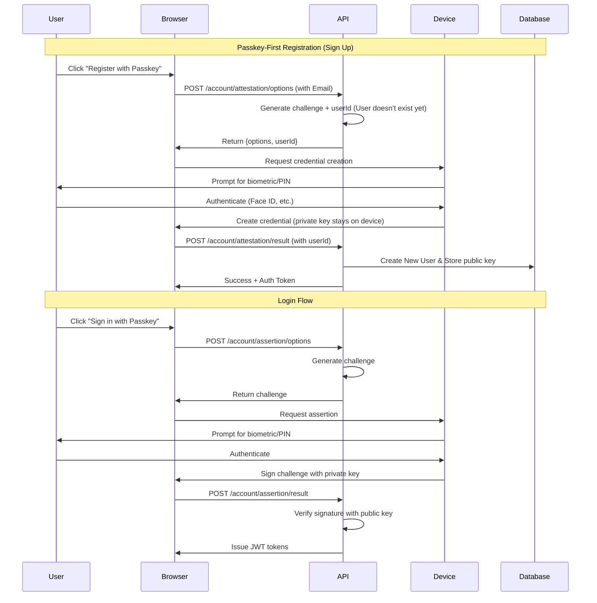

# Passkey Authentication Guide

This guide covers implementing and using **passkey authentication** (WebAuthn/FIDO2) in the BookStore application with .NET 10's built-in support.

## What are Passkeys?

Passkeys are a **modern, passwordless authentication method** that provides:

- **Phishing-resistant security** - Credentials are bound to specific domains
- **No shared secrets** - Only public keys are stored on the server
- **Biometric/PIN authentication** - Uses device authentication (Face ID, Touch ID, Windows Hello, etc.)
- **Cross-device synchronization** - Passkeys can sync across your devices via iCloud, Google Password Manager, etc.
- **Better user experience** - No passwords to remember or type

### How Passkeys Work



## .NET 10 Built-in Support

.NET 10 includes **native passkey support** in ASP.NET Core Identity, eliminating the need for external libraries like `fido2-net-lib`.

### Key Features

- **Automatic credential storage** - Passkeys stored with `ApplicationUser` via `IUserPasskeyStore`
- **Standard Identity endpoints** - Integrated with `SignInManager`
- **Configuration via options** - `IdentityPasskeyOptions`
- **Works with existing Identity** - Integrates seamlessly with password authentication

## Configuration

### Backend Setup

Passkeys require binding to a specific domain (Origin) to prevent phishing.

**appsettings.json**:
```json
{
  "Authentication": {
    "Passkey": {
      "ServerDomain": "localhost",
      "AllowedOrigins": [
        "https://localhost:7260",
        "http://localhost:7260"
      ]
    }
  }
}
```

**Key Settings**:
- **ServerDomain**: Public domain of the API (e.g. `bookstore.com` or `localhost`).
- **AllowedOrigins**: List of origins allowed to perform passkey operations (e.g. your Web App URL).

### Rate Limiting

Rate limiting is enforced on all passkey endpoints via the `AuthPolicy`.
- **Limit**: 10 requests per minute per IP.
- **Violation**: Returns `429 Too Many Requests`.
```

> [!WARNING]
> **Production Configuration**
> In production, you **MUST** set `ServerDomain` to your public domain (e.g., `bookstore.com`) without protocol or port. Use environment variables: `Authentication__Passkey__ServerDomain=bookstore.com`.

## API Endpoints

The application exposes the following endpoints for Passkey operations:

### Creation (Registration)

1.  **POST `/account/attestation/options`**
    *   **Purpose**: Generates WebAuthn creation options (challenge) for creating a new passkey.
    *   **Request**: `PasskeyCreationRequest { Email: string? }`
    *   **Response**: `{ options: {...}, userId: "guid" }` - Returns both the WebAuthn options AND the generated user ID
    *   **Logic**:
        *   If user is **Authenticated**: Generates options to add a passkey to the current account.
        *   If user is **Anonymous** (and Email provided): Generates options to register a **new user** with this passkey.
        *   **Critical**: The `userId` in the response MUST be sent back during attestation to ensure consistency.

2.  **POST `/account/attestation/result`**
    *   **Purpose**: Completes the registration by verifying the attestation.
    *   **Request**: `RegisterPasskeyRequest { CredentialJson: string, Email: string?, UserId: string? }`
    *   **Logic**:
        *   Verifies the WebAuthn attestation.
        *   Uses the `UserId` from the request (sent by client from options response) to create the user.
        *   If **Authenticated**: Adds passkey to existing user.
        *   If **Anonymous**: Creates a new `ApplicationUser` with the provided Email and UserId. **Logs the user in immediately.**
    *   **Critical**: The `UserId` parameter ensures the passkey's embedded user ID matches the database user ID, enabling successful login.

### Assertion (Login)

1.  **POST `/account/assertion/options`**
    *   **Purpose**: Generates WebAuthn assertion options (challenge) for login.
    *   **Request**: `PasskeyLoginOptionsRequest { Email: string? }`
    *   **Logic**: Supports both "Discoverable Credentials" (login without username) and username-based flows.

2.  **POST `/account/assertion/result`**
    *   **Purpose**: Verifies the assertion and logs the user in.
    *   **Request**: `{ CredentialJson: string }`
    *   **Logic**: 
        *   Verifies the WebAuthn signature.
        *   Retrieves the user via `IUserPasskeyStore.FindByPasskeyIdAsync`.
        *   Uses centralized `JwtTokenService` to generate access tokens and rotate refresh tokens.
        *   Returns a standard `LoginResponse`.

## Client-Side Integration

### `passkeys.js`

We use a helper script `wwwroot/js/passkeys.js` to handle the `navigator.credentials` API calls.

```javascript
window.passkey = {
    register: async (optionsJson) => {
        const options = JSON.parse(optionsJson);
        // ... Convert base64 strings to Uint8Array ...
        const credential = await navigator.credentials.create({ publicKey: options });
        // ... Convert ArrayBuffers back to base64 ...
        // IMPORTANT: Include userHandle in the response
        return JSON.stringify(credentialResponse);
    },
    login: async (optionsJson) => {
        // ... Similar flow for navigator.credentials.get() ...
    },
    isSupported: async () => {
        return !!(window.PublicKeyCredential && 
                  await PublicKeyCredential.isUserVerifyingPlatformAuthenticatorAvailable());
    }
};
```

### Blazor Service (`PasskeyService`)

The `PasskeyService` acts as the bridge between the Blazor UI, the JavaScript interop, and the Backend API.

```csharp
public class PasskeyService
{
    // ...
    
    public async Task<(string? Options, string? Error)> GetCreationOptionsAsync(string? email = null)
    {
         // Calls POST /account/attestation/options
         // Returns JSON with { options: {...}, userId: "guid" }
    }

    public async Task<LoginResult?> RegisterPasskeyAsync(string credentialJson, string? email = null, string? userId = null)
    {
         // Calls POST /account/attestation/result
         // Sends credentialJson, email, AND userId
         // Returns LoginResult (Success + Tokens)
    }
}
```

### Critical Implementation Detail: User ID Consistency

**The passkey's embedded user ID MUST match the database user ID.** This is achieved by:

1.  **Server** generates a user ID in `/account/attestation/options` and returns it with the options
2.  **Client** extracts the `userId` from the response
3.  **Client** sends the `userId` back in `/account/attestation/result`
4.  **Server** uses this `userId` to create the database user

**Example Client Code** (`Register.razor`):
```csharp
// 1. Get options (includes userId)
var (options, error) = await PasskeyService.GetCreationOptionsAsync(email);

// 2. Extract userId from response
string? userId = null;
string optionsJson = options;
using var doc = System.Text.Json.JsonDocument.Parse(options);
if (doc.RootElement.TryGetProperty("userId", out var userIdElem))
{
    userId = userIdElem.GetString();
}
if (doc.RootElement.TryGetProperty("options", out var optionsElem))
{
    optionsJson = optionsElem.GetRawText();
}

// 3. Create passkey with WebAuthn
var credentialJson = await JS.InvokeAsync<string>("passkey.register", optionsJson);

// 4. Send credential AND userId to server
var result = await PasskeyService.RegisterPasskeyAsync(credentialJson, email, userId);
```

This ensures the passkey verification succeeds during login because the user IDs match.

## Security Considerations

1.  **HTTPS Is Mandatory**: WebAuthn refuses to run in insecure contexts. Production environments **must** use HTTPS.
2.  **Domain Binding**: Passkeys are chemically bound to the domain (e.g., `bookstore.com`). They cannot be phished by `evil-bookstore.com`.
3.  **User Verification**: We force `UserVerification = Required` to ensure the user actually performed a biometric check (FaceID/PIN), not just a presence check.

## Troubleshooting

### "User already exists"
If you try to use "Passkey-First Registration" with an email that is already registered (e.g., with a password), the server will reject the request.
*   **Fix**: Log in with your password, then go to "Manage Passkeys" to add a passkey to your existing account.

### "NotSupportedError" in Console
*   **Cause**: You are likely accessing the site via `http://` (not localhost) or your device has no biometric authenticator available.
*   **Fix**: Use `https://` or `localhost`.
