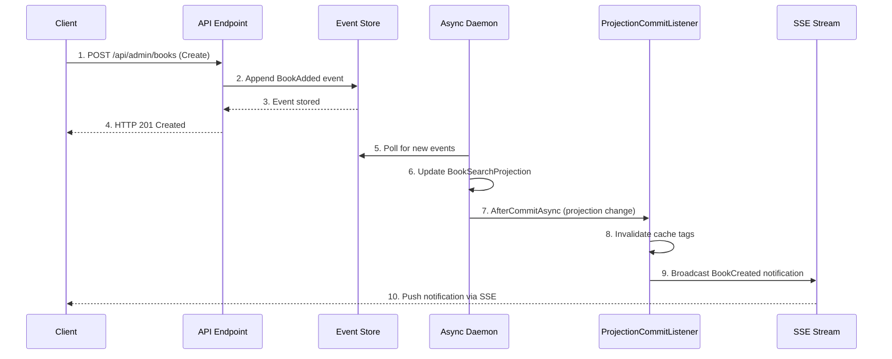

# Real-time Notifications (SSE)

The application automatically sends **Server-Sent Events (SSE)** notifications whenever projections are updated, providing real-time updates to connected clients without polling.

## How it Works

1. **Mutation occurs** - Control flow starts when a client creates, updates, or deletes an entity.
2. **Event stored** - The corresponding domain event (e.g., `BookAdded`) is appended to the Marten event store.
3. **Projection updates** - The **Async Daemon** processes the event and updates the relevant read model (projection).
4. **Notification sent** - A `ProjectionCommitListener` detects the projection change and triggers an SSE notification.
5. **Clients receive** - All connected clients receive the update in real-time.

## Data Flow



## Supported Events

The system currently broadcasts notifications for the following entity lifecycles:

*   **Books**: `BookCreated`, `BookUpdated`, `BookDeleted`
*   **Authors**: `AuthorCreated`, `AuthorUpdated`, `AuthorDeleted`
*   **Categories**: `CategoryCreated`, `CategoryUpdated`, `CategoryDeleted`
*   **Publishers**: `PublisherCreated`, `PublisherUpdated`, `PublisherDeleted`

> [!NOTE]
> **Soft Deletion**: Soft-delete operations appear as `Delete` notifications. Restore operations appear as `Update` notifications (because the `IsDeleted` flag changes from `true` to `false`).

## Backend Implementation

The notification logic is centralized in a Marten **Document Session Listener**. This ensures notifications are reliable and tied directly to the success of the data projection, rather than the API request.

```csharp
// ProjectionCommitListener.cs
public class ProjectionCommitListener : IDocumentSessionListener
{
    public async Task AfterCommitAsync(IDocumentSession _, IChangeSet commit, CancellationToken token)
    {
        // Process all projection changes
        await ProcessDocumentChangesAsync(commit.Inserted, ChangeType.Insert, token);
        await ProcessDocumentChangesAsync(commit.Updated, ChangeType.Update, token);  
        await ProcessDocumentChangesAsync(commit.Deleted, ChangeType.Delete, token);
    }
    
    async Task HandleCategoryChangeAsync(CategoryProjection category, ChangeType changeType)
    {
        // Determine notification type based on change and soft-delete status
        var effectiveChangeType = DetermineEffectiveChangeType(changeType, category.IsDeleted);
        
        // 1. Invalidate cache (HybridCache)
        await InvalidateCacheTagsAsync(category.Id, CacheTags.CategoryItemPrefix, CacheTags.CategoryList);
        
        // 2. Send SSE notification
        IDomainEventNotification notification = effectiveChangeType switch
        {
            ChangeType.Insert => new CategoryCreatedNotification(category.Id),
            ChangeType.Update => new CategoryUpdatedNotification(category.Id),
            ChangeType.Delete => new CategoryDeletedNotification(category.Id)
        };
        await _notificationService.NotifyAsync(notification);
    }
}
```

### Benefits

| Benefit | Description |
| :--- | :--- |
| **Automatic** | No manual notification code needed in command handlers. |
| **Reliable** | Notifications only fire if the projection update succeeds. |
| **Efficient** | A single listener handles all entities generically. |
| **Integrated** | Cache invalidation and SSE broadcast happen in the same atomic unit of work. |

## Client Integration

Clients can connect to the `/api/notifications/stream` endpoint to receive updates.

### JavaScript / Browser

```javascript
// Connect to SSE endpoint
const eventSource = new EventSource('/api/notifications/stream');

eventSource.addEventListener('BookUpdated', (event) => {
    const notification = JSON.parse(event.data);
    console.log(`Book ${notification.entityId} updated`);
    
    // Logic to update UI, e.g., re-fetch book list or update specific item
    refreshBookList();
});
```

### Blazor (C#)

In the Blazor frontend, we use a shared service to listen for these events and trigger UI state updates.

```csharp
// BookStoreEventsService.cs
var request = new HttpRequestMessage(HttpMethod.Get, "api/notifications/stream");
request.SetBrowserResponseStreamingEnabled(true);

using var response = await _httpClient.SendAsync(request, HttpCompletionOption.ResponseHeadersRead);
using var stream = await response.Content.ReadAsStreamAsync();
await foreach (var sseEvent in ParseSseStream(stream))
{
    // Handle event...
}
```
