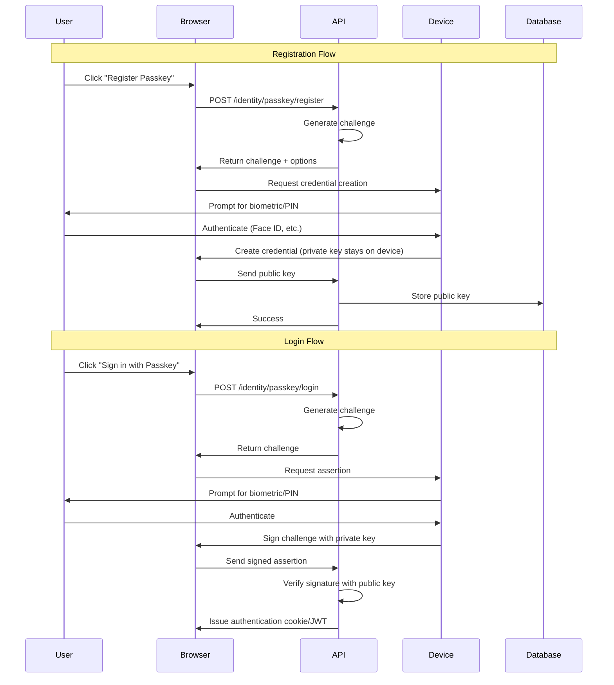

# Passkey Authentication Guide

This guide covers implementing and using **passkey authentication** (WebAuthn/FIDO2) in the BookStore application with .NET 10's built-in support.

## What are Passkeys?

Passkeys are a **modern, passwordless authentication method** that provides:

- **Phishing-resistant security** - Credentials are bound to specific domains
- **No shared secrets** - Only public keys are stored on the server
- **Biometric/PIN authentication** - Uses device authentication (Face ID, Touch ID, Windows Hello, etc.)
- **Cross-device synchronization** - Passkeys can sync across your devices via iCloud, Google Password Manager, etc.
- **Better user experience** - No passwords to remember or type

### How Passkeys Work



## .NET 10 Built-in Support

.NET 10 includes **native passkey support** in ASP.NET Core Identity, eliminating the need for external libraries like `fido2-net-lib`.

### Key Features

- **Automatic credential storage** - Passkeys stored with `ApplicationUser`
- **Standard Identity endpoints** - `/identity/passkey/*` endpoints
- **Configuration via options** - `IdentityPasskeyOptions`
- **Works with existing Identity** - Integrates seamlessly with password authentication

## Configuration

### Backend Setup

#### 1. Configure Passkey Options

```csharp
// Program.cs or ApplicationServicesExtensions.cs
builder.Services.AddIdentityCore<ApplicationUser>(options =>
{
    // Password options
    options.Password.RequireDigit = true;
    options.Password.RequireLowercase = true;
    options.Password.RequireUppercase = true;
    options.Password.RequireNonAlphanumeric = true;
    options.Password.RequiredLength = 8;
    
    // Passkey options
    options.Passkey.ServerDomain = builder.Configuration["Authentication:Passkey:ServerDomain"] 
        ?? "localhost";
    options.Passkey.AuthenticatorTimeout = TimeSpan.FromMinutes(2);
    options.Passkey.ChallengeSize = 32;
})
.AddApiEndpoints()
.AddUserStore<MartenUserStore>()
.AddSignInManager()
.AddDefaultTokenProviders();
```

#### 2. Configure Domain Settings

**appsettings.Development.json:**
```json
{
  "Authentication": {
    "Passkey": {
      "ServerDomain": "localhost"
    }
  }
}
```

**appsettings.Production.json:**
```json
{
  "Authentication": {
    "Passkey": {
      "ServerDomain": "bookstore.com"
    }
  }
}
```

> [!CAUTION]
> **Domain Configuration is Critical**
> 
> - Passkeys are **permanently bound** to the domain specified in `ServerDomain`
> - Changing the domain in production requires **all users to re-register** their passkeys
> - Use the **exact domain** users will access (e.g., `bookstore.com`, not `www.bookstore.com`)
> - **Cannot use IP addresses** - must be a valid domain name

### Frontend Setup

#### 1. WebAuthn JavaScript Integration

Create a service to interact with the browser's WebAuthn API:

```typescript
// wwwroot/js/passkey-service.js
export class PasskeyService {
    
    /**
     * Register a new passkey
     */
    async registerPasskey(options) {
        try {
            // Convert base64 challenge to ArrayBuffer
            const publicKey = {
                ...options,
                challenge: this.base64ToArrayBuffer(options.challenge),
                user: {
                    ...options.user,
                    id: this.base64ToArrayBuffer(options.user.id)
                }
            };

            // Request credential creation from device
            const credential = await navigator.credentials.create({ publicKey });

            // Convert credential to format server expects
            return {
                id: credential.id,
                rawId: this.arrayBufferToBase64(credential.rawId),
                response: {
                    clientDataJSON: this.arrayBufferToBase64(credential.response.clientDataJSON),
                    attestationObject: this.arrayBufferToBase64(credential.response.attestationObject)
                },
                type: credential.type
            };
        } catch (error) {
            console.error('Passkey registration failed:', error);
            throw error;
        }
    }

    /**
     * Login with passkey
     */
    async loginWithPasskey(options) {
        try {
            const publicKey = {
                ...options,
                challenge: this.base64ToArrayBuffer(options.challenge),
                allowCredentials: options.allowCredentials?.map(cred => ({
                    ...cred,
                    id: this.base64ToArrayBuffer(cred.id)
                }))
            };

            const assertion = await navigator.credentials.get({ publicKey });

            return {
                id: assertion.id,
                rawId: this.arrayBufferToBase64(assertion.rawId),
                response: {
                    clientDataJSON: this.arrayBufferToBase64(assertion.response.clientDataJSON),
                    authenticatorData: this.arrayBufferToBase64(assertion.response.authenticatorData),
                    signature: this.arrayBufferToBase64(assertion.response.signature),
                    userHandle: assertion.response.userHandle 
                        ? this.arrayBufferToBase64(assertion.response.userHandle) 
                        : null
                },
                type: assertion.type
            };
        } catch (error) {
            console.error('Passkey login failed:', error);
            throw error;
        }
    }

    // Helper methods
    base64ToArrayBuffer(base64) {
        const binary = atob(base64.replace(/-/g, '+').replace(/_/g, '/'));
        const bytes = new Uint8Array(binary.length);
        for (let i = 0; i < binary.length; i++) {
            bytes[i] = binary.charCodeAt(i);
        }
        return bytes.buffer;
    }

    arrayBufferToBase64(buffer) {
        const bytes = new Uint8Array(buffer);
        let binary = '';
        for (let i = 0; i < bytes.length; i++) {
            binary += String.fromCharCode(bytes[i]);
        }
        return btoa(binary).replace(/\+/g, '-').replace(/\//g, '_').replace(/=/g, '');
    }
}

// Create global instance
window.passkeyService = new PasskeyService();
```

#### 2. Blazor Component for Passkey Registration

```razor
@page "/account/passkeys"
@inject IJSRuntime JS
@inject HttpClient Http
@inject ISnackbar Snackbar

<MudContainer MaxWidth="MaxWidth.Medium">
    <MudPaper Class="pa-6 mt-4">
        <MudText Typo="Typo.h4" Class="mb-4">Manage Passkeys</MudText>
        
        <MudText Typo="Typo.body1" Class="mb-4">
            Passkeys provide secure, passwordless authentication using your device's biometric sensors or PIN.
        </MudText>

        <MudButton Variant="Variant.Filled" 
                   Color="Color.Primary" 
                   OnClick="RegisterPasskey"
                   StartIcon="@Icons.Material.Filled.Fingerprint">
            Register New Passkey
        </MudButton>

        @if (passkeys.Any())
        {
            <MudText Typo="Typo.h6" Class="mt-6 mb-2">Your Passkeys</MudText>
            <MudList>
                @foreach (var passkey in passkeys)
                {
                    <MudListItem>
                        <div class="d-flex justify-space-between align-center">
                            <div>
                                <MudText Typo="Typo.body1">@passkey.Name</MudText>
                                <MudText Typo="Typo.caption">
                                    Created: @passkey.CreatedAt.ToLocalTime().ToString("g")
                                </MudText>
                            </div>
                            <MudIconButton Icon="@Icons.Material.Filled.Delete" 
                                          Color="Color.Error"
                                          OnClick="@(() => DeletePasskey(passkey.Id))" />
                        </div>
                    </MudListItem>
                }
            </MudList>
        }
    </MudPaper>
</MudContainer>

@code {
    private List<PasskeyInfo> passkeys = new();

    protected override async Task OnInitializedAsync()
    {
        await LoadPasskeys();
    }

    private async Task LoadPasskeys()
    {
        try
        {
            passkeys = await Http.GetFromJsonAsync<List<PasskeyInfo>>("/identity/passkey/list") 
                ?? new();
        }
        catch (Exception ex)
        {
            Snackbar.Add($"Failed to load passkeys: {ex.Message}", Severity.Error);
        }
    }

    private async Task RegisterPasskey()
    {
        try
        {
            // Get registration options from server
            var options = await Http.PostAsJsonAsync("/identity/passkey/register/begin", new { });
            var optionsData = await options.Content.ReadFromJsonAsync<PasskeyRegistrationOptions>();

            // Use WebAuthn API to create credential
            var credential = await JS.InvokeAsync<object>("passkeyService.registerPasskey", optionsData);

            // Send credential to server
            var response = await Http.PostAsJsonAsync("/identity/passkey/register/complete", credential);

            if (response.IsSuccessStatusCode)
            {
                Snackbar.Add("Passkey registered successfully!", Severity.Success);
                await LoadPasskeys();
            }
            else
            {
                Snackbar.Add("Failed to register passkey", Severity.Error);
            }
        }
        catch (Exception ex)
        {
            Snackbar.Add($"Error: {ex.Message}", Severity.Error);
        }
    }

    private async Task DeletePasskey(string id)
    {
        try
        {
            var response = await Http.DeleteAsync($"/identity/passkey/{id}");
            
            if (response.IsSuccessStatusCode)
            {
                Snackbar.Add("Passkey deleted", Severity.Success);
                await LoadPasskeys();
            }
            else
            {
                Snackbar.Add("Failed to delete passkey", Severity.Error);
            }
        }
        catch (Exception ex)
        {
            Snackbar.Add($"Error: {ex.Message}", Severity.Error);
        }
    }

    record PasskeyInfo(string Id, string Name, DateTime CreatedAt);
    record PasskeyRegistrationOptions(string Challenge, object User, object PubKeyCredParams);
}
```

#### 3. Login Component with Passkey Support

```razor
@page "/login"
@inject AuthenticationService AuthService
@inject IJSRuntime JS
@inject NavigationManager Navigation

<MudContainer MaxWidth="MaxWidth.Small">
    <MudPaper Class="pa-6 mt-8">
        <MudText Typo="Typo.h4" Align="Align.Center" Class="mb-4">
            Sign In
        </MudText>

        @* Passkey Login *@
        <MudButton Variant="Variant.Filled" 
                   Color="Color.Primary" 
                   FullWidth="true"
                   StartIcon="@Icons.Material.Filled.Fingerprint"
                   OnClick="LoginWithPasskey"
                   Class="mb-4">
            Sign in with Passkey
        </MudButton>

        <MudDivider Class="my-4">
            <MudText Typo="Typo.caption">or</MudText>
        </MudDivider>

        @* Password Login *@
        <EditForm Model="loginModel" OnValidSubmit="LoginWithPassword">
            <DataAnnotationsValidator />
            
            <MudTextField @bind-Value="loginModel.Email"
                         Label="Email"
                         Variant="Variant.Outlined"
                         Required="true"
                         Class="mb-3" />
            
            <MudTextField @bind-Value="loginModel.Password"
                         Label="Password"
                         Variant="Variant.Outlined"
                         InputType="InputType.Password"
                         Required="true"
                         Class="mb-3" />

            @if (!string.IsNullOrEmpty(errorMessage))
            {
                <MudAlert Severity="Severity.Error" Class="mb-3">
                    @errorMessage
                </MudAlert>
            }

            <MudButton ButtonType="ButtonType.Submit"
                      Variant="Variant.Filled"
                      Color="Color.Primary"
                      FullWidth="true">
                Sign In
            </MudButton>
        </EditForm>
    </MudPaper>
</MudContainer>

@code {
    private LoginModel loginModel = new();
    private string? errorMessage;

    private async Task LoginWithPassword()
    {
        errorMessage = null;
        var result = await AuthService.LoginAsync(loginModel.Email, loginModel.Password);
        
        if (result.Success)
        {
            await JS.InvokeVoidAsync("authBroadcast.notifyLogin");
            Navigation.NavigateTo("/", forceLoad: true);
        }
        else
        {
            errorMessage = result.Error;
        }
    }

    private async Task LoginWithPasskey()
    {
        try
        {
            // Get login options from server
            var options = await Http.PostAsJsonAsync("/identity/passkey/login/begin", new { });
            var optionsData = await options.Content.ReadFromJsonAsync<PasskeyLoginOptions>();

            // Use WebAuthn API to get assertion
            var assertion = await JS.InvokeAsync<object>("passkeyService.loginWithPasskey", optionsData);

            // Send assertion to server
            var response = await Http.PostAsJsonAsync("/identity/passkey/login/complete", assertion);

            if (response.IsSuccessStatusCode)
            {
                await JS.InvokeVoidAsync("authBroadcast.notifyLogin");
                Navigation.NavigateTo("/", forceLoad: true);
            }
            else
            {
                errorMessage = "Passkey authentication failed";
            }
        }
        catch (Exception ex)
        {
            errorMessage = $"Error: {ex.Message}";
        }
    }

    class LoginModel
    {
        public string Email { get; set; } = "";
        public string Password { get; set; } = "";
    }

    record PasskeyLoginOptions(string Challenge, object[] AllowCredentials);
}
```

## API Endpoints

### Registration Flow

#### 1. Begin Registration

**POST** `/identity/passkey/register/begin`

Returns WebAuthn creation options:

```json
{
  "challenge": "base64-encoded-challenge",
  "rp": {
    "name": "BookStore",
    "id": "localhost"
  },
  "user": {
    "id": "base64-user-id",
    "name": "user@example.com",
    "displayName": "user@example.com"
  },
  "pubKeyCredParams": [
    { "alg": -7, "type": "public-key" },
    { "alg": -257, "type": "public-key" }
  ],
  "authenticatorSelection": {
    "authenticatorAttachment": "platform",
    "userVerification": "required"
  },
  "timeout": 120000
}
```

#### 2. Complete Registration

**POST** `/identity/passkey/register/complete`

Send the credential created by the browser:

```json
{
  "id": "credential-id",
  "rawId": "base64-raw-id",
  "response": {
    "clientDataJSON": "base64-client-data",
    "attestationObject": "base64-attestation"
  },
  "type": "public-key"
}
```

### Login Flow

#### 1. Begin Login

**POST** `/identity/passkey/login/begin`

Returns WebAuthn request options:

```json
{
  "challenge": "base64-encoded-challenge",
  "rpId": "localhost",
  "allowCredentials": [
    {
      "id": "base64-credential-id",
      "type": "public-key"
    }
  ],
  "userVerification": "required",
  "timeout": 120000
}
```

#### 2. Complete Login

**POST** `/identity/passkey/login/complete`

Send the assertion from the browser:

```json
{
  "id": "credential-id",
  "rawId": "base64-raw-id",
  "response": {
    "clientDataJSON": "base64-client-data",
    "authenticatorData": "base64-authenticator-data",
    "signature": "base64-signature",
    "userHandle": "base64-user-handle"
  },
  "type": "public-key"
}
```

### Management Endpoints

- **GET** `/identity/passkey/list` - List user's registered passkeys
- **DELETE** `/identity/passkey/{id}` - Delete a specific passkey
- **PUT** `/identity/passkey/{id}/rename` - Rename a passkey

## Browser Support

Passkeys require WebAuthn support:

| Browser | Support | Notes |
|---------|---------|-------|
| Chrome 67+ | ✅ Full | Platform and cross-platform authenticators |
| Edge 18+ | ✅ Full | Platform and cross-platform authenticators |
| Firefox 60+ | ✅ Full | Platform and cross-platform authenticators |
| Safari 13+ | ✅ Full | Platform authenticators, iCloud Keychain sync |
| Mobile Safari | ✅ Full | Face ID, Touch ID support |
| Chrome Android | ✅ Full | Fingerprint, face unlock support |

### Feature Detection

```javascript
if (window.PublicKeyCredential) {
    // WebAuthn is supported
    const available = await PublicKeyCredential.isUserVerifyingPlatformAuthenticatorAvailable();
    if (available) {
        // Device supports biometric/PIN authentication
    }
}
```

## Security Considerations

### Best Practices

> [!IMPORTANT]
> Follow these security guidelines:

1. **HTTPS Required** - WebAuthn only works over HTTPS (except localhost)
2. **Domain Validation** - Passkeys are bound to the exact domain
3. **User Verification** - Always require `userVerification: "required"`
4. **Attestation** - Consider requiring attestation for high-security scenarios
5. **Backup Authenticators** - Allow users to register multiple passkeys

### Attack Resistance

✅ **Phishing-resistant** - Credentials won't work on fake domains  
✅ **No credential stuffing** - Each passkey is unique per site  
✅ **No password databases to breach** - Only public keys stored  
✅ **Man-in-the-middle resistant** - Cryptographic verification  
✅ **Replay attack resistant** - Each authentication uses unique challenge

## Troubleshooting

### Common Issues

#### "WebAuthn not supported"

**Cause**: Browser doesn't support WebAuthn or page not served over HTTPS

**Solution**:
- Verify browser version (see Browser Support table)
- Ensure site is accessed via HTTPS (or localhost for development)
- Check browser console for specific errors

#### "No authenticator available"

**Cause**: Device doesn't have biometric/PIN authentication set up

**Solution**:
- Verify device has Face ID, Touch ID, Windows Hello, or PIN configured
- Try using a security key (USB authenticator)
- Check device settings for biometric authentication

#### "Domain mismatch"

**Cause**: `ServerDomain` doesn't match the actual domain

**Solution**:
- Verify `ServerDomain` in configuration matches exactly
- Don't include protocol (`https://`) or port (`:443`)
- Use exact domain users access (e.g., `bookstore.com` not `www.bookstore.com`)

#### "Registration fails silently"

**Cause**: JavaScript error or incorrect data format

**Solution**:
- Check browser console for errors
- Verify base64 encoding/decoding is correct
- Ensure ArrayBuffer conversions are working
- Test with browser DevTools Network tab

## Testing

### Manual Testing

1. **Register a Passkey**
   - Navigate to `/account/passkeys`
   - Click "Register New Passkey"
   - Follow device prompts (Face ID, Touch ID, etc.)
   - Verify passkey appears in list

2. **Login with Passkey**
   - Navigate to `/login`
   - Click "Sign in with Passkey"
   - Authenticate with device
   - Verify successful login

3. **Cross-Device Sync** (if supported)
   - Register passkey on Device A
   - Wait for sync (iCloud, Google, etc.)
   - Login with passkey on Device B

### Automated Testing

```csharp
[Test]
public async Task PasskeyRegistration_WithValidOptions_Succeeds()
{
    // Arrange
    var client = _factory.CreateClient();
    await LoginAsUser(client);

    // Act
    var beginResponse = await client.PostAsync("/identity/passkey/register/begin", null);
    var options = await beginResponse.Content.ReadFromJsonAsync<PasskeyOptions>();

    // Assert
    Assert.IsNotNull(options.Challenge);
    Assert.AreEqual("localhost", options.Rp.Id);
}
```

## Migration Strategy

### Adding Passkeys to Existing Accounts

1. **Gradual Rollout**
   - Enable passkey registration for all users
   - Keep password authentication as fallback
   - Encourage passkey adoption via UI prompts

2. **User Communication**
   - Explain benefits (security, convenience)
   - Provide clear instructions
   - Offer support for issues

3. **Monitoring**
   - Track passkey adoption rate
   - Monitor authentication success rates
   - Collect user feedback

### Passwordless Migration

For fully passwordless authentication:

1. **Phase 1**: Passkeys optional (current state)
2. **Phase 2**: Encourage passkey registration
3. **Phase 3**: Require passkey for new users
4. **Phase 4**: Deprecate password authentication (optional)

## Related Guides

- [Authentication Guide](authentication-guide.md) - Overall authentication system
- [Security Best Practices](security-guide.md) - Security guidelines
- [API Conventions](api-conventions-guide.md) - API design patterns
- [Testing Guide](testing-guide.md) - Testing authentication flows
