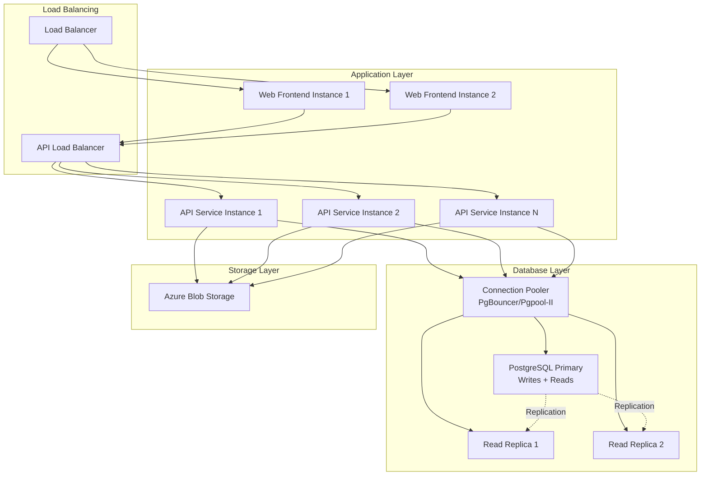

# Production Scaling Guide

This guide covers strategies and best practices for scaling the BookStore application in production environments, including application-level scaling, database optimization, and performance tuning.

## Overview

The BookStore application is designed for horizontal scalability with:
- **Stateless Services** - API and Web services can scale independently
- **Event-Sourced Architecture** - Marten with PostgreSQL for reliable event storage
- **Read Model Projections** - Optimized for read-heavy workloads
- **Real-time Updates** - Server-Sent Events (SSE) for live notifications

## Scaling Strategy Overview



---

## Application Scaling

### Azure Container Apps Scaling

Azure Container Apps uses KEDA (Kubernetes Event-Driven Autoscaling) for robust autoscaling capabilities.

#### Configure Autoscaling Rules

Create or update your Container App scaling configuration:

```bash
# Scale API service based on HTTP requests
az containerapp update \
  --name apiservice \
  --resource-group bookstore-rg \
  --min-replicas 2 \
  --max-replicas 10 \
  --scale-rule-name http-scaling \
  --scale-rule-type http \
  --scale-rule-http-concurrency 50

# Scale based on CPU utilization
az containerapp update \
  --name apiservice \
  --resource-group bookstore-rg \
  --scale-rule-name cpu-scaling \
  --scale-rule-type cpu \
  --scale-rule-metadata "type=Utilization" "value=70"
```

#### Scaling Configuration via YAML

```yaml
# api-scaling.yaml
properties:
  configuration:
    activeRevisionsMode: Single
  template:
    scale:
      minReplicas: 2
      maxReplicas: 10
      rules:
      - name: http-rule
        http:
          metadata:
            concurrentRequests: "50"
      - name: cpu-rule
        custom:
          type: cpu
          metadata:
            type: Utilization
            value: "70"
```

#### Best Practices for Azure Container Apps

1. **Set Minimum Replicas ≥ 2** for production APIs to avoid cold starts
2. **Configure Appropriate Concurrency** - Start with 50 concurrent requests per instance
3. **Use Multiple Scaling Rules** - Combine HTTP, CPU, and memory triggers
4. **Monitor Scaling Events** - Use Azure Monitor to track scaling decisions
5. **Optimize Container Images** - Use minimal base images for faster startup

```bash
# View scaling events
az monitor activity-log list \
  --resource-group bookstore-rg \
  --resource-id /subscriptions/<sub-id>/resourceGroups/bookstore-rg/providers/Microsoft.App/containerApps/apiservice \
  --start-time 2025-01-01T00:00:00Z
```

### Kubernetes Horizontal Pod Autoscaler (HPA)

For Kubernetes deployments, use HPA to automatically scale pods based on resource metrics.

#### Install Metrics Server

```bash
# Required for HPA to function
kubectl apply -f https://github.com/kubernetes-sigs/metrics-server/releases/latest/download/components.yaml
```

#### Configure HPA for API Service

```yaml
# api-hpa.yaml
apiVersion: autoscaling/v2
kind: HorizontalPodAutoscaler
metadata:
  name: apiservice-hpa
  namespace: bookstore
spec:
  scaleTargetRef:
    apiVersion: apps/v1
    kind: Deployment
    name: apiservice
  minReplicas: 2
  maxReplicas: 10
  metrics:
  - type: Resource
    resource:
      name: cpu
      target:
        type: Utilization
        averageUtilization: 70
  - type: Resource
    resource:
      name: memory
      target:
        type: Utilization
        averageUtilization: 80
  behavior:
    scaleDown:
      stabilizationWindowSeconds: 300
      policies:
      - type: Percent
        value: 50
        periodSeconds: 60
    scaleUp:
      stabilizationWindowSeconds: 0
      policies:
      - type: Percent
        value: 100
        periodSeconds: 30
      - type: Pods
        value: 2
        periodSeconds: 30
      selectPolicy: Max
```

Apply the HPA:

```bash
kubectl apply -f api-hpa.yaml

# Verify HPA status
kubectl get hpa -n bookstore
kubectl describe hpa apiservice-hpa -n bookstore
```

#### Configure HPA for Web Frontend

```yaml
# web-hpa.yaml
apiVersion: autoscaling/v2
kind: HorizontalPodAutoscaler
metadata:
  name: webfrontend-hpa
  namespace: bookstore
spec:
  scaleTargetRef:
    apiVersion: apps/v1
    kind: Deployment
    name: webfrontend
  minReplicas: 2
  maxReplicas: 8
  metrics:
  - type: Resource
    resource:
      name: cpu
      target:
        type: Utilization
        averageUtilization: 60
  behavior:
    scaleDown:
      stabilizationWindowSeconds: 300
```

#### Custom Metrics with Prometheus

For more advanced scaling, use custom metrics from Prometheus:

```yaml
# custom-metrics-hpa.yaml
apiVersion: autoscaling/v2
kind: HorizontalPodAutoscaler
metadata:
  name: apiservice-custom-hpa
  namespace: bookstore
spec:
  scaleTargetRef:
    apiVersion: apps/v1
    kind: Deployment
    name: apiservice
  minReplicas: 2
  maxReplicas: 15
  metrics:
  - type: Pods
    pods:
      metric:
        name: http_requests_per_second
      target:
        type: AverageValue
        averageValue: "1000"
  - type: Pods
    pods:
      metric:
        name: api_response_time_p95
      target:
        type: AverageValue
        averageValue: "500m"  # 500ms
```

#### Best Practices for Kubernetes HPA

1. **Define Accurate Resource Requests/Limits** in deployment manifests
2. **Set Stabilization Windows** to prevent flapping (rapid scaling up/down)
3. **Use Multiple Metrics** for more intelligent scaling decisions
4. **Combine with Cluster Autoscaler** to scale nodes when needed
5. **Monitor HPA Behavior** and adjust thresholds based on actual usage

```bash
# Monitor HPA in real-time
kubectl get hpa -n bookstore --watch

# View HPA events
kubectl describe hpa apiservice-hpa -n bookstore | grep Events -A 20
```

### Resource Requests and Limits

Define appropriate resource requests and limits for optimal scheduling and scaling:

```yaml
# api-deployment.yaml
apiVersion: apps/v1
kind: Deployment
metadata:
  name: apiservice
  namespace: bookstore
spec:
  replicas: 2
  template:
    spec:
      containers:
      - name: apiservice
        image: bookstoreacr.azurecr.io/bookstore-api:latest
        resources:
          requests:
            cpu: 500m
            memory: 512Mi
          limits:
            cpu: 1000m
            memory: 1Gi
        livenessProbe:
          httpGet:
            path: /health
            port: 8080
          initialDelaySeconds: 30
          periodSeconds: 10
        readinessProbe:
          httpGet:
            path: /health
            port: 8080
          initialDelaySeconds: 5
          periodSeconds: 5
```

---

## Database Scaling

### PostgreSQL Read Replicas

For read-heavy workloads, implement read replicas to offload read queries from the primary database.

#### Azure Database for PostgreSQL

```bash
# Create read replica
az postgres flexible-server replica create \
  --resource-group bookstore-rg \
  --name bookstore-db-replica-1 \
  --source-server bookstore-db \
  --location eastus2

# Create additional replicas for different regions
az postgres flexible-server replica create \
  --resource-group bookstore-rg \
  --name bookstore-db-replica-westus \
  --source-server bookstore-db \
  --location westus2
```

#### Configure Application for Read Replicas

Update your connection strings to use read replicas for read operations:

```csharp
// In Program.cs or configuration
services.AddMarten(options =>
{
    // Primary connection for writes
    options.Connection(builder.Configuration.GetConnectionString("bookstore"));
    
    // Read replicas for queries
    options.ReadReplicas(replicas =>
    {
        replicas.Add(builder.Configuration.GetConnectionString("bookstore-replica-1"));
        replicas.Add(builder.Configuration.GetConnectionString("bookstore-replica-2"));
    });
    
    // Use round-robin load balancing for read replicas
    options.UseReadReplicaLoadBalancing(LoadBalancingMode.RoundRobin);
});
```

> [!IMPORTANT]
> Marten supports read replicas natively. Configure read replicas in your Marten setup to automatically route read queries to replicas while keeping writes on the primary.

#### Monitor Replication Lag

```sql
-- Check replication lag on replica
SELECT 
    CASE 
        WHEN pg_last_wal_receive_lsn() = pg_last_wal_replay_lsn() THEN 0
        ELSE EXTRACT(EPOCH FROM (now() - pg_last_xact_replay_timestamp()))
    END AS replication_lag_seconds;

-- View replication status
SELECT * FROM pg_stat_replication;
```

### Connection Pooling

Implement connection pooling to efficiently manage database connections and improve performance.

#### PgBouncer Configuration

Deploy PgBouncer as a connection pooler:

```ini
# pgbouncer.ini
[databases]
bookstore = host=bookstore-db.postgres.database.azure.com port=5432 dbname=bookstore
bookstore-replica-1 = host=bookstore-db-replica-1.postgres.database.azure.com port=5432 dbname=bookstore

[pgbouncer]
listen_addr = *
listen_port = 6432
auth_type = md5
auth_file = /etc/pgbouncer/userlist.txt
pool_mode = transaction
max_client_conn = 1000
default_pool_size = 25
reserve_pool_size = 5
reserve_pool_timeout = 3
max_db_connections = 100
server_idle_timeout = 600
server_lifetime = 3600
```

#### Kubernetes Deployment for PgBouncer

```yaml
# pgbouncer-deployment.yaml
apiVersion: apps/v1
kind: Deployment
metadata:
  name: pgbouncer
  namespace: bookstore
spec:
  replicas: 2
  selector:
    matchLabels:
      app: pgbouncer
  template:
    metadata:
      labels:
        app: pgbouncer
    spec:
      containers:
      - name: pgbouncer
        image: pgbouncer/pgbouncer:latest
        ports:
        - containerPort: 6432
        volumeMounts:
        - name: config
          mountPath: /etc/pgbouncer
        resources:
          requests:
            cpu: 100m
            memory: 128Mi
          limits:
            cpu: 500m
            memory: 256Mi
      volumes:
      - name: config
        configMap:
          name: pgbouncer-config
---
apiVersion: v1
kind: Service
metadata:
  name: pgbouncer
  namespace: bookstore
spec:
  selector:
    app: pgbouncer
  ports:
  - port: 6432
    targetPort: 6432
  type: ClusterIP
```

Update application connection strings to use PgBouncer:

```bash
# Instead of connecting directly to PostgreSQL
Host=bookstore-db.postgres.database.azure.com;Port=5432;...

# Connect through PgBouncer
Host=pgbouncer;Port=6432;...
```

### Database Performance Tuning

#### PostgreSQL Configuration

Optimize PostgreSQL settings for production workloads:

```sql
-- Increase shared buffers (25% of available RAM)
ALTER SYSTEM SET shared_buffers = '4GB';

-- Increase effective cache size (50-75% of available RAM)
ALTER SYSTEM SET effective_cache_size = '12GB';

-- Optimize for write-heavy workloads
ALTER SYSTEM SET wal_buffers = '16MB';
ALTER SYSTEM SET checkpoint_completion_target = 0.9;
ALTER SYSTEM SET max_wal_size = '4GB';

-- Optimize query planner
ALTER SYSTEM SET random_page_cost = 1.1;  -- For SSD storage
ALTER SYSTEM SET effective_io_concurrency = 200;

-- Increase connection limits
ALTER SYSTEM SET max_connections = 200;

-- Reload configuration
SELECT pg_reload_conf();
```

#### Index Optimization

Ensure critical queries have appropriate indexes:

```sql
-- Analyze query performance
EXPLAIN ANALYZE 
SELECT * FROM mt_doc_booksearchprojection 
WHERE search_text @@ to_tsquery('english', 'architecture');

-- Create indexes for common queries
CREATE INDEX CONCURRENTLY idx_book_search_gin 
ON mt_doc_booksearchprojection 
USING gin(search_text gin_trgm_ops);

-- Index for filtering by category
CREATE INDEX CONCURRENTLY idx_book_category 
ON mt_doc_booksearchprojection (category_id);

-- Composite index for common query patterns
CREATE INDEX CONCURRENTLY idx_book_category_published 
ON mt_doc_booksearchprojection (category_id, publication_date DESC);

-- Analyze tables after creating indexes
ANALYZE mt_doc_booksearchprojection;
```

#### Vacuum and Maintenance

```sql
-- Configure autovacuum for event-sourced tables
ALTER TABLE mt_events SET (
    autovacuum_vacuum_scale_factor = 0.05,
    autovacuum_analyze_scale_factor = 0.02
);

-- Manual vacuum for large tables
VACUUM ANALYZE mt_events;
VACUUM ANALYZE mt_doc_booksearchprojection;

-- Monitor table bloat
SELECT 
    schemaname, 
    tablename, 
    pg_size_pretty(pg_total_relation_size(schemaname||'.'||tablename)) AS size,
    n_live_tup,
    n_dead_tup,
    round(n_dead_tup * 100.0 / NULLIF(n_live_tup + n_dead_tup, 0), 2) AS dead_ratio
FROM pg_stat_user_tables
WHERE n_dead_tup > 1000
ORDER BY n_dead_tup DESC;
```

---

## Caching Strategies

### Application-Level Caching

Implement caching for frequently accessed data:

```csharp
// Add distributed caching
services.AddStackExchangeRedisCache(options =>
{
    options.Configuration = builder.Configuration.GetConnectionString("redis");
    options.InstanceName = "BookStore:";
});

// Cache category translations
public class CachedCategoryService
{
    private readonly IDistributedCache _cache;
    private readonly ICategoryRepository _repository;
    
    public async Task<IEnumerable<CategoryDto>> GetCategoriesAsync(
        string language, 
        CancellationToken ct)
    {
        var cacheKey = $"categories:{language}";
        var cached = await _cache.GetStringAsync(cacheKey, ct);
        
        if (cached != null)
            return JsonSerializer.Deserialize<IEnumerable<CategoryDto>>(cached);
        
        var categories = await _repository.GetAllAsync(language, ct);
        
        await _cache.SetStringAsync(
            cacheKey, 
            JsonSerializer.Serialize(categories),
            new DistributedCacheEntryOptions
            {
                AbsoluteExpirationRelativeToNow = TimeSpan.FromMinutes(15)
            },
            ct);
        
        return categories;
    }
}
```

### HTTP Caching with ETags

The BookStore application already implements ETags for optimistic concurrency. Leverage this for HTTP caching:

```csharp
// In API endpoints
app.MapGet("/api/books/{id}", async (
    Guid id, 
    IDocumentSession session,
    HttpContext context) =>
{
    var book = await session.LoadAsync<BookSearchProjection>(id);
    if (book == null) return Results.NotFound();
    
    var etag = $"\"{book.Version}\"";
    
    // Check If-None-Match header
    if (context.Request.Headers.IfNoneMatch == etag)
        return Results.StatusCode(304); // Not Modified
    
    context.Response.Headers.ETag = etag;
    context.Response.Headers.CacheControl = "private, max-age=60";
    
    return Results.Ok(book);
});
```

### CDN for Static Assets

Use Azure CDN or Cloudflare for static assets:

```bash
# Create Azure CDN profile
az cdn profile create \
  --resource-group bookstore-rg \
  --name bookstore-cdn \
  --sku Standard_Microsoft

# Create CDN endpoint
az cdn endpoint create \
  --resource-group bookstore-rg \
  --profile-name bookstore-cdn \
  --name bookstore-static \
  --origin bookstore-storage.blob.core.windows.net \
  --origin-host-header bookstore-storage.blob.core.windows.net
```

---

## Server-Sent Events (SSE) Scaling

For real-time notifications across multiple instances, SSE connections are stateful and bound to specific server instances. Consider these scaling strategies:

### Load Balancer with Sticky Sessions

```yaml
# nginx configuration for SSE with sticky sessions
upstream bookstore_api {
    ip_hash;  # Ensures same client goes to same server
    server api1.bookstore.com:5000;
    server api2.bookstore.com:5000;
    server api3.bookstore.com:5000;
}

server {
    location /api/notifications/stream {
        proxy_pass http://bookstore_api;
        proxy_http_version 1.1;
        proxy_set_header Connection "";
        proxy_buffering off;
        proxy_cache off;
        proxy_read_timeout 24h;
    }
}
```

### Redis Pub/Sub for Multi-Instance Broadcasting

Use Redis to broadcast notifications across all API instances:

```csharp
// NotificationService.cs
public class NotificationService : INotificationService
{
    private readonly IConnectionMultiplexer _redis;
    
    public async Task NotifyAsync(IDomainEventNotification notification)
    {
        // Publish to Redis channel
        await _redis.GetSubscriber()
            .PublishAsync("bookstore:notifications", JsonSerializer.Serialize(notification));
    }
}

// Program.cs - Subscribe to Redis notifications
var subscriber = redis.GetSubscriber();
await subscriber.SubscribeAsync("bookstore:notifications", (channel, message) =>
{
    // Broadcast to all connected SSE clients on this instance
    notificationHub.BroadcastToClients(message);
});
```

**Benefits:**
- ✅ Horizontal scaling with multiple API instances
- ✅ All clients receive notifications regardless of which server they're connected to
- ✅ Redis provides reliable message delivery

---

## Load Testing

Perform load testing to validate scaling configuration and identify bottlenecks.

### Using Azure Load Testing

```bash
# Create load testing resource
az load create \
  --name bookstore-loadtest \
  --resource-group bookstore-rg \
  --location eastus2
```

### Using k6 for Load Testing

```javascript
// load-test.js
import http from 'k6/http';
import { check, sleep } from 'k6';

export const options = {
  stages: [
    { duration: '2m', target: 100 },  // Ramp up to 100 users
    { duration: '5m', target: 100 },  // Stay at 100 users
    { duration: '2m', target: 200 },  // Ramp up to 200 users
    { duration: '5m', target: 200 },  // Stay at 200 users
    { duration: '2m', target: 0 },    // Ramp down
  ],
  thresholds: {
    http_req_duration: ['p(95)<500'], // 95% of requests under 500ms
    http_req_failed: ['rate<0.01'],   // Error rate under 1%
  },
};

export default function () {
  // Test book search
  const searchRes = http.get('https://bookstore-api.azurecontainerapps.io/api/books/search?query=architecture');
  check(searchRes, {
    'search status is 200': (r) => r.status === 200,
    'search response time < 500ms': (r) => r.timings.duration < 500,
  });
  
  sleep(1);
  
  // Test book details
  const detailRes = http.get('https://bookstore-api.azurecontainerapps.io/api/books/123e4567-e89b-12d3-a456-426614174000');
  check(detailRes, {
    'detail status is 200': (r) => r.status === 200,
  });
  
  sleep(1);
}
```

Run the test:

```bash
k6 run load-test.js
```

---

## Monitoring and Observability

### Key Metrics to Monitor

#### Application Metrics
- **Request Rate** - Requests per second
- **Response Time** - P50, P95, P99 latencies
- **Error Rate** - 4xx and 5xx responses
- **Active Connections** - Current connections to services
- **Pod/Instance Count** - Current replica count

#### Database Metrics
- **Connection Count** - Active database connections
- **Query Performance** - Slow query log
- **Replication Lag** - Delay between primary and replicas
- **Cache Hit Ratio** - PostgreSQL buffer cache efficiency
- **Transaction Rate** - Transactions per second

#### Resource Metrics
- **CPU Utilization** - Per instance/pod
- **Memory Usage** - Working set and GC pressure
- **Network I/O** - Throughput and latency
- **Disk I/O** - IOPS and throughput

### Azure Monitor Queries

```kusto
// Average response time by endpoint
requests
| where timestamp > ago(1h)
| summarize avg(duration), percentile(duration, 95) by name
| order by avg_duration desc

// Error rate over time
requests
| where timestamp > ago(24h)
| summarize 
    total = count(),
    errors = countif(success == false)
    by bin(timestamp, 5m)
| extend error_rate = errors * 100.0 / total
| render timechart

// Scaling events
AzureActivity
| where OperationNameValue contains "scale"
| where ResourceGroup == "bookstore-rg"
| project TimeGenerated, OperationNameValue, ActivityStatusValue, Properties
```

### Prometheus Metrics (Kubernetes)

```yaml
# servicemonitor.yaml
apiVersion: monitoring.coreos.com/v1
kind: ServiceMonitor
metadata:
  name: bookstore-metrics
  namespace: bookstore
spec:
  selector:
    matchLabels:
      app: apiservice
  endpoints:
  - port: metrics
    interval: 30s
```

---

## Cost Optimization

### Right-Sizing Instances

1. **Monitor actual resource usage** over 2-4 weeks
2. **Adjust resource requests/limits** based on P95 usage
3. **Use burstable instances** for variable workloads (Azure B-series, AWS T-series)
4. **Scale to zero** for non-production environments

### Reserved Capacity

For predictable workloads, use reserved instances:

```bash
# Azure Reserved Instances (1-3 year commitment)
az reservations reservation-order purchase \
  --reservation-order-id <order-id> \
  --sku Standard_D2s_v3 \
  --location eastus2 \
  --quantity 2 \
  --term P1Y
```

### Spot Instances (Kubernetes)

Use spot instances for non-critical workloads:

```yaml
# node-pool-spot.yaml (AKS)
apiVersion: v1
kind: NodePool
metadata:
  name: spot-pool
spec:
  scaleSetPriority: Spot
  scaleSetEvictionPolicy: Delete
  spotMaxPrice: -1  # Pay up to regular price
  nodeLabels:
    workload: batch
  nodeTaints:
  - key: kubernetes.azure.com/scalesetpriority
    value: spot
    effect: NoSchedule
```

---

## Scaling Checklist

### Pre-Production

- [ ] Define resource requests and limits for all services
- [ ] Configure HPA or Azure Container Apps scaling rules
- [ ] Set up database read replicas
- [ ] Implement connection pooling (PgBouncer)
- [ ] Configure distributed caching (Redis)
- [ ] Configure sticky sessions or Redis pub/sub for SSE in multi-instance deployments
- [ ] Create load testing scenarios
- [ ] Define monitoring dashboards and alerts

### Production Launch

- [ ] Start with conservative scaling settings (min replicas ≥ 2)
- [ ] Monitor scaling behavior for first 48 hours
- [ ] Perform load testing during off-peak hours
- [ ] Validate database replication lag
- [ ] Test failover scenarios
- [ ] Review and optimize slow queries

### Ongoing Optimization

- [ ] Review scaling metrics weekly
- [ ] Adjust scaling thresholds based on actual traffic patterns
- [ ] Optimize database indexes based on query patterns
- [ ] Monitor cost vs. performance trade-offs
- [ ] Conduct quarterly load testing
- [ ] Update resource allocations based on growth

---

## Troubleshooting Scaling Issues

### Pods Not Scaling

```bash
# Check HPA status
kubectl describe hpa apiservice-hpa -n bookstore

# Verify metrics server
kubectl top nodes
kubectl top pods -n bookstore

# Check HPA events
kubectl get events -n bookstore --field-selector involvedObject.name=apiservice-hpa
```

### Database Connection Pool Exhaustion

```sql
-- Check current connections
SELECT count(*) FROM pg_stat_activity;

-- Identify long-running queries
SELECT pid, now() - query_start AS duration, query
FROM pg_stat_activity
WHERE state = 'active'
ORDER BY duration DESC
LIMIT 10;

-- Terminate idle connections
SELECT pg_terminate_backend(pid)
FROM pg_stat_activity
WHERE state = 'idle'
AND now() - state_change > interval '10 minutes';
```

### High Replication Lag

```sql
-- Check replication lag
SELECT 
    client_addr,
    state,
    sent_lsn,
    write_lsn,
    flush_lsn,
    replay_lsn,
    sync_state,
    pg_wal_lsn_diff(sent_lsn, replay_lsn) AS replication_lag_bytes
FROM pg_stat_replication;
```

If lag is high:
1. Check network connectivity between primary and replica
2. Verify replica has sufficient resources (CPU, memory, disk I/O)
3. Consider increasing `max_wal_senders` and `wal_keep_size`
4. Review `hot_standby_feedback` setting

---

## Additional Resources

- [Azure Container Apps Scaling](https://learn.microsoft.com/azure/container-apps/scale-app)
- [Kubernetes HPA Documentation](https://kubernetes.io/docs/tasks/run-application/horizontal-pod-autoscale/)
- [PostgreSQL Replication](https://www.postgresql.org/docs/current/high-availability.html)
- [PgBouncer Documentation](https://www.pgbouncer.org/)
- [Marten Read Replicas](https://martendb.io/configuration/hostbuilder.html#read-replicas)
- [k6 Load Testing](https://k6.io/docs/)
