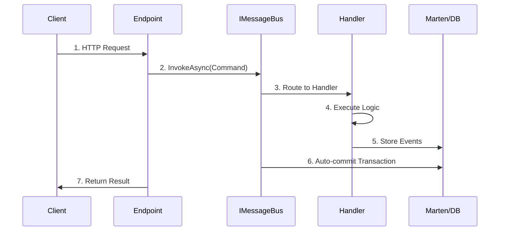
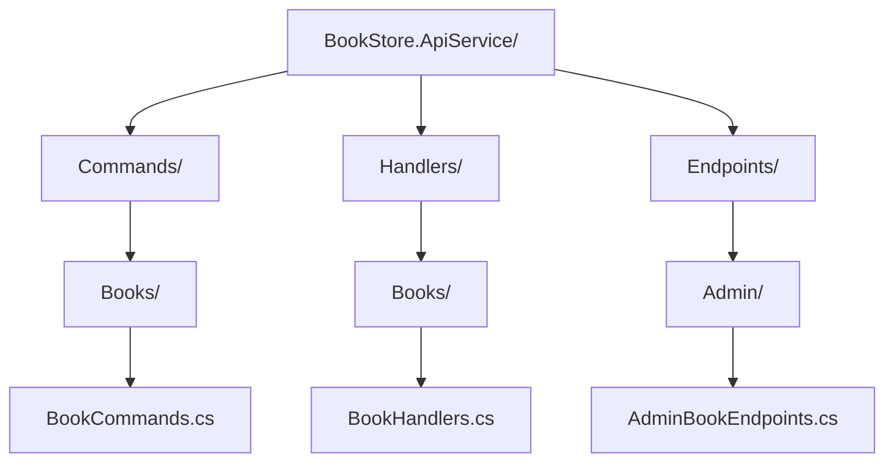

# Wolverine Integration Guide

## Overview

The Book Store API uses **Wolverine** - a next-generation .NET mediator and message bus framework - to implement the command/handler pattern with automatic transaction management.

## Why Wolverine?

### Benefits

✅ **Clean Separation**: Business logic separated from HTTP concerns  
✅ **Testability**: Handlers are pure functions, easy to unit test  
✅ **Auto-Transactions**: Wolverine manages Marten sessions and commits  
✅ **No Boilerplate**: No manual `SaveChangesAsync()` calls  
✅ **Foundation for Async**: Ready for background jobs and messaging  

### Before/After Comparison

**Before (Traditional Endpoint)**:
```csharp
private static async Task<IResult> CreateBook(
    CreateBookRequest request,
    IDocumentSession session)
{
    var id = Guid.CreateVersion7();
    var @event = BookAggregate.Create(...);
    session.Events.StartStream<BookAggregate>(id, @event);
    await session.SaveChangesAsync(); // Manual transaction management
    return Results.Created($"/api/admin/books/{id}", new { id });
}
```

**After (Wolverine Pattern)**:
```csharp
// Endpoint: Just routes to command
private static Task<IResult> CreateBook(
    CreateBookRequest request,
    IMessageBus bus)
{
    var command = new CreateBook(...);
    return bus.InvokeAsync<IResult>(command);
}

// Handler: Pure, testable business logic
public static IResult Handle(CreateBook command, IDocumentSession session)
{
    var @event = BookAggregate.Create(...);
    session.Events.StartStream<BookAggregate>(command.Id, @event);
    // Wolverine auto-commits transaction
    return Results.Created(...);
}
```

## Architecture

### Command Flow

```

```

### Project Structure



## Creating Commands

Commands are immutable records that represent user intent:

```csharp
namespace BookStore.ApiService.Commands.Books;

/// <summary>
/// Command to create a new book
/// </summary>
public record CreateBook(
    string Title,
    string? Isbn,
    string? Description,
    DateOnly? PublicationDate,
    Guid? PublisherId,
    List<Guid> AuthorIds,
    List<Guid> CategoryIds)
{
    /// <summary>
    /// Unique identifier (generated automatically)
    /// </summary>
    public Guid Id { get; init; } = Guid.CreateVersion7();
}

/// <summary>
/// Command to update an existing book
/// </summary>
public record UpdateBook(
    Guid Id,
    string Title,
    string? Isbn,
    string? Description,
    DateOnly? PublicationDate,
    Guid? PublisherId,
    List<Guid> AuthorIds,
    List<Guid> CategoryIds)
{
    /// <summary>
    /// ETag for optimistic concurrency control
    /// </summary>
    public string? ETag { get; init; }
}
```

**Command Best Practices**:
- Use `record` for immutability
- Include all required data
- Use `init` for optional properties (like ETag)
- Add XML documentation
- Keep commands simple (no logic)
- Use `Guid.CreateVersion7()` for IDs (see [Marten Guide](marten-guide.md#performance-guidcreateversionversion7) for performance benefits)

## Creating Handlers

> [!NOTE]
> Handlers use Marten's event sourcing APIs. For details on streams, aggregates, and events, see the [Marten Guide](marten-guide.md).

Handlers are static methods that Wolverine auto-discovers:

```csharp
namespace BookStore.ApiService.Handlers.Books;

public static class BookHandlers
{
    /// <summary>
    /// Handle CreateBook command
    /// Wolverine automatically manages the Marten session and commits the transaction
    /// </summary>
    public static IResult Handle(CreateBook command, IDocumentSession session)
    {
        var @event = BookAggregate.Create(
            command.Id,
            command.Title,
            command.Isbn,
            command.Description,
            command.PublicationDate,
            command.PublisherId,
            command.AuthorIds,
            command.CategoryIds);
        
        session.Events.StartStream<BookAggregate>(command.Id, @event);
        
        // Wolverine automatically calls SaveChangesAsync after this handler completes
        return Results.Created(
            $"/api/admin/books/{command.Id}",
            new { id = command.Id, correlationId = session.CorrelationId });
    }
    
    /// <summary>
    /// Handle UpdateBook command with ETag validation
    /// </summary>
    public static async Task<IResult> Handle(
        UpdateBook command,
        IDocumentSession session,
        HttpContext context)
    {
        // ETag validation
        var streamState = await session.Events.FetchStreamStateAsync(command.Id);
        if (streamState == null)
            return Results.NotFound();

        var currentETag = ETagHelper.GenerateETag(streamState.Version);
        if (!string.IsNullOrEmpty(command.ETag) && 
            !ETagHelper.CheckIfMatch(context, currentETag))
        {
            return ETagHelper.PreconditionFailed();
        }

        // Business logic
        var aggregate = await session.Events.AggregateStreamAsync<BookAggregate>(command.Id);
        if (aggregate == null)
            return Results.NotFound();

        var @event = aggregate.Update(...);
        session.Events.Append(command.Id, @event);

        // Return new ETag
        var newStreamState = await session.Events.FetchStreamStateAsync(command.Id);
        var newETag = ETagHelper.GenerateETag(newStreamState!.Version);
        ETagHelper.AddETagHeader(context, newETag);

        return Results.NoContent();
    }
}
```

**Handler Best Practices**:
- Use static methods in static classes
- Method name must be `Handle`
- Wolverine discovers handlers by convention
- Return `IResult` for HTTP responses
- Inject dependencies as parameters
- No manual transaction management

### Handler Discovery

Wolverine auto-discovers handlers based on:
1. **Method name**: Must be `Handle`
2. **First parameter**: The command type
3. **Return type**: Determines behavior
4. **Additional parameters**: Auto-injected by Wolverine

## Updating Endpoints

Endpoints become thin routing layers:

```csharp
using Wolverine;

public static class AdminBookEndpoints
{
    public static RouteGroupBuilder MapAdminBookEndpoints(this RouteGroupBuilder group)
    {
        group.MapPost("/", CreateBook)
            .WithName("CreateBook")
            .WithSummary("Create a new book using Wolverine command/handler pattern");

        group.MapPut("/{id:guid}", UpdateBook)
            .WithName("UpdateBook")
            .WithSummary("Update a book. Supports optimistic concurrency with If-Match header.");

        return group;
    }

    private static Task<IResult> CreateBook(
        [FromBody] CreateBookRequest request,
        [FromServices] IMessageBus bus)
    {
        var command = new CreateBook(
            request.Title,
            request.Isbn,
            request.Description,
            request.PublicationDate,
            request.PublisherId,
            request.AuthorIds ?? [],
            request.CategoryIds ?? []);
        
        // Wolverine invokes the handler, manages transaction, and returns result
        return bus.InvokeAsync<IResult>(command);
    }

    private static Task<IResult> UpdateBook(
        Guid id,
        [FromBody] UpdateBookRequest request,
        [FromServices] IMessageBus bus,
        HttpContext context)
    {
        // Extract ETag from If-Match header
        var etag = context.Request.Headers["If-Match"].FirstOrDefault();
        
        var command = new UpdateBook(
            id,
            request.Title,
            request.Isbn,
            request.Description,
            request.PublicationDate,
            request.PublisherId,
            request.AuthorIds ?? [],
            request.CategoryIds ?? [])
        {
            ETag = etag
        };
        
        return bus.InvokeAsync<IResult>(command);
    }
}
```

**Endpoint Responsibilities**:
- Extract data from HTTP request
- Create command object
- Invoke command via `IMessageBus`
- Return result to client

## Testing Handlers

Handlers are pure functions - easy to test!

```csharp
using NSubstitute;
using Xunit;

public class BookHandlerTests
{
    [Fact]
    public void CreateBookHandler_ShouldStartStreamWithBookAddedEvent()
    {
        // Arrange
        var command = new CreateBook(
            "Clean Code",
            "978-0132350884",
            "A Handbook of Agile Software Craftsmanship",
            new DateOnly(2008, 8, 1),
            Guid.CreateVersion7(),
            [Guid.CreateVersion7()],
            [Guid.CreateVersion7()]);
        
        var session = Substitute.For<IDocumentSession>();
        session.CorrelationId.Returns("test-correlation-id");
        
        // Act
        var result = BookHandlers.Handle(command, session);
        
        // Assert
        Assert.NotNull(result);
        session.Events.Received(1).StartStream<BookAggregate>(
            command.Id,
            Arg.Is<Events.BookAdded>(e => 
                e.Title == "Clean Code" && 
                e.Isbn == "978-0132350884"));
    }
    
    [Fact]
    public async Task UpdateBookHandler_WithWrongETag_ShouldReturn412()
    {
        // Arrange
        var bookId = Guid.CreateVersion7();
        var command = new UpdateBook(bookId, "Updated Title", ...) 
        { 
            ETag = "\"999\"" 
        };
        
        var session = Substitute.For<IDocumentSession>();
        var context = new DefaultHttpContext();
        context.Request.Headers["If-Match"] = "\"999\"";
        
        var streamState = new Marten.Events.StreamState(bookId, 5);
        session.Events.FetchStreamStateAsync(bookId)
            .Returns(Task.FromResult<Marten.Events.StreamState?>(streamState));
        
        // Act
        var result = await BookHandlers.Handle(command, session, context);
        
        // Assert
        var problemResult = Assert.IsType<ProblemHttpResult>(result);
        Assert.Equal(412, problemResult.StatusCode);
    }
}
```

**Testing Benefits**:
- No HTTP context mocking (unless needed for ETag)
- Pure function testing
- Easy to test edge cases
- Fast test execution
- Clear arrange/act/assert

## Configuration

### Program.cs Setup

```csharp
using Wolverine;
using Wolverine.Marten;

// Configure Marten first
builder.Services.AddMarten(options =>
{
    options.Connection(connectionString);
    // ... Marten configuration
}).IntegrateWithWolverine(); // Important: Integrate with Wolverine

// Add Wolverine
builder.Services.AddWolverine(opts =>
{
    // Auto-discover handlers in this assembly
    opts.Discovery.IncludeAssembly(typeof(Program).Assembly);
    
    // Policies for automatic behavior
    opts.Policies.AutoApplyTransactions();
});
```

### Key Configuration Points

1. **`IntegrateWithWolverine()`**: Connects Marten to Wolverine
2. **`IncludeAssembly()`**: Tells Wolverine where to find handlers
3. **`AutoApplyTransactions()`**: Enables automatic transaction management

## Advanced Patterns

### Cascading Messages

Return multiple outputs from a handler:

```csharp
public static (IResult, SendEmail, UpdateSearchIndex) Handle(
    CreateBook command,
    IDocumentSession session)
{
    var @event = BookAggregate.Create(...);
    session.Events.StartStream(command.Id, @event);
    
    // Return multiple outputs - Wolverine handles them
    return (
        Results.Created(...),
        new SendEmail("admin@library.com", "New book added"),
        new UpdateSearchIndex(command.Id)
    );
}
```

### Side Effects

Publish events or messages after successful commit:

```csharp
public static (IResult, BookCreatedEvent) Handle(
    CreateBook command,
    IDocumentSession session)
{
    var @event = BookAggregate.Create(...);
    session.Events.StartStream(command.Id, @event);
    
    // This event is published after transaction commits
    return (
        Results.Created(...),
        new BookCreatedEvent(command.Id, command.Title)
    );
}
```

## Migration Checklist

When migrating an endpoint to Wolverine:

- [ ] Create command record in `Commands/` folder
- [ ] Create handler in `Handlers/` folder
- [ ] Update endpoint to use `IMessageBus.InvokeAsync()`
- [ ] Remove manual `SaveChangesAsync()` calls
- [ ] Write unit tests for handler
- [ ] Test endpoint with Scalar UI
- [ ] Verify events in database

## Common Patterns

### Pattern 1: Simple Create

```csharp
// Command
public record CreateEntity(string Name, string Description);

// Handler
public static IResult Handle(CreateEntity command, IDocumentSession session)
{
    var @event = EntityAggregate.Create(command.Name, command.Description);
    session.Events.StartStream(Guid.CreateVersion7(), @event);
    return Results.Created(...);
}

// Endpoint
private static Task<IResult> Create(CreateEntityRequest request, IMessageBus bus)
    => bus.InvokeAsync<IResult>(new CreateEntity(request.Name, request.Description));
```

### Pattern 2: Update with ETag

```csharp
// Command
public record UpdateEntity(Guid Id, string Name) 
{ 
    public string? ETag { get; init; } 
}

// Handler
public static async Task<IResult> Handle(
    UpdateEntity command,
    IDocumentSession session,
    HttpContext context)
{
    // ETag validation
    var streamState = await session.Events.FetchStreamStateAsync(command.Id);
    if (streamState == null) return Results.NotFound();
    
    var currentETag = ETagHelper.GenerateETag(streamState.Version);
    if (!ETagHelper.CheckIfMatch(context, currentETag))
        return ETagHelper.PreconditionFailed();
    
    // Business logic
    var aggregate = await session.Events.AggregateStreamAsync<EntityAggregate>(command.Id);
    var @event = aggregate.Update(command.Name);
    session.Events.Append(command.Id, @event);
    
    // Return new ETag
    var newStreamState = await session.Events.FetchStreamStateAsync(command.Id);
    ETagHelper.AddETagHeader(context, ETagHelper.GenerateETag(newStreamState!.Version));
    
    return Results.NoContent();
}
```

### Pattern 3: Delete/Restore

```csharp
// Command
public record SoftDeleteEntity(Guid Id) 
{ 
    public string? ETag { get; init; } 
}

// Handler (similar to Update pattern)
public static async Task<IResult> Handle(
    SoftDeleteEntity command,
    IDocumentSession session,
    HttpContext context)
{
    // ETag validation...
    var aggregate = await session.Events.AggregateStreamAsync<EntityAggregate>(command.Id);
    var @event = aggregate.SoftDelete();
    session.Events.Append(command.Id, @event);
    return Results.NoContent();
}
```

## Troubleshooting

### Handler Not Found

**Problem**: `InvalidOperationException: No handler for command`

**Solution**:
- Ensure handler method is named `Handle`
- Verify handler is in assembly specified in `opts.Discovery.IncludeAssembly()`
- Check handler is `public static`

### Transaction Not Committing

**Problem**: Events not saved to database

**Solution**:
- Verify `IntegrateWithWolverine()` is called on Marten configuration
- Ensure `AutoApplyTransactions()` policy is enabled
- Check handler doesn't throw exceptions

### ETag Not Working

**Problem**: ETag validation not working

**Solution**:
- Ensure `HttpContext` is injected into handler
- Verify `If-Match` header is being sent
- Check ETag format (should be quoted: `"5"`)

## Best Practices

1. **Keep Commands Simple**: Just data, no logic
2. **Handlers are Pure**: No side effects except database writes
3. **Test Handlers**: Easy to test, so write comprehensive tests
4. **Thin Endpoints**: Just routing, no business logic
5. **Use ETags**: For optimistic concurrency on updates/deletes
6. **Document Commands**: XML comments help API consumers

## Summary

Wolverine provides:
- ✅ Clean command/handler separation
- ✅ Automatic transaction management
- ✅ Easy testing
- ✅ Foundation for async messaging
- ✅ Less boilerplate code

The pattern is simple:
1. **Command** = User intent (immutable record)
2. **Handler** = Business logic (pure function)
3. **Endpoint** = HTTP routing (thin layer)

## Next Steps

- **[Event Sourcing Guide](event-sourcing-guide.md)** - Event sourcing concepts and patterns
- **[Marten Guide](marten-guide.md)** - Event sourcing, streams, aggregates, and projections
- **[Architecture Overview](architecture.md)** - System design and CQRS patterns
- **[ETag Guide](etag-guide.md)** - Optimistic concurrency implementation
- **[Getting Started](getting-started.md)** - Setup and running the application
